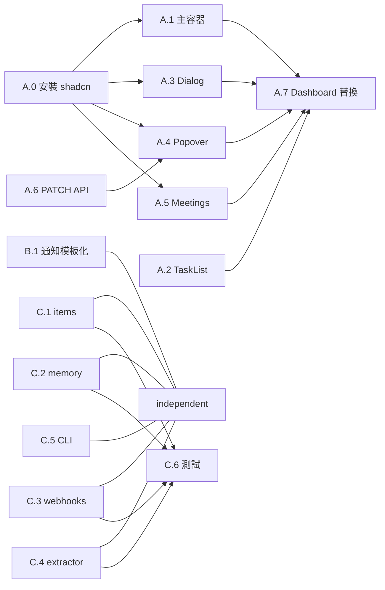

# 功能規劃：任務中心 + 通知模板化 + RAG Embedding 腳本化

**規劃時間**：2026-04-01（更新 2026-04-07）
**預估工作量**：30 任務點（前端 16 + 後端 14）

---

## 1. 功能概述

### 1.1 目標

三項改進：

1. **任務中心（Task Center）**：取代 Dashboard 通知面板，以待辦事項列表為主、最近 Hedy 記錄為輔。支援新增/刪除 TODO、設定到期提醒。
2. **通知模板化**：通知 generate API 完全移除 AI 呼叫，改為從 items metadata 聚合結構化摘要
3. **RAG Embedding 腳本化**：API routes 的 `after()` 不再呼叫 `triggerEmbedding`，改為獨立 CLI 腳本批次處理

### 1.2 範圍

**包含**：
- 新增 `src/components/shared/task-center/` 元件群（8 檔案）
- 新增 `PATCH /api/memory` endpoint（更新 due_date）
- 修改 Dashboard 頁面 import
- 移除 `notifications/generate` 中的 `chatCompletion` 呼叫
- 移除 4 個 API route + 1 個 extractor 中的 `triggerEmbedding` 呼叫
- 新增 `scripts/process-embeddings.ts` CLI 腳本
- 安裝缺少的 shadcn/ui 元件
- 更新受影響的測試

**不包含**：
- `src/app/api/items/extract/route.ts` 不改動（AI 提取邏輯保留）
- `src/app/api/rag/embed/route.ts` 不改動
- `src/lib/rag/worker.ts` 的 `triggerEmbedding()` 函式保留
- DB trigger / migration 不改動
- 推播通知（未來功能）

### 1.3 技術約束
- DB trigger 已自動將 items/memory insert/update 標記為 `pending`
- `processEmbeddingQueue()` 已支援 `tenantId?: string` 可選參數
- MiniMax RPM 極低（token plan），殘留 AI 呼叫容易 rate limit
- Jina AI embedding 不佔 MiniMax 額度
- `memory_entries` 已有 `due_date` 欄位（migration 014）
- POST `/api/memory` 已支援 `dueDate` 參數

---

## 2. WBS 任務分解

### 2.1 分解結構圖

```mermaid
graph TD
    ROOT["三項改進"] --> A["模組 A：任務中心前端"]
    ROOT --> B["模組 B：通知後端模板化"]
    ROOT --> C["模組 C：RAG Embedding 腳本化"]

    A --> A0["A.0 安裝 shadcn/ui 元件"]
    A --> A1["A.1 types.ts + task-center.tsx 主容器"]
    A --> A2["A.2 task-list.tsx + task-item.tsx"]
    A --> A3["A.3 add-task-dialog.tsx"]
    A --> A4["A.4 reminder-popover.tsx"]
    A --> A5["A.5 recent-meetings.tsx + meeting-item.tsx"]
    A --> A6["A.6 PATCH /api/memory endpoint"]
    A --> A7["A.7 Dashboard 頁面替換 + 刪除舊元件"]

    B --> B1["B.1 移除 AI 呼叫，改用 metadata 聚合"]

    C --> C1["C.1 移除 items/route.ts triggerEmbedding"]
    C --> C2["C.2 移除 memory/route.ts triggerEmbedding"]
    C --> C3["C.3 移除 webhooks/hedy triggerEmbedding"]
    C --> C4["C.4 移除 memory/extractor.ts triggerEmbedding"]
    C --> C5["C.5 新增 CLI 腳本 process-embeddings.ts"]
    C --> C6["C.6 更新測試"]
```



### 2.2 任務清單

---

#### 模組 A：任務中心前端（16 任務點）

##### A.0 安裝 shadcn/ui 元件（1 點）

```bash
npx shadcn@latest add popover calendar collapsible textarea label
```

確認 `react-day-picker` 依賴已安裝（Calendar 元件依賴）。

##### A.1 types.ts + task-center.tsx 主容器（3 點）

**新增檔案**：
- `src/components/shared/task-center/types.ts`
- `src/components/shared/task-center/task-center.tsx`

**types.ts**：定義 `TaskEntry`、`MeetingNote` 共用介面

**task-center.tsx 職責**：
- "use client" 元件
- 並行載入 `GET /api/memory?category=task` + `GET /api/items?type=meeting_note&limit=5`
- 狀態管理：tasks, meetings, loading, addDialogOpen
- 組合子元件：TaskList + Separator + RecentMeetings
- Header：[ClipboardList] 任務中心 + [+ 新增] Button + [Settings2] 連結到 /settings
- Loading 骨架屏
- 傳遞 CRUD callbacks 給子元件

##### A.2 task-list.tsx + task-item.tsx（4 點）

**新增檔案**：
- `src/components/shared/task-center/task-list.tsx`
- `src/components/shared/task-center/task-item.tsx`

**task-item.tsx**：
- 到期狀態計算 `getDueStatus()`：逾期（紅）、3天內（琥珀）、正常、未設定
- 視覺提示：逾期 `border-l-2 border-l-destructive bg-destructive/5`
- 操作按鈕：🔔 設定提醒 + 🗑 刪除（桌面 hover 顯示，mobile 常顯）
- 空狀態提示

**task-list.tsx**：
- 渲染 TaskItem 列表
- 前端排序：逾期 > 今天到期 > 即將到期 > 正常 > 未設定

##### A.3 add-task-dialog.tsx（3 點）

**新增檔案**：`src/components/shared/task-center/add-task-dialog.tsx`

- Dialog 彈窗：任務內容 textarea + 可選到期日 Calendar
- 驗證：內容必填，到期日可選（若設定須為未來日期）
- 提交 → `POST /api/memory`（category=task）→ 成功後關閉 Dialog + 更新列表

##### A.4 reminder-popover.tsx（2 點）

**新增檔案**：`src/components/shared/task-center/reminder-popover.tsx`

- 鐘鈴圖標 → Popover + Calendar
- 選日期 → `PATCH /api/memory`（樂觀更新 due_date）
- [清除提醒] 按鈕 → 設 due_date = null
- 失敗 rollback + Toast 錯誤

##### A.5 recent-meetings.tsx + meeting-item.tsx（2 點）

**新增檔案**：
- `src/components/shared/task-center/recent-meetings.tsx`
- `src/components/shared/task-center/meeting-item.tsx`

**meeting-item.tsx**：
- 標題 + 日期 + actionItems 數量 Badge
- Collapsible 展開 keyPoints 摘要
- 點擊標題導航至 `/items/[id]`

**recent-meetings.tsx**：
- 渲染 MeetingItem 列表
- 底部「查看全部 →」連結到 `/items`
- 空狀態處理

##### A.6 PATCH /api/memory endpoint（1 點）

**修改檔案**：`src/app/api/memory/route.ts`

新增 `PATCH` handler：
- 接收 `{ id, due_date }` body
- 驗證 due_date 格式（允許 null 清除）
- 更新 `chainthings_memory_entries.due_date`
- tenant_id 隔離 + status=active 檢查

##### A.7 Dashboard 頁面替換（1 點）

**修改檔案**：`src/app/(protected)/dashboard/page.tsx`

```diff
- import { NotificationPanel } from "@/components/shared/notification-panel";
+ import { TaskCenter } from "@/components/shared/task-center/task-center";
...
- <NotificationPanel />
+ <TaskCenter />
```

刪除或標記 deprecated：`src/components/shared/notification-panel.tsx`

---

#### 模組 B：通知後端模板化（4 任務點）

##### B.1 移除 AI 呼叫，改用 metadata 聚合 summary（4 點）

**修改檔案**：`src/app/api/notifications/generate/route.ts`

1. 移除 `import { chatCompletion } from "@/lib/ai-gateway"` (line 2)
2. 替換 lines 139-164 的 AI summary 邏輯：
   - 遍歷 recentItems，取 `item.metadata?.summary`（已在 extract 時產生）
   - 無 metadata.summary 時 fallback 到 `item.title`
   - 拼接為一段文字（用句號分隔，限 200 字）
   - 若拼接結果為空，fallback：「本期有 X 筆待辦事項和 Y 筆會議記錄」
3. 移除 try/catch 中的 AI 錯誤處理
4. `parsed` 物件結構不變：`{ summary, actionItems, reminders, recentMeetings }`

---

#### 模組 C：RAG Embedding 腳本化（10 任務點）

##### C.1 移除 items/route.ts 的 triggerEmbedding（1 點）

**修改檔案**：`src/app/api/items/route.ts`
- 移除 `import { triggerEmbedding }` (line 2)
- 移除 `after(() => triggerEmbedding(...))` (line 44)
- 移除 `after` from import (line 3)

##### C.2 移除 memory/route.ts 的 triggerEmbedding（1 點）

**修改檔案**：`src/app/api/memory/route.ts`
- 移除 `import { triggerEmbedding }` (line 2)
- 移除 `after(() => triggerEmbedding(...))` (line 101)
- 移除 `after` from import (line 3)

##### C.3 移除 webhooks/hedy 的 triggerEmbedding（1 點）

**修改檔案**：`src/app/api/webhooks/hedy/[tenantId]/route.ts`
- 移除 `import { triggerEmbedding }` (line 2)
- 移除 `after(() => triggerEmbedding(tenantId))` (line 130)
- 移除 `after` from import (line 3)

##### C.4 移除 memory/extractor.ts 的 triggerEmbedding（1 點）

**修改檔案**：`src/lib/memory/extractor.ts`
- 移除 `import { triggerEmbedding }` (line 3)
- 移除 `await triggerEmbedding(tenantId)` (line 114)
- 注意：`chat/route.ts` 的 `after()` 仍用於 memory extraction，`after` import 保留

##### C.5 新增 CLI 腳本 process-embeddings.ts（4 點）

**新增檔案**：`scripts/process-embeddings.ts`

- 載入 `dotenv/config`
- CLI 參數：`--tenant-id <uuid>`（可選）、`--batch-size <number>`（預設 50）、`--help`
- 呼叫 `processEmbeddingQueue(tenantId, { maxDocs: batchSize })`
- 輸出：`[embeddings] Done: 12 processed, 1 failed`
- Exit code：有 failed 時 exit 1
- 執行：`npx tsx scripts/process-embeddings.ts`

##### C.6 更新測試（2 點）

**修改檔案**：`src/app/api/webhooks/hedy/[tenantId]/route.test.ts` + 其他受影響測試

- 移除 `vi.mock("@/lib/rag/worker", ...)` (webhook test lines 8-10)
- 檢查其他測試檔案的 triggerEmbedding mock 並清理
- 執行 `npx vitest run` 確認全部測試通過

---

## 3. 依賴關係

### 3.1 依賴圖



### 3.2 並行策略

**Phase 1**（全部並行）：
- A.0 安裝 shadcn（先行，其他 A 任務依賴）
- B.1 通知模板化
- C.1 + C.2 + C.3 + C.4 移除 triggerEmbedding
- C.5 CLI 腳本

**Phase 2**（A.0 完成後，前端並行）：
- A.1 主容器 + A.2 TaskList/Item + A.3 Dialog + A.4 Popover + A.5 Meetings + A.6 PATCH API

**Phase 3**（收尾）：
- A.7 Dashboard 替換
- C.6 更新測試
- `npx vitest run` 全量驗證

---

## 4. 改動檔案彙總

| 檔案 | 操作 | 任務 |
|------|------|------|
| `src/components/shared/task-center/types.ts` | 新增 | A.1 |
| `src/components/shared/task-center/task-center.tsx` | 新增 | A.1 |
| `src/components/shared/task-center/task-list.tsx` | 新增 | A.2 |
| `src/components/shared/task-center/task-item.tsx` | 新增 | A.2 |
| `src/components/shared/task-center/add-task-dialog.tsx` | 新增 | A.3 |
| `src/components/shared/task-center/reminder-popover.tsx` | 新增 | A.4 |
| `src/components/shared/task-center/recent-meetings.tsx` | 新增 | A.5 |
| `src/components/shared/task-center/meeting-item.tsx` | 新增 | A.5 |
| `src/app/api/memory/route.ts` | 修改 | A.6 + C.2 |
| `src/app/(protected)/dashboard/page.tsx` | 修改 | A.7 |
| `src/components/shared/notification-panel.tsx` | 刪除 | A.7 |
| `src/app/api/notifications/generate/route.ts` | 修改 | B.1 |
| `src/app/api/items/route.ts` | 修改 | C.1 |
| `src/app/api/webhooks/hedy/[tenantId]/route.ts` | 修改 | C.3 |
| `src/lib/memory/extractor.ts` | 修改 | C.4 |
| `scripts/process-embeddings.ts` | 新增 | C.5 |
| `src/app/api/webhooks/hedy/[tenantId]/route.test.ts` | 修改 | C.6 |

**共 17 個檔案**（9 新增 + 7 修改 + 1 刪除）

---

## 5. 驗收標準

### 任務中心（模組 A）
- [ ] Dashboard 顯示任務中心 Card，取代舊通知面板
- [ ] 待辦事項列表正確載入（category=task, status=active）
- [ ] 逾期/即將到期有紅/琥珀色視覺提示
- [ ] 點「+ 新增」彈出 Dialog，提交成功後列表更新
- [ ] 點 🔔 彈出 Popover + Calendar，選日期後 due_date 更新
- [ ] 點 🗑 確認後刪除（歸檔），列表移除
- [ ] 最近記錄顯示 Hedy 會議，可展開摘要，點擊導航至 /items/[id]
- [ ] PATCH /api/memory 正確更新 due_date（含 tenant 隔離）
- [ ] 空狀態、Loading 狀態、Error 狀態均正確處理
- [ ] Mobile 響應式正常

### 通知模板化（模組 B）
- [ ] `notifications/generate/route.ts` 中無 `chatCompletion` import 或呼叫
- [ ] summary 從 items metadata.summary 聚合
- [ ] 手動/cron 觸發均正常

### RAG Embedding 腳本化（模組 C）
- [ ] 4 個檔案無 `triggerEmbedding` import 或呼叫
- [ ] `scripts/process-embeddings.ts` 可成功執行並處理 pending documents
- [ ] CLI 腳本支援 `--tenant-id` 和 `--batch-size` 參數
- [ ] `npx vitest run` 全部測試通過

---

## 6. 設計參考

UI/UX 詳細設計文件：`docs/design/task-center-ui-design.md`

包含：元件樹結構、Props 介面、交互流程圖、狀態轉換表、響應式策略、A11y、配色、動畫、所有 shadcn/lucide 元件清單。
