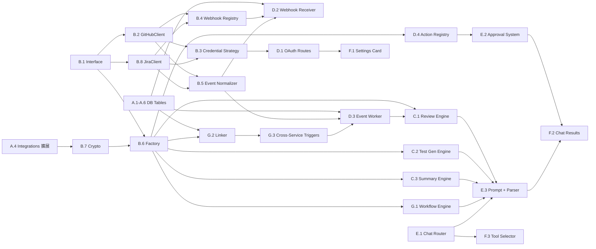

# 功能規劃：Developer Service Integration Layer (v3 — 跨服務協調)

**規劃時間**：2026-04-15
**修訂時間**：2026-04-15（v2 審查修正 + v3 跨服務協調重構）
**預估工作量**：70 任務點
**規劃範圍**：Service-agnostic 通用架構，三大能力同步實施

---

## 1. 功能概述

### 1.1 目標

為 ChainThings 新增開發者服務整合層，讓用戶連接 GitHub / GitLab / Jira 等服務，透過 OpenClaw AI 實現：

- **跨服務專案管理（核心）** — AI 協調多服務間的雜務：Jira 開單自動帶 GitLab branch、PR merge 回更新 Jira 狀態、跨服務 Sprint 摘要、自動維護 ticket↔MR 雙向連結
- **Code Review** — PR/MR Webhook 觸發 AI 審查草稿，用戶確認後回寫
- **Test Generation** — 基於 PR diff 或指定代碼，AI 生成單元測試建議

### 1.2 設計原則

**Service-Agnostic First**：所有 DB 表、API 路由、Service Layer 從 Day 1 就設計為通用架構。新增服務（GitLab、Jira）只需：
1. 實作 `DevServiceClient` interface adapter
2. 加入 credential strategy（OAuth / API Token / App Installation）
3. 加入 Webhook 簽章驗證邏輯
4. 在 registry 中註冊
5. **零 route 檔案新增；schema extension-friendly，保留 migration 空間但非必要**

**Human-in-the-Loop**：所有 AI 產生的操作（code review 提交、issue 建立等）必須經用戶確認後才執行。

**Durable Processing**：Webhook 事件處理採 DB state machine 驅動，不依賴 `after()` 做核心工作。

### 1.3 範圍

**不分 Phase，三大能力同步實施**：

| 能力 | 涵蓋服務 | 說明 |
|------|----------|------|
| **跨服務專案管理** | Jira + GitLab/GitHub | Jira 開單→自動建 branch、PR merge→更新 Jira、Sprint 摘要、ticket↔MR 連結 |
| **Code Review** | GitLab/GitHub | Webhook 觸發 AI draft review → 用戶確認 → 回寫 |
| **Test Generation** | GitLab/GitHub | 基於 diff 或檔案生成測試 |

**首批 Adapter**：GitHub + Jira（GitLab 結構相同，加 adapter 即可）

**跨服務工作流範例**：
1. 用戶在 Chat：「幫我建一個 feature ticket：用戶登入頁重構」
   → AI 在 Jira 建 ticket（PROJ-123）→ 在 GitHub 建 branch `feature/PROJ-123-login-refactor` → 回傳連結
2. PR #42 merged（含 commit message `PROJ-123`）
   → Webhook 觸發 → 自動將 Jira PROJ-123 狀態移到「Done」
3. 用戶：「這週 Sprint 進度如何？」
   → AI 彙整 Jira tickets + GitHub PRs → 生成跨服務摘要

### 1.4 技術約束

- 複用 `chainthings_integrations` 表，新增 `status` 欄位 + `secret_config` 加密存儲
- 通用 Webhook 接收：`/api/dev-services/webhooks/[service]/[tenantId]`
- AI 使用 OpenClaw（OpenAI-compatible），複用 `src/lib/ai-gateway/`
- Multi-tenant RLS 隔離：所有新表加 `tenant_id` + RLS
- 現有 migration 編號到 011，新 migration 從 012 開始

---

## 2. WBS 任務分解

### 2.1 分解結構圖

```mermaid
graph TD
    A["Developer Service Integration Layer"] --> B["A. Database Schema<br/>16 點"]
    A --> C["B. Service Abstraction Layer<br/>14 點"]
    A --> D["C. AI Engine<br/>10 點"]
    A --> H["G. Cross-Service Orchestration<br/>8 點"]
    A --> E["D. Backend API Routes<br/>10 點"]
    A --> F["E. Chat Integration<br/>6 點"]
    A --> G["F. Frontend UI<br/>6 點"]

    B --> B1["A.1 Webhook Events"]
    B --> B2["A.2 Code Reviews"]
    B --> B3["A.3 Test Generations"]
    B --> B4["A.4 Integrations 擴展"]
    B --> B5["A.6 Cross-Service Links"]

    C --> C1["B.1 DevServiceClient Interface"]
    C --> C2["B.2 GitHubClient Adapter"]
    C --> C6["B.8 JiraClient Adapter"]
    C --> C3["B.3 Credential Strategy"]
    C --> C4["B.4 Webhook Verifier Registry"]
    C --> C5["B.5 Event Normalizer"]

    D --> D1["C.1 Code Review Engine"]
    D --> D2["C.2 Test Generation Engine"]
    D --> D3["C.3 Summary Engine"]

    H --> H1["G.1 Workflow Engine"]
    H --> H2["G.2 Ticket↔MR Linker"]
    H --> H3["G.3 Cross-Service Triggers"]

    E --> E1["D.1 OAuth Routes"]
    E --> E2["D.2 Webhook Receiver"]
    E --> E3["D.3 Action Registry API"]
    E --> E4["D.4 Event Worker"]

    F --> F1["E.1 Chat Tool Router"]
    F --> F2["E.2 Approval Card System"]
    F --> F3["E.3 Command Executor"]

    G --> G1["F.1 Service Settings Card"]
    G --> G2["F.2 Chat Result Components"]
    G --> G3["F.3 Chat Tool Selector"]
```



### 2.2 任務清單

---

#### 模組 A：Database Schema（16 任務點）

##### 任務 A.1：Webhook Events Log 表（3 點）

**文件**: `supabase/migrations/012_dev_service_tables.sql`

- [ ] **A.1.1**：建立 `chainthings_webhook_events` 表
  - **關鍵步驟**：
    ```sql
    create table public.chainthings_webhook_events (
      id uuid primary key default gen_random_uuid(),
      tenant_id uuid not null references public.chainthings_profiles(tenant_id) on delete cascade,
      integration_id uuid references public.chainthings_integrations(id) on delete set null,
      service text not null,              -- 'github', 'gitlab', 'jira', ...
      event_type text not null,           -- 原始事件名：'pull_request.opened', 'merge_request.open'
      normalized_event text,              -- 標準化事件名：'mr.opened', 'issue.opened'
      delivery_id text,                   -- 服務提供的 unique delivery ID
      payload jsonb not null default '{}',
      status text not null default 'received',  -- received → processing → completed | failed
      error_message text,
      retry_count integer not null default 0,
      next_retry_at timestamptz,          -- worker retry 排程
      processed_at timestamptz,
      created_at timestamptz not null default now()
    );
    ```
  - 冪等索引：`UNIQUE(integration_id, delivery_id) WHERE delivery_id IS NOT NULL`
  - Worker 掃描索引：`(status, created_at)` 用於 poller
  - 查詢索引：`(tenant_id, service, created_at DESC)`
  - RLS：租戶隔離
  - Retention：加註 90 天清理（pg_cron）

##### 任務 A.2：Code Reviews 表（3 點）

**文件**: `supabase/migrations/012_dev_service_tables.sql`

- [ ] **A.2.1**：建立 `chainthings_code_reviews` 表（通用 subject 命名）
  - **關鍵步驟**：
    ```sql
    create table public.chainthings_code_reviews (
      id uuid primary key default gen_random_uuid(),
      tenant_id uuid not null references public.chainthings_profiles(tenant_id) on delete cascade,
      integration_id uuid not null references public.chainthings_integrations(id) on delete cascade,
      webhook_event_id uuid references public.chainthings_webhook_events(id),
      service text not null,
      repo_ref text not null,                   -- 通用 repo 標識
      subject_type text not null default 'merge_request',  -- 'merge_request', 'commit', 'file'
      subject_ref text not null,                -- PR #, MR IID, commit SHA（text 容許不同格式）
      subject_title text,
      subject_url text,                         -- PR/MR 完整 URL
      diff_summary text,                        -- AI 生成的 diff 摘要
      review_comments jsonb not null default '[]',  -- [{path, line, body, severity, suggestion}]
      review_status text not null default 'draft',  -- draft → approved → submitted | failed | skipped
      ai_model text,
      token_usage jsonb,
      metadata jsonb default '{}',              -- 服務特有：{head_sha, base_sha, review_id, diff_refs, ...}
      submitted_at timestamptz,
      created_at timestamptz not null default now()
    );
    ```
  - 索引：`(tenant_id, service, repo_ref, subject_ref)`, `(tenant_id, created_at DESC)`
  - RLS：租戶隔離
  - **審查修正**：`mr_ref` → `subject_ref`，`mr_title` → `subject_title`，`review_status` 預設 `'draft'` 非 `'pending'`

##### 任務 A.3：Test Generations 表（2 點）

**文件**: `supabase/migrations/012_dev_service_tables.sql`

- [ ] **A.3.1**：建立 `chainthings_test_generations` 表
  - **關鍵步驟**：
    ```sql
    create table public.chainthings_test_generations (
      id uuid primary key default gen_random_uuid(),
      tenant_id uuid not null references public.chainthings_profiles(tenant_id) on delete cascade,
      integration_id uuid not null references public.chainthings_integrations(id) on delete cascade,
      service text not null,
      repo_ref text not null,
      source_type text not null,           -- 'mr_diff', 'file', 'snippet'
      source_ref text,                     -- subject ref, file path, commit SHA
      source_summary text,                 -- 摘要（不存完整源碼）
      source_hash text,                    -- SHA-256 of source content（去重）
      generated_tests text,                -- AI 生成的測試代碼
      language text,
      framework text,
      ai_model text,
      token_usage jsonb,
      metadata jsonb default '{}',
      created_at timestamptz not null default now()
    );
    ```
  - **審查修正**：移除 `source_code`，改為 `source_summary` + `source_hash`；完整源碼不入 DB

##### 任務 A.4：Integrations 表擴展（4 點）

**文件**: `supabase/migrations/012_dev_service_tables.sql`

- [ ] **A.4.1**：為 `chainthings_integrations` 新增欄位
  - **關鍵步驟**：
    ```sql
    -- 新增 status 欄位（連接狀態管理）
    alter table public.chainthings_integrations
      add column if not exists status text not null default 'active',       -- active, expired, revoked, error
      add column if not exists secret_config bytea,                         -- AES-256-GCM 加密的敏感資料
      add column if not exists capabilities text[] default '{}',            -- ['code_review', 'issues', 'test_gen', 'summary']
      add column if not exists last_error_at timestamptz,
      add column if not exists last_error_message text;
    ```
  - **審查修正**：
    - `secret_config`（bytea）：存加密後的 `access_token`, `refresh_token`, `api_token`
    - `config` JSONB 只存公開設定（auto_review_enabled, repos, scopes, external_user_id 等）
    - `capabilities`：讓 UI/Chat 知道此整合支援哪些 action
    - `status`：支援 UI 顯示需重新授權狀態

- [ ] **A.4.2**：文件化 config 結構（公開 vs 加密分離）
  - **關鍵步驟**：
    ```typescript
    // 公開 config（存 config JSONB）
    interface DevServicePublicConfig {
      auth_type: 'oauth2' | 'api_token' | 'app_installation';
      external_user_id?: string;
      external_avatar_url?: string;
      token_expires_at?: string;          // ISO timestamp（用於預檢）
      // Settings
      auto_review_enabled: boolean;
      auto_review_repos: string[];
      review_language: string;            // 'zh-TW', 'en'
      scopes?: string[];
      // Service-specific（非敏感）
      github?: { installation_id?: number; app_id?: number };
      gitlab?: { base_url?: string };
      jira?: {
        domain: string;
        email: string;
        projects: string[];              // ['PROJ', 'BACKEND'] — ticket ref 解析
        status_mapping?: {               // PR 事件 → Jira 狀態（可自定義）
          mr_opened?: string;            // 預設 'In Review'
          mr_merged?: string;            // 預設 'Done'
        };
      };
    }

    // 加密 config（存 secret_config bytea，AES-256-GCM）
    interface DevServiceSecretConfig {
      access_token: string;
      refresh_token?: string;
      api_token?: string;                 // Jira
    }
    ```

##### 任務 A.5：效能索引（2 點）

- [ ] **A.5.1**：覆蓋索引
  - `chainthings_webhook_events(status, created_at)` — worker 掃描
  - `chainthings_webhook_events(integration_id, status, created_at)` — per-integration 狀態查詢
  - `chainthings_code_reviews(tenant_id, service, review_status)` — 未完成 review 查詢
  - `chainthings_integrations(tenant_id, status)` — 有效整合查詢
  - `chainthings_service_links(tenant_id, source_service, source_ref)` — 跨服務連結查詢

##### 任務 A.6：Cross-Service Links 表（2 點）

**文件**: `supabase/migrations/012_dev_service_tables.sql`

- [ ] **A.6.1**：建立 `chainthings_service_links` 表（跨服務資源連結）
  - **關鍵步驟**：
    ```sql
    -- 記錄跨服務資源的雙向連結（例：Jira ticket ↔ GitHub PR）
    create table public.chainthings_service_links (
      id uuid primary key default gen_random_uuid(),
      tenant_id uuid not null references public.chainthings_profiles(tenant_id) on delete cascade,
      -- 來源端
      source_service text not null,         -- 'jira'
      source_integration_id uuid references public.chainthings_integrations(id) on delete set null,
      source_type text not null,            -- 'ticket', 'issue', 'merge_request', 'branch'
      source_ref text not null,             -- 'PROJ-123', 'owner/repo#42'
      source_url text,
      -- 目標端
      target_service text not null,         -- 'github'
      target_integration_id uuid references public.chainthings_integrations(id) on delete set null,
      target_type text not null,            -- 'branch', 'merge_request', 'issue'
      target_ref text not null,             -- 'feature/PROJ-123-login', 'owner/repo#42'
      target_url text,
      -- 狀態
      link_type text not null,              -- 'ticket_branch', 'ticket_mr', 'issue_mr', 'mr_ticket'
      status text not null default 'active', -- active, completed, broken
      metadata jsonb default '{}',
      created_at timestamptz not null default now(),
      updated_at timestamptz not null default now()
    );
    ```
  - 索引：`(tenant_id, source_service, source_ref)`, `(tenant_id, target_service, target_ref)`
  - 用途：查詢某 Jira ticket 關聯的所有 PR/branch，或某 PR 關聯的 ticket
  - RLS：租戶隔離

---

#### 模組 B：Service Abstraction Layer（14 任務點）

##### 任務 B.1：DevServiceClient Interface + 資源模型（3 點）

**文件**: `src/lib/dev-services/types.ts`

- [ ] **B.1.1**：定義三層資源模型 + 通用 interface
  - **關鍵步驟**：
    ```typescript
    // === 三個標準資源模型（服務各實作子集）===

    // CodeHost: GitHub, GitLab（有 repo + MR + file + branch）
    interface CodeHostClient {
      readonly service: string;
      listRepos(): Promise<Repo[]>;
      getFileContent(repoRef: string, path: string, ref?: string): Promise<string>;
      // Branch
      createBranch(repoRef: string, branchName: string, fromRef?: string): Promise<Branch>;
      // Merge Request (PR/MR)
      getMergeRequest(repoRef: string, mrRef: string): Promise<MergeRequest>;
      getMergeRequestDiff(repoRef: string, mrRef: string): Promise<string>;
      getMergeRequestFiles(repoRef: string, mrRef: string): Promise<ChangedFile[]>;
      createMergeRequest(repoRef: string, title: string, body: string, sourceBranch: string, targetBranch?: string): Promise<MergeRequest>;
      submitReview(repoRef: string, mrRef: string, body: string, comments: ReviewComment[], event: ReviewEvent): Promise<void>;
    }

    // WorkItemTracker: GitHub Issues, GitLab Issues, Jira
    interface WorkItemClient {
      listIssues(projectRef: string, params?: IssueListParams): Promise<Issue[]>;
      createIssue(projectRef: string, title: string, body: string, options?: CreateIssueOptions): Promise<Issue>;
      getIssue(projectRef: string, issueRef: string): Promise<Issue>;
      updateIssueStatus(projectRef: string, issueRef: string, status: string): Promise<Issue>;
      // Jira-specific 但通用化：取得可用狀態列表
      getAvailableTransitions?(projectRef: string, issueRef: string): Promise<Transition[]>;
    }

    // DevServiceClient = 組合（服務各取所需）
    interface DevServiceClient {
      readonly service: string;
      readonly capabilities: ServiceCapability[];
      getAuthenticatedUser(): Promise<ServiceUser>;
      // 按 capability 提供，不支援的回 undefined
      asCodeHost?(): CodeHostClient;
      asWorkItemTracker?(): WorkItemClient;
    }

    type ServiceCapability = 'code_review' | 'issues' | 'test_gen' | 'summary' | 'branches' | 'transitions';
    type ReviewEvent = 'comment' | 'approve' | 'request_changes';

    interface CreateIssueOptions {
      labels?: string[];
      assignee?: string;
      priority?: string;          // Jira priority
      issueType?: string;         // Jira: 'Story', 'Bug', 'Task'
      sprintId?: string;          // Jira sprint
      linkedBranch?: string;      // 自動建立 branch 並連結
      linkedService?: string;     // branch 所在的 service（跨服務）
    }
    ```

  - **審查修正**：不假設每個 service 都能實作全部方法；capability-based 設計

- [ ] **B.1.2**：定義錯誤型別體系
  - **關鍵步驟**：
    ```typescript
    class DevServiceError extends Error { constructor(public service: string, message: string) }
    class RateLimitError extends DevServiceError { constructor(service: string, public retryAfter: number) }
    class AuthExpiredError extends DevServiceError {}
    class PermissionDeniedError extends DevServiceError {}
    class NotFoundError extends DevServiceError {}
    class RetryableNetworkError extends DevServiceError {}
    class UnsupportedCapabilityError extends DevServiceError {}
    class WebhookVerificationError extends DevServiceError {}
    ```

##### 任務 B.2：GitHubClient Adapter（4 點）

**文件**: `src/lib/dev-services/adapters/github.ts`

- [ ] **B.2.1**：實作 `GitHubClient implements DevServiceClient & CodeHostClient & WorkItemClient`
  - **關鍵步驟**：
    1. 原生 fetch + AbortController 超時（15s）
    2. 實作 `CodeHostClient` + `WorkItemClient` 所有方法
    3. `capabilities: ['code_review', 'issues', 'test_gen', 'summary', 'branches']`
    4. Rate limit header 追蹤 → `RateLimitError`
    5. 401 → `AuthExpiredError`（由上層處理 refresh）
    6. `truncateDiff(diff, maxTokens)` 大 diff 處理
    7. Exponential backoff for `RetryableNetworkError`

- [ ] **B.2.2**：GitHub OAuth helpers
  - **文件**: `src/lib/dev-services/adapters/github-auth.ts`
  - 實作 `GitHubCredentialStrategy`（見 B.3）

##### 任務 B.8：JiraClient Adapter（3 點）

**文件**: `src/lib/dev-services/adapters/jira.ts`

- [ ] **B.8.1**：實作 `JiraClient implements DevServiceClient & WorkItemClient`
  - **關鍵步驟**：
    1. Jira REST API v3（`https://{domain}.atlassian.net/rest/api/3/`）
    2. 認證：Basic Auth（email + API token）
    3. `capabilities: ['issues', 'summary', 'transitions']`（無 code_review, test_gen, branches）
    4. `asCodeHost()` 回傳 `undefined`
    5. `asWorkItemTracker()` 實作：
       - `listIssues` → JQL 查詢（`project = X AND sprint in openSprints()`）
       - `createIssue` → 支援 issueType, priority, sprint, labels
       - `updateIssueStatus` → 透過 Jira transitions API
       - `getAvailableTransitions` → 取得 ticket 可用狀態流轉
    6. Sprint 相關：`getActiveSprint()`, `getSprintIssues()`

- [ ] **B.8.2**：Jira Credential Strategy
  - **文件**: `src/lib/dev-services/adapters/jira-auth.ts`
  - `requiresOAuth() = false`（API Token 模式）
  - `resolveCredential()` → 從 secret_config 取 api_token + 從 config 取 domain/email

##### 任務 B.3：Credential Strategy Registry（3 點）

**文件**: `src/lib/dev-services/credential-registry.ts`

- [ ] **B.3.1**：實作多策略認證註冊表
  - **審查修正**：不再統一用 AuthHandler，改為分策略
  - **關鍵步驟**：
    ```typescript
    // 認證策略 interface
    interface CredentialStrategy {
      readonly authType: 'oauth2' | 'api_token' | 'app_installation';
      requiresOAuth(): boolean;
      // OAuth flow（僅 oauth2 / app_installation 需實作）
      getAuthorizationUrl?(state: string): string;
      exchangeCodeForToken?(code: string): Promise<TokenResult>;
      // Token lifecycle
      resolveCredential(secretConfig: DevServiceSecretConfig, publicConfig: DevServicePublicConfig): Promise<ResolvedCredential>;
      refreshIfNeeded?(current: ResolvedCredential): Promise<ResolvedCredential | null>;
    }

    interface ResolvedCredential {
      token: string;
      expiresAt?: Date;
    }

    // Registry
    const credentialRegistry: Record<string, CredentialStrategy> = {
      github: new GitHubOAuthStrategy(),       // OAuth2 + refresh
      jira: new JiraApiTokenStrategy(),        // requiresOAuth() = false
      // 擴展: gitlab: new GitLabOAuthStrategy(),
    };
    ```

##### 任務 B.4：Webhook Verifier Registry（2 點）

**文件**: `src/lib/dev-services/webhook-registry.ts`

- [ ] **B.4.1**：實作 Webhook 簽章驗證註冊表
  - **關鍵步驟**：
    ```typescript
    interface WebhookVerifier {
      verify(payload: string, headers: Headers, secret: string): boolean;
      getDeliveryId(headers: Headers): string | null;
      getEventType(headers: Headers, payload: unknown): string;
    }

    const webhookRegistry: Record<string, WebhookVerifier> = {
      github: new GitHubWebhookVerifier(),  // X-Hub-Signature-256 (HMAC-SHA256)
      jira: new JiraWebhookVerifier(),      // X-Hub-Secret (HMAC-SHA256)
      // 擴展: gitlab: new GitLabWebhookVerifier(),
    };
    ```
  - **安全**：簽章內容必須包含 tenant/integration identity

##### 任務 B.5：Event Normalizer（2 點）

**文件**: `src/lib/dev-services/event-normalizer.ts`

- [ ] **B.5.1**：實作函式型 Event Normalizer
  - **審查修正**：從 `Record<string, string>` 字串映射改為函式型
  - **關鍵步驟**：
    ```typescript
    // 標準化事件 envelope
    interface NormalizedEvent {
      eventName: string;           // 'mr.opened', 'issue.closed', ...
      actor: { id: string; login: string };
      resource: {
        type: 'merge_request' | 'issue' | 'comment';
        ref: string;               // PR#, MR IID, Issue#
        repoRef: string;
        url: string;
        title?: string;            // PR/Issue 標題（linker 用於 ticket ref 解析）
        body?: string;             // PR/Issue 描述
        sourceBranch?: string;     // PR 來源分支名（linker 解析 ticket ref）
        state?: string;            // opened, merged, closed
      };
      dedupeKey: string;           // 用於冪等
      normalizedPayload: unknown;  // 裁剪後的必要欄位
    }

    // 各服務的 normalizer 函式
    type EventNormalizerFn = (rawEventType: string, payload: unknown) => NormalizedEvent | null;

    const eventNormalizers: Record<string, EventNormalizerFn> = {
      github: normalizeGitHubEvent,
      jira: normalizeJiraEvent,
      // 擴展: gitlab: normalizeGitLabEvent,
    };
    ```

##### 任務 B.6：Client Factory（1 點）

**文件**: `src/lib/dev-services/factory.ts`

- [ ] **B.6.1**：實作 `createDevServiceClient(tenantId, service): Promise<DevServiceClient>`
  - 從 integrations 表讀取 config + 解密 secret_config
  - 檢查 `status`：非 `active` → 拋 `AuthExpiredError`
  - 透過 `credentialRegistry[service].resolveCredential()` 取得可用 token
  - 如需 refresh → `refreshIfNeeded()` → 更新 DB
  - Refresh 失敗 → 更新 integration status 為 `expired`
  - 回傳 adapter instance

##### 任務 B.7：加密工具（1 點）

**文件**: `src/lib/dev-services/crypto.ts`

- [ ] **B.7.1**：實作 secret_config 加密/解密
  - AES-256-GCM，key 由環境變數 `DEV_SERVICE_ENCRYPTION_KEY` 提供
  - `encryptSecretConfig(config: DevServiceSecretConfig): Buffer`
  - `decryptSecretConfig(encrypted: Buffer): DevServiceSecretConfig`

---

#### 模組 C：AI Engine（10 任務點）

> AI Engine 完全 service-agnostic，只接收通用型別。

##### 任務 C.1：Code Review Engine — Draft 模式（4 點）

**文件**: `src/lib/dev-services/engines/code-review.ts`

- [ ] **C.1.1**：實作 AI Code Review 引擎（Draft 模式）
  - **審查修正**：Phase 1 只產生 draft review，不自動提交
  - **輸入**：diff string + subject metadata（通用型別）
  - **輸出**：`ReviewComment[]` + `diff_summary`（存入 code_reviews 表，status='draft'）
  - **關鍵步驟**：
    1. System prompt：專注 bugs, security, performance, clarity（不管 style/formatting）
    2. Diff 預處理：
       - 解析 unified diff → 按檔案拆分
       - 忽略 lockfiles, generated files（`*.lock`, `*.min.js`, `dist/`）
       - Binary/rename 檔案只記錄不 review
    3. 大 diff（>6000 tokens）→ 分檔案獨立 review → 合併 + 去重
    4. AI 呼叫：`chatCompletion()` from `ai-gateway`
    5. Response 解析：JSON parse + Zod 結構驗證
    6. 存入 `chainthings_code_reviews`，`review_status = 'draft'`
    7. **不自動提交**：由用戶在 Chat UI 確認後觸發 C.1.2

- [ ] **C.1.2**：實作 Review 提交（用戶確認後）
  - 從 code_reviews 表讀取 draft → 用戶篩選後的 comments
  - `DevServiceClient.asCodeHost().submitReview()`
  - 更新 status → 'submitted'
  - 失敗 → status='failed' + error_message

##### 任務 C.2：Test Generation Engine（3 點）

**文件**: `src/lib/dev-services/engines/test-generation.ts`

- [ ] **C.2.1**：實作 AI 測試生成引擎
  - **輸入**：source code + language + framework
  - **輸出**：generated test code string
  - **關鍵步驟**：
    1. 語言偵測：副檔名 + 代碼內容
    2. System prompt：按 language/framework 動態組建
    3. MR diff 模式：從 diff 提取新增/修改函式
    4. File 模式：用 `CodeHostClient.getFileContent()`
    5. 存入 test_generations（`source_summary` + `source_hash`，不存完整源碼）

##### 任務 C.3：Summary Engine（3 點）

**文件**: `src/lib/dev-services/engines/summary.ts`

- [ ] **C.3.1**：實作 AI 專案摘要引擎
  - **輸入**：Issues + MRs 列表（通用型別）+ 時間範圍
  - **輸出**：Markdown 摘要
  - 功能：`generateWeeklySummary()`, `summarizeMergeRequest()`
  - **快取策略**：摘要結果寫入 memory_entries（category='summary'），避免每次 chat 即時計算
  - **v3 新增**：跨服務摘要 — 同時拉 Jira Sprint issues + GitHub/GitLab MRs，合併為統一進度報告

---

#### 模組 G：Cross-Service Orchestration（8 任務點）

> **核心模組**：讓 AI 成為「專案經理」，協調多服務間的雜務。

##### 任務 G.1：Workflow Engine（3 點）

**文件**: `src/lib/dev-services/orchestration/workflow-engine.ts`

- [ ] **G.1.1**：實作跨服務工作流引擎
  - **關鍵步驟**：
    ```typescript
    // 預定義工作流（白名單，非任意組合）
    interface Workflow {
      name: string;
      description: string;
      requiredServices: string[];          // 需要哪些服務已連接
      requiredCapabilities: Record<string, ServiceCapability[]>;  // 每個服務需要的能力
      steps: WorkflowStep[];
    }

    interface WorkflowStep {
      id: string;
      service: string;
      action: string;
      params: Record<string, string>;      // 支援 {{prev.issueRef}} 模板變數
      dependsOn?: string[];                // 前置步驟 ID
    }

    // === 預定義工作流 ===

    const WORKFLOWS: Record<string, Workflow> = {
      // 1. 建立 Feature：Jira ticket + GitHub branch
      'create_feature': {
        name: 'Create Feature',
        description: '在 Jira 建立 ticket，自動在 GitHub/GitLab 建立對應 branch',
        requiredServices: ['jira', 'github|gitlab'],
        steps: [
          { id: 'ticket', service: 'jira', action: 'create_issue', params: { title: '{{input.title}}', body: '{{input.description}}', issueType: '{{input.type}}' } },
          { id: 'branch', service: '{{input.codeService}}', action: 'create_branch', params: { repoRef: '{{input.repo}}', branchName: 'feature/{{ticket.issueRef}}-{{input.slug}}' }, dependsOn: ['ticket'] },
          { id: 'link', service: '_internal', action: 'create_link', params: { sourceService: 'jira', sourceRef: '{{ticket.issueRef}}', targetService: '{{input.codeService}}', targetRef: '{{branch.ref}}', linkType: 'ticket_branch' }, dependsOn: ['ticket', 'branch'] },
        ]
      },

      // 2. PR Ready：建立 PR 並連結 Jira ticket
      'create_pr_with_ticket': {
        name: 'Create PR with Ticket Link',
        description: '建立 PR，標題自動帶 Jira ticket ref，描述連結 ticket',
        requiredServices: ['jira', 'github|gitlab'],
        steps: [
          { id: 'ticket_info', service: 'jira', action: 'get_issue', params: { issueRef: '{{input.ticketRef}}' } },
          { id: 'pr', service: '{{input.codeService}}', action: 'create_mr', params: { repoRef: '{{input.repo}}', title: '{{input.ticketRef}}: {{ticket_info.title}}', body: 'Resolves [{{input.ticketRef}}]({{ticket_info.url}})', sourceBranch: '{{input.branch}}' }, dependsOn: ['ticket_info'] },
          { id: 'link', service: '_internal', action: 'create_link', params: { sourceService: 'jira', sourceRef: '{{input.ticketRef}}', targetService: '{{input.codeService}}', targetRef: '{{pr.ref}}', linkType: 'ticket_mr' }, dependsOn: ['pr'] },
        ]
      },

      // 3. Sprint 摘要：跨 Jira + GitHub/GitLab
      'sprint_summary': {
        name: 'Sprint Summary',
        description: '彙整本 Sprint 的 Jira tickets + 對應 PRs/MRs 進度',
        requiredServices: ['jira'],
        steps: [
          { id: 'sprint_issues', service: 'jira', action: 'get_sprint_issues', params: {} },
          { id: 'linked_mrs', service: '_internal', action: 'resolve_links', params: { issues: '{{sprint_issues}}' } },
          { id: 'summary', service: '_ai', action: 'generate_sprint_summary', params: { issues: '{{sprint_issues}}', mrs: '{{linked_mrs}}' }, dependsOn: ['sprint_issues', 'linked_mrs'] },
        ]
      },
    };
    ```
  - 工作流執行器：按 `dependsOn` 拓撲排序 → 逐步執行 → 模板變數替換
  - 每個步驟結果存入 context，供後續步驟引用
  - 失敗處理：記錄已完成步驟，不做自動 rollback（人工處理）

##### 任務 G.2：Ticket↔MR 自動連結器（3 點）

**文件**: `src/lib/dev-services/orchestration/linker.ts`

- [ ] **G.2.1**：實作 Ticket↔MR 雙向連結
  - **觸發時機**：
    1. **Webhook 觸發**：PR/MR opened → 解析 title/body/branch 中的 ticket ref（`PROJ-123`, `#42`）→ 自動建立 service_link
    2. **Webhook 觸發**：PR merged 且有 ticket link → 自動更新 Jira ticket 狀態（透過 transitions API）
    3. **手動觸發**：用戶在 Chat 中連結
  - **Ticket Ref 解析**：
    ```typescript
    // 從 PR title/body/branch name 中提取 Jira ticket ref
    function extractTicketRefs(text: string, jiraProjects: string[]): string[] {
      // 匹配 PROJ-123, PROJECT-456 格式
      const pattern = new RegExp(`(${jiraProjects.join('|')})-\\d+`, 'gi');
      return [...new Set(text.match(pattern) || [])];
    }
    ```
  - **自動狀態同步**：
    - PR opened + has ticket ref → Jira ticket → "In Review"
    - PR merged + has ticket ref → Jira ticket → "Done"
    - 狀態名稱透過 `getAvailableTransitions()` 動態匹配（不硬編碼）

- [ ] **G.2.2**：Jira Project Mapping 配置
  - 已在 `DevServicePublicConfig.jira`（A.4.2）定義 `projects` + `status_mapping`
  - Settings UI（F.1）需為 Jira card 加入：Jira project key 多選 + status mapping 自定義

##### 任務 G.3：Cross-Service Event Triggers（2 點）

**文件**: `src/lib/dev-services/orchestration/triggers.ts`

- [ ] **G.3.1**：在 Event Worker 中加入跨服務觸發邏輯
  - **擴展 webhook-handlers.ts**：
    ```typescript
    // 現有：mr.opened → code review (optional)
    // 新增：mr.opened → ticket link check → status update
    // 新增：mr.merged → ticket link check → status transition

    async function handleMROpened(tenantId: string, service: string, event: NormalizedEvent) {
      // 1. 檢查是否啟用 auto review → 觸發 Code Review Engine (draft)
      // 2. 【新增】解析 ticket refs → 建立 service_links → 更新 Jira 狀態
      const ticketRefs = extractTicketRefs(event.resource.title + event.resource.body, jiraProjects);
      for (const ref of ticketRefs) {
        await linker.createLink(tenantId, service, event, 'jira', ref, 'ticket_mr');
        await linker.transitionTicket(tenantId, ref, 'mr_opened');
      }
    }

    async function handleMRMerged(tenantId: string, service: string, event: NormalizedEvent) {
      // 解析 ticket refs → 更新 Jira 狀態為 Done
      const links = await getLinksForMR(tenantId, service, event.resource.ref);
      for (const link of links) {
        await linker.transitionTicket(tenantId, link.sourceRef, 'mr_merged');
      }
    }
    ```

---

#### 模組 D：Backend API Routes（10 任務點）

##### 任務 D.1：OAuth Routes（3 點）

**文件**: `src/app/api/dev-services/[service]/authorize/route.ts`
**文件**: `src/app/api/dev-services/[service]/callback/route.ts`

- [ ] **D.1.1**：實作通用 OAuth 發起
  - 從 URL 取得 `service` → 查 `credentialRegistry[service]`
  - 檢查 `requiresOAuth()`；非 OAuth 服務回 400
  - 產生 state token（tenantId + service + CSRF）→ httpOnly cookie（5 分鐘過期）
  - 回傳 `{ url: strategy.getAuthorizationUrl(state) }`

- [ ] **D.1.2**：實作通用 OAuth Callback
  - 驗證 state cookie
  - `credentialRegistry[service].exchangeCodeForToken(code)` → 取得 tokens
  - 加密 tokens → `secret_config`
  - 建立 `DevServiceClient` → `getAuthenticatedUser()` 取外部用戶資訊
  - 判斷 capabilities → 存入 integrations
  - Upsert `chainthings_integrations`（status='active', capabilities, config, secret_config）
  - Redirect `/settings?tab=integrations&service={service}&status=connected`

##### 任務 D.2：Webhook Receiver（2 點）

**文件**: `src/app/api/dev-services/webhooks/[service]/[tenantId]/route.ts`

- [ ] **D.2.1**：實作通用 Webhook 接收端點（僅落地，不處理）
  - **審查修正**：HTTP handler 只做驗簽 + 寫 event table + 回 202，不做任何業務處理
  - **關鍵步驟**：
    1. 從 URL 取得 `service` + `tenantId`
    2. 從 integrations 表取得 webhook_secret
    3. `webhookRegistry[service].verify(payload, headers, secret)` → 失敗回 401
    4. `webhookRegistry[service].getDeliveryId(headers)` → 冪等檢查（unique index）
    5. `eventNormalizers[service](eventType, payload)` → 標準化
    6. 插入 `chainthings_webhook_events`（status='received', normalized_event）
    7. 立即回 `202 Accepted`
    8. **不使用 `after()`**：由 Event Worker 消費

##### 任務 D.3：Event Worker（3 點）

**文件**: `src/app/api/dev-services/worker/route.ts`
**文件**: `src/lib/dev-services/event-worker.ts`

- [ ] **D.3.1**：實作 DB-driven Event Worker
  - **審查修正**：替代 `after()` 的 durable 處理機制
  - **關鍵步驟**：
    1. Worker API route（POST，由 cron 或 webhook handler 觸發）：
       - 認證：`CRON_SECRET` header 或內部呼叫
       - 從 `chainthings_webhook_events` 取 `status='received'` 事件
       - Compare-and-set：`status='received' → 'processing'`（防並發）
       - 依 `normalized_event` 路由到對應 handler：
         - `mr.opened` / `mr.updated` → 檢查 auto_review_enabled → 觸發 Code Review Engine（draft）
         - `issue.*` → 同步到 items/memory
       - 成功 → `status='completed'`；失敗 → `status='failed'` + `retry_count++` + `next_retry_at`
    2. Retry 策略：最多 3 次，exponential backoff（1min, 5min, 15min）
    3. Webhook handler 回 202 後，fire-and-forget 呼叫 worker endpoint（`fetch()` 不 await，不影響回應時間）；cron 作為兜底定期掃描 received 事件

##### 任務 D.4：Action Registry API（2 點）

**文件**: `src/app/api/dev-services/actions/route.ts`

- [ ] **D.4.1**：實作顯式 Action Registry（非任意 proxy）
  - **審查修正**：每個 action 有固定 schema + 權限檢查
  - **關鍵步驟**：
    ```typescript
    // Action 定義
    interface ActionDef {
      name: string;
      requiredCapability: ServiceCapability;
      inputSchema: ZodSchema;              // Zod 驗證輸入
      requiresApproval: boolean;           // 是否需用戶確認
      handler: (client: DevServiceClient, tenantId: string, params: unknown) => Promise<unknown>;
    }

    // 註冊表（白名單，非任意 action）
    const actionRegistry: Record<string, ActionDef> = {
      list_repos:     { requiredCapability: 'code_review', inputSchema: z.object({}), requiresApproval: false, handler: ... },
      list_issues:    { requiredCapability: 'issues', inputSchema: listIssuesSchema, requiresApproval: false, handler: ... },
      create_issue:   { requiredCapability: 'issues', inputSchema: createIssueSchema, requiresApproval: true, handler: ... },
      get_mr:         { requiredCapability: 'code_review', inputSchema: getMrSchema, requiresApproval: false, handler: ... },
      review_mr:      { requiredCapability: 'code_review', inputSchema: reviewMrSchema, requiresApproval: true, handler: ... },
      generate_tests: { requiredCapability: 'test_gen', inputSchema: genTestsSchema, requiresApproval: false, handler: ... },
      submit_review:  { requiredCapability: 'code_review', inputSchema: submitReviewSchema, requiresApproval: true, handler: ... },
      // 跨服務工作流
      execute_workflow: { requiredCapability: 'issues', inputSchema: executeWorkflowSchema, requiresApproval: true, handler: executeWorkflowHandler },
    };
    ```
  - POST `{ service, action, params }` → 查 registry → 驗證 schema → 檢查 capability → 檢查 tenant ownership → 執行
  - `requiresApproval: true` 的 action 必須帶 `approvalToken`（由前端 Approval Card 簽發）

---

#### 模組 E：Chat Integration（6 任務點）

##### 任務 E.1：Chat Tool Router（2 點）

**文件**: `src/app/api/chat/route.ts`（修改現有）

- [ ] **E.1.1**：擴展 Chat API 支援 `tool === "dev"`
  - 注入 Dev Service system prompt
  - AI 回應產生結構化 action proposal（非自由格式 code block）
  - 回應結構：
    ```typescript
    {
      conversationId: string;
      message: string;
      devService?: {
        service: string;
        action: string;
        params: unknown;
        requiresApproval: boolean;       // 是否需確認
        approvalToken?: string;          // 由後端簽發的一次性 token
      };
    }
    ```

##### 任務 E.2：Approval Card System（2 點）

**文件**: `src/lib/dev-services/approval.ts`

- [ ] **E.2.1**：實作 Human-in-the-Loop 核准系統
  - **審查修正**：所有有副作用的操作必須經用戶確認
  - **關鍵步驟**：
    1. `generateApprovalToken(tenantId, action, params)` — HMAC 簽章 + 10 分鐘有效期
    2. `verifyApprovalToken(token)` — 驗證簽章 + 過期
    3. 前端渲染「待核准卡片」→ 用戶點「執行」→ 帶 approvalToken 呼叫 actions API
    4. 一次性消費（防重放）

##### 任務 E.3：Dev System Prompt + Command Parser（2 點）

**文件**: `src/lib/dev-services/prompts.ts`

- [ ] **E.3.1**：設計 Dev 助手系統提示詞（跨服務感知）
  - **v3 新增**：AI 理解多服務 context，能協調跨服務操作
  - System prompt 核心：
    ```
    You are a project management assistant with access to the user's connected dev services.

    Connected services: {{connectedServices}}
    Available workflows: {{workflows}}

    You can propose:
    1. Single-service actions:
       ```dev-action
       {"action": "list_issues", "service": "jira", "projectRef": "PROJ"}
       ```
    2. Cross-service workflows:
       ```dev-action
       {"workflow": "create_feature", "params": {"title": "Login refactor", "type": "Story", "repo": "owner/repo", "codeService": "github", "slug": "login-refactor"}}
       ```
    3. Status queries (no approval needed):
       ```dev-action
       {"action": "sprint_summary", "service": "jira"}
       ```

    NEVER execute actions directly. Always propose and wait for user confirmation.
    For cross-service workflows, explain each step that will be performed.
    ```
  - 動態注入：已連接服務 + capabilities + repos + Jira projects + service_links
  - Parser：解析 `dev-action` JSON → 區分 single action vs workflow → 驗證白名單

---

#### 模組 F：Frontend UI（6 任務點）

##### 任務 F.1：Service Settings Card（3 點）

**文件**: `src/app/(protected)/settings/components/dev-service-section.tsx`

- [ ] **F.1.1**：實作通用服務整合設定 UI
  - **關鍵步驟**：
    1. `DevServiceCard` 通用組件，接收 `service` prop
    2. **連接狀態顯示**：
       - username + avatar + relative time（"Connected 2 hours ago"）
       - Scope 標記（`Read-only` / `Full Access`）
       - Status badge：active（綠）/ expired（黃，帶 Re-authenticate 按鈕）/ error（紅）
    3. **認證方式動態切換**：
       - OAuth：Connect 按鈕（GitHub/GitLab）
       - API Token：輸入欄位（Jira）— `credentialRegistry[service].requiresOAuth()`
    4. **配置區**（依服務動態顯示）：
       - GitHub/GitLab：Auto review 開關 + Repo 選擇器（Combobox + 伺服器端搜尋 + 虛擬列表）+ Review 語言
       - Jira：Project key 多選（從 Jira API 拉取可用 projects）+ Status mapping 自定義（mr_opened → ?, mr_merged → ?）
    5. **Disconnect 確認對話框**
    6. **Token 預檢**：定期檢查 `token_expires_at`，接近過期主動提示

##### 任務 F.2：Chat Result Components（2 點）

**文件**: `src/app/(protected)/chat/components/dev-service-result.tsx`

- [ ] **F.2.1**：實作 Chat 中 Dev Service 結果展示
  - **ApprovalCard** — 待核准操作卡片，顯示即將執行的動作 + 確認/取消按鈕
  - **ReviewResult** — review comments 列表：
    - Severity 色標（critical=紅, warning=橙, suggestion=藍, praise=綠）
    - **Checkbox 選取**：用戶勾選要採納的 comments
    - **單條編輯**：點擊可修改 comment 文字
    - 「提交選中的 comments」按鈕
    - 代碼片段預設折疊，點擊展開 diff context
    - Container Queries 適配 sidebar / fullscreen
  - **TestResult** — syntax highlight + 複製按鈕
  - **IssueResult** — issue 列表/新建結果 + 外部連結
  - **SummaryResult** — Markdown 渲染
  - **分段進度**：長任務顯示步驟（`[1/3] Fetching diff...` → `[2/3] Analyzing...`）

##### 任務 F.3：Chat Tool Selector（1 點）

**文件**: `src/app/(protected)/chat/components/chat-input.tsx`（修改現有）

- [ ] **F.3.1**：加入 Dev Service 工具選項
  - `tool="dev"` 模式
  - 選中時 Chat Input 邊框輕微變色（淡藍）提示「開發者模式」
  - 顯示已連接服務列表 + 快捷指令提示
  - 連接狀態異常時顯示警告（expired/error integration）

---

## 3. 依賴關係

### 3.1 依賴圖



### 3.2 並行任務群組

**群組 1**：A.1-A.6 (DB) + B.1 (Interface) + B.7 (Crypto) — 無依賴，可並行

**群組 2**（需群組 1 後）：
- B.2 GitHubClient + B.8 JiraClient + B.3 Credential Strategy + B.4 Webhook Registry + B.5 Event Normalizer（互相獨立）
- F.1 Settings Card 骨架（mock data）

**群組 3**（需群組 2 後）：
- C.1 Review Engine || C.2 Test Gen Engine || C.3 Summary Engine（互相獨立）
- B.6 Factory
- G.2 Linker（依賴 B.6 + A.6）

**群組 4**（需群組 3 後）：
- D.1 OAuth Routes + D.2 Webhook Receiver + D.3 Event Worker + D.4 Action Registry（互相獨立）
- G.1 Workflow Engine + G.3 Cross-Service Triggers
- E.2 Approval System

**群組 5**（最後整合）：E.1 + E.3 + F.2 + F.3

---

## 4. 實施建議

### 4.1 技術選型

| 需求 | 方案 | 理由 |
|------|------|------|
| API Client | 原生 fetch（自建）| 與現有 ai-gateway 模式一致 |
| OAuth State | httpOnly cookie + HMAC | 與現有 Supabase auth 一致 |
| Webhook 驗簽 | Node.js crypto | 與現有 Hedy webhook 相同 |
| Diff 解析 | 自建 unified diff parser | 只需行號和路徑 |
| AI 呼叫 | 複用 `chatCompletion()` | 已有抽象層 |
| Token 加密 | AES-256-GCM（application-level）| 不再依賴 DB at-rest encryption |
| Input 驗證 | Zod | 所有 action params + config 結構 |
| Retry | Exponential backoff + DB state machine | 可靠性保證 |

### 4.2 潛在風險

| 風險 | 緩解措施 |
|------|----------|
| GitHub API Rate Limit（5000 req/h）| Rate limit header 追蹤 + exponential backoff + 剩餘配額回傳 + per-service circuit breaker |
| 大 PR diff 超 AI context | 分檔案 review + MAX_DIFF_TOKENS=6000 + binary/rename skip |
| OAuth token 過期（8h）| Factory 自動 refresh → 失敗時 integration status='expired' → UI 提示 re-auth |
| Webhook 事件遺失 | DB state machine + retry 3 次 + cron poller 兜底 |
| AI review 幻覺 | Draft 模式 + 用戶選取確認 + Zod 結構驗證 |
| Token 洩漏 | secret_config 加密 + 前端 API 永不回傳 token + 巢狀 redaction |

### 4.3 測試策略

- **單元測試**（25+ tests）：
  - Crypto: encrypt/decrypt round-trip
  - Adapters: GitHub API mock, error handling, rate limit
  - Credential strategies: OAuth flow, token refresh
  - Webhook verifiers: signature validation, delivery ID extraction
  - Event normalizers: payload transformation
  - Engines: diff parser, prompt building, response parsing
  - Action registry: schema validation, capability check
  - Approval: token generation, verification, expiry

- **API Route 測試**（15+ tests）：
  - OAuth callback: state validation, token exchange, integration upsert
  - Webhook receiver: signature verify, dedupe, event creation
  - Event worker: status transitions, retry, handler dispatch
  - Actions API: schema validation, approval token, capability check

- **整合測試**：
  - OAuth 全流程（mock GitHub OAuth server）
  - Webhook → Event Worker → Code Review → Draft → User Approve → Submit 全鏈路
  - Chat → dev-action → approval card → execute → result
  - **Orchestration**：Workflow Engine 執行 create_feature（mock Jira + GitHub API）
  - **Linker**：PR opened 含 ticket ref → auto link + Jira transition
  - **Cross-service**：PR merged → link lookup → Jira status update

---

## 5. 驗收標準

- [ ] GitHub OAuth 連接/斷開正常運作
- [ ] Jira API Token 連接/斷開正常運作
- [ ] Settings 顯示連接狀態（active/expired）+ capabilities + scope
- [ ] Settings Jira card 可設定 project keys + status mapping
- [ ] Webhook 正確接收並記錄事件，worker 處理成功
- [ ] AI Code Review 產生 draft，用戶可選取/編輯/提交
- [ ] Review 成功回寫 GitHub PR
- [ ] AI Test Generation 生成合理的單元測試
- [ ] Chat `tool=dev` 模式 + Approval Card 流程完整
- [ ] **跨服務工作流**：Chat 中 create_feature → Jira ticket + GitHub branch + link 建立
- [ ] **自動連結**：PR opened 含 ticket ref → 自動建立 service_link + Jira 狀態更新
- [ ] **自動狀態同步**：PR merged → Jira ticket → Done
- [ ] **Sprint 摘要**：跨 Jira + GitHub 的統一進度報告
- [ ] Token 加密存儲，API 回應不洩漏 token
- [ ] 所有新表有 RLS + 租戶隔離
- [ ] Webhook 簽章驗證正確 + 冪等處理
- [ ] 新增測試 >= 45 個，現有 108+ 測試不受影響
- [ ] 零 Critical/High 安全問題
- [ ] 擴展性：新增 GitLab 只需 adapter 檔案

---

## 6. 環境變數新增

```env
# GitHub OAuth
GITHUB_CLIENT_ID=
GITHUB_CLIENT_SECRET=

# Token encryption
DEV_SERVICE_ENCRYPTION_KEY=           # AES-256 key (32 bytes, base64 encoded)

# Optional: Review defaults
DEV_REVIEW_MAX_DIFF_TOKENS=6000
DEV_REVIEW_AUTO_SUBMIT=false          # Phase 1 always false (draft mode)
```

---

## 7. 新增檔案清單

```
supabase/migrations/
  012_dev_service_tables.sql                  # A.1-A.6（所有新表 + integrations 擴展）

src/lib/dev-services/
  types.ts                                    # B.1 — Interface + 資源模型 + 錯誤型別
  factory.ts                                  # B.6 — Client factory
  crypto.ts                                   # B.7 — AES-256-GCM encrypt/decrypt
  credential-registry.ts                      # B.3 — Credential strategy registry
  webhook-registry.ts                         # B.4 — Webhook verifier registry
  event-normalizer.ts                         # B.5 — Event normalizer
  webhook-handlers.ts                         # D.3 — Normalized event handlers（含跨服務觸發）
  event-worker.ts                             # D.3 — DB-driven worker logic
  action-registry.ts                          # D.4 — Action definitions + schemas
  approval.ts                                 # E.2 — Approval token system
  prompts.ts                                  # E.3 — System prompts + parser
  adapters/
    github.ts                                 # B.2 — GitHubClient adapter
    github-auth.ts                            # B.3 — GitHub credential strategy
    github-webhook.ts                         # B.4 — GitHub webhook verifier
    github-normalizer.ts                      # B.5 — GitHub event normalizer
    jira.ts                                   # B.8 — JiraClient adapter
    jira-auth.ts                              # B.8 — Jira credential strategy
    jira-webhook.ts                           # B.8 — Jira webhook verifier
    jira-normalizer.ts                        # B.8 — Jira event normalizer
  engines/
    code-review.ts                            # C.1
    test-generation.ts                        # C.2
    summary.ts                                # C.3
    diff-parser.ts                            # C.1 輔助
  orchestration/
    workflow-engine.ts                        # G.1 — 跨服務工作流引擎
    linker.ts                                 # G.2 — Ticket↔MR 連結器
    triggers.ts                               # G.3 — 跨服務事件觸發

src/app/api/dev-services/
  [service]/authorize/route.ts                # D.1
  [service]/callback/route.ts                 # D.1
  webhooks/[service]/[tenantId]/route.ts      # D.2
  actions/route.ts                            # D.4
  worker/route.ts                             # D.3

src/app/(protected)/settings/components/
  dev-service-section.tsx                     # F.1

src/app/(protected)/chat/components/
  dev-service-result.tsx                      # F.2（含 ApprovalCard + WorkflowResult）
```

**修改的現有檔案**：
- `src/app/api/chat/route.ts` — 加入 `tool === "dev"` 分支
- `src/app/(protected)/settings/components/integrations-section.tsx` — 引入 DevServiceSection
- `src/app/(protected)/chat/components/chat-input.tsx` — 加入 Dev tool 選項
- `.env.example` — 新增環境變數

---

## 8. 擴展：新增 GitLab — 只需 4 個 adapter 檔案

```
src/lib/dev-services/adapters/
  gitlab.ts              # GitLabClient implements CodeHostClient & WorkItemClient
  gitlab-auth.ts         # GitLab OAuth credential strategy
  gitlab-webhook.ts      # GitLab webhook verifier (X-Gitlab-Token)
  gitlab-normalizer.ts   # GitLab event normalizer
```

+ 在 credential-registry、webhook-registry、event-normalizer 中註冊
+ Settings UI：`<DevServiceCard service="gitlab" />`
+ 跨服務工作流自動生效（Jira↔GitLab 連結、Ticket ref 解析已通用化）
+ **零 route 新增**

---

## 9. 審查修正追蹤

| # | 原始問題 | 嚴重度 | 修正方式 |
|---|----------|--------|----------|
| 1 | dev-command 自動執行 | Critical | Approval Card + approvalToken 機制（E.2）|
| 2 | Token 明文存儲 | Critical | secret_config bytea + AES-256-GCM（A.4, B.7）|
| 3 | Actions Proxy 任意 RPC | Critical | Action Registry + Zod schema + capability check（D.4）|
| 4 | after() 不耐久 | Critical | DB state machine + Event Worker + cron poller（D.3）|
| 5 | 零 migration 過度樂觀 | Critical | 改措辭為「零 route 新增，保留 migration 空間」|
| 6 | mr_ref 非通用 | Major | subject_type + subject_ref（A.2）|
| 7 | 存完整源碼 | Major | source_summary + source_hash 取代（A.3）|
| 8 | Event normalizer 太薄 | Major | 函式型 normalizer + NormalizedEvent envelope（B.5）|
| 9 | ReviewResult 一鍵提交 | Major | Checkbox 選取 + 單條編輯（F.2）|
| 10 | Repo 選擇器性能 | Major | Combobox + 伺服器端搜尋 + 虛擬列表（F.1）|
| 11 | Webhook dedupe 範圍 | Major | UNIQUE(integration_id, delivery_id)（A.1）|
| 12 | Auth lifecycle 混雜 | Major | CredentialStrategy 多策略（B.3）|
| 13 | AI auto review 高估 | Major | Phase 1 Draft 模式（C.1）|
| 14 | Token 過期 UI 缺失 | Major | integration status + UI 預檢 + re-auth 提示（A.4, F.1）|

---

## 10. v3 變更摘要

| 變更 | 說明 |
|------|------|
| **不分 Phase** | GitHub + Jira 同步實施，安全性不拆階段 |
| **新增模組 G** | Cross-Service Orchestration — 工作流引擎 + Ticket↔MR 連結器 + 跨服務觸發 |
| **新增 A.6** | `chainthings_service_links` 表 — 跨服務資源雙向連結 |
| **新增 B.8** | JiraClient adapter — Jira REST API v3 + transitions + Sprint |
| **Interface 擴展** | `createBranch()`, `createMergeRequest()`, `updateIssueStatus()`, `getAvailableTransitions()` |
| **Chat 升級** | AI 理解多服務 context，支援 single action + cross-service workflow 兩種模式 |
| **預定義工作流** | `create_feature`, `create_pr_with_ticket`, `sprint_summary` — 白名單式，非任意組合 |
| **自動連結** | PR 開啟/合併時自動解析 ticket ref → 建立 link → 更新 Jira 狀態 |
