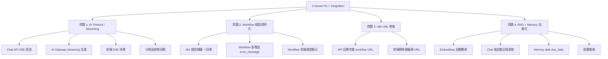
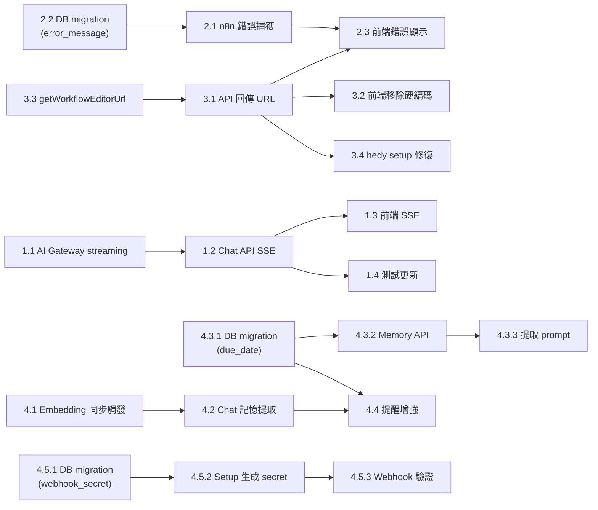

# 功能規劃：4 個問題修復 + RAG/Memory 整合優化

**規劃時間**：2026-03-22（v2.1 更新：二輪審查修正）
**預估工作量**：48 任務點（+2 落地細節任務）
**遷移起始編號**：013

---

## 1. 功能概述

### 1.1 目標

修復 4 個已知問題（AI timeout、Workflow 靜默失敗、n8n URL 硬編碼、RAG/Memory 未自動觸發），並將 RAG embedding、Memory 提取、提醒功能整合為自動化閉環。

### 1.2 範圍

**包含**：
- Chat API 改為 SSE streaming + 分階段狀態回饋
- Workflow 建立失敗時回傳具體錯誤 + 前端顯示
- n8n workflow URL 由 API 回傳（使用獨立 `N8N_EDITOR_BASE_URL`，不暴露內部地址）
- Items POST / Hedy webhook 寫入後**同步觸發** embedding worker（在 response 返回前完成）
- Chat 回覆後自動提取記憶（task/fact/preference），含去重策略
- Memory 中 task 類型支援 due_date 欄位
- 提醒功能基於 memory task + due_date 觸發
- **Hedy webhook 改為 per-tenant secret 認證**（強化租戶隔離）

**不包含**：
- ZeroClaw memory API 整合（Phase 2，需 ZeroClaw 支援 memory 端點）
- 前端完整重寫
- OpenClaw streaming 支援（ZeroClaw 為主要 provider，OpenClaw 為 legacy）

### 1.3 技術約束
- ZeroClaw 使用 `POST /webhook` 格式（flat message string），不支援原生 streaming —— 需在 server 端做 SSE 包裝
- **SSE 包裝的核心價值是分階段狀態回饋（searching → thinking → done），非首字節延遲優化**
- 不破壞現有 108 個測試
- 保持多租戶 RLS 隔離（含 Hedy webhook per-tenant secret）
- 遷移從 013 開始
- 向後相容現有 .env 配置
- **Next.js route handler 環境中，response 返回後執行上下文不保證存活** —— 所有關鍵操作必須在 response 前完成

### 1.4 資料一致性策略

| 場景 | 處理方式 |
|------|----------|
| SSE 中途中斷（client 斷開）| assistant message 仍完整寫入 DB（因 AI 回覆是先完整取得再推送）|
| n8n 建立失敗 | workflow 記錄存為 status="error" + error_message，前端顯示具體錯誤 |
| Memory extraction 失敗 | 靜默忽略，不影響聊天回覆；下次對話重試 |
| Embedding worker 失敗 | rag_documents status="failed" + error_message，下次觸發時重試 pending/failed |

---

## 2. WBS 任務分解

### 2.1 分解結構圖



### 2.2 任務清單

---

#### 問題 1：AI 回應 Timeout / Streaming（14 任務點）

**選擇方案**：A + C 混合 —— Chat API 改為 SSE streaming，RAG 和 AI 的 timeout 分開配置，前端顯示分階段狀態。

> **為何選 SSE 而非 WebSocket**：SSE 為單向推送，與 Next.js App Router 原生相容（返回 ReadableStream），無需額外 infra；ZeroClaw 非原生 streaming，server 端收到完整回應後分段推送即可。

> **⚠️ 審查修正**：SSE 包裝的核心價值是**分階段狀態回饋**（讓用戶看到 searching → thinking → done），而非降低首字節延遲（ZeroClaw 仍需等完整回應）。真正解決 timeout 的是 timeout 分離配置（chat 60s vs embedding 10s vs RPC 10s）。不使用人工 delay 模擬 streaming（浪費 serverless 執行時間），完整回應一次性推送 delta 事件。

---

##### 任務 1.1：AI Gateway 增加 streaming wrapper + 分段 timeout（3 點）

**文件**: `src/lib/ai-gateway/client.ts`

- [ ] **任務 1.1.1**：新增 `chatCompletionStream()` 函式
  - **輸入**：同 `chatCompletion` 參數
  - **輸出**：`AsyncGenerator<StreamEvent>` yield 不同階段事件
  - **關鍵步驟**：
    1. 定義 `StreamEvent` 類型：`{ type: 'status' | 'delta' | 'sources' | 'n8n' | 'done' | 'error', data: unknown }`
    2. ZeroClaw 模式：整體請求仍為非 streaming（POST /webhook），但增加獨立 timeout 配置
    3. 收到完整回應後，以 chunk 方式 yield delta 事件（模擬 streaming 效果）
    4. OpenClaw 模式（未來擴展）：可直接使用 `stream: true` 參數

- [ ] **任務 1.1.2**：分離 RAG timeout 與 AI timeout 配置
  - **輸入**：環境變數
  - **輸出**：獨立的 timeout 值
  - **關鍵步驟**：
    1. 在 `providers.ts` 新增 `RAG_TIMEOUT_MS` 環境變數支援（預設 10000ms）
    2. `chatCompletion` 保持 30s timeout（或 `ZEROCLAW_TIMEOUT_MS`）
    3. Embedding 請求使用 `RAG_TIMEOUT_MS`
    4. **Supabase RPC 搜尋 + memory query 也使用 `RAG_TIMEOUT_MS`**（chat route 中用 AbortController 包裝整個 RAG 階段）
    - **⚠️ v2.1 修正**：需修改 `src/lib/rag/search.ts` 的 `hybridSearch()` 和 `src/lib/ai-gateway/embeddings.ts` 的 `generateEmbedding()` 接受 `signal?: AbortSignal` 參數，透傳到 Supabase RPC / fetch 呼叫
    5. 新增 `ZEROCLAW_CHAT_TIMEOUT_MS` 環境變數，預設 60000ms（比 30s 更寬裕）
    6. 保留 `ZEROCLAW_TIMEOUT_MS` 作為 fallback 向後相容

**文件**: `src/lib/ai-gateway/providers.ts`

- [ ] **任務 1.1.3**：新增 `chatTimeoutMs` 和 `embeddingTimeoutMs` 分離配置
  - **關鍵步驟**：
    1. `ProviderConfig` 介面新增 `chatTimeoutMs` 和 `embeddingTimeoutMs`
    2. zeroclaw config: `chatTimeoutMs` 讀取 `ZEROCLAW_CHAT_TIMEOUT_MS`，fallback `ZEROCLAW_TIMEOUT_MS`，預設 60000
    3. `embeddingTimeoutMs` 讀取 `RAG_TIMEOUT_MS`，預設 10000
    4. 原 `timeoutMs` 保留作為通用 fallback

---

##### 任務 1.2：Chat API 改為 SSE 端點（4 點）

**文件**: `src/app/api/chat/route.ts`

- [ ] **任務 1.2.1**：重構 POST handler 返回 SSE stream
  - **輸入**：同現有 request body
  - **輸出**：`Response` with `text/event-stream` content type
  - **關鍵步驟**：
    1. 建立 `ReadableStream` + `TextEncoder`
    2. 認證、profile 查詢等前置邏輯不變
    3. 在 stream 中依序推送事件：
       - `event: status\ndata: {"phase": "searching"}\n\n`（RAG 開始）
       - `event: status\ndata: {"phase": "thinking"}\n\n`（AI 請求開始）
       - `event: sources\ndata: [{"id":..., "title":...}]\n\n`（RAG 結果）
       - `event: delta\ndata: {"content": "..."}\n\n`（AI 回應文字，分段推送）
       - `event: n8n\ndata: {"name":..., "status":...}\n\n`（如有 workflow 結果）
       - `event: done\ndata: {"conversationId": "..."}\n\n`
       - `event: error\ndata: {"message": "..."}\n\n`（錯誤）
    4. RAG 失敗時推送 status "thinking"（跳過搜尋階段，非致命）
    5. 保存 user message 和 assistant message 到 DB 的邏輯不變

- [ ] **任務 1.2.2**：AI 回應推送 + 資料持久化
  - **關鍵步驟**：
    1. ZeroClaw 回應為完整字串，一次性推送為單個 delta 事件（不加人工延遲，節省 serverless 執行時間）
    2. **持久化策略**：因 AI 回覆是先完整取得再推送，assistant message 在推送 delta 前就寫入 DB（保證 DB 一致性）
    3. 推送 delta → 推送 done 事件
    4. SSE 連線中斷時：DB 已有完整記錄，用戶刷新即可看到

- [ ] **任務 1.2.3**：向後相容 —— 支援非 streaming 模式
  - **關鍵步驟**：
    1. 檢查 request header `Accept: text/event-stream`
    2. 無此 header 時走原有 JSON 回應路徑（保護現有測試）
    3. 有此 header 時走 SSE 路徑

---

##### 任務 1.3：前端 SSE 消費 + 分階段 UI（5 點）

**文件**: `src/lib/chat/stream-client.ts`（新建）

- [ ] **任務 1.3.1**：建立 SSE 客戶端工具函式
  - **輸入**：chat API URL + request body
  - **輸出**：事件回呼介面
  - **關鍵步驟**：
    1. 使用 `fetch` + `getReader()` 讀取 SSE stream
    2. 解析 `event:` 和 `data:` 行
    3. 提供 `onStatus`, `onDelta`, `onSources`, `onN8n`, `onDone`, `onError` 回呼
    4. 支援 AbortController 取消

**文件**: `src/app/(protected)/chat/[conversationId]/page.tsx`

- [ ] **任務 1.3.2**：改造 sendMessage 使用 SSE
  - **關鍵步驟**：
    1. 替換 `fetch` + `res.json()` 為 SSE 客戶端
    2. `onStatus` 回呼更新 loading 狀態文字（"正在搜索相關資料..." / "正在思考..."）
    3. `onDelta` 回呼即時追加 assistant message content
    4. `onSources` 回呼附加到 message 的 sources
    5. `onDone` 回呼結束 loading

- [ ] **任務 1.3.3**：改造 LoadingDots 為 StreamingStatus 組件
  - **關鍵步驟**：
    1. 新增 `phase` prop：`"connecting" | "searching" | "thinking" | "streaming"`
    2. 各階段顯示不同文字和動畫（含脈動/微旋轉，區別於靜止狀態）
    3. "searching" 顯示搜索圖標 + "正在搜索相關資料..."
    4. "thinking" 顯示腦圖標 + "正在思考..."
    5. "streaming" 時不顯示此組件（直接看到文字流入）
    6. **a11y**：`role="status"` + `aria-live="polite"`，確保螢幕閱讀器播報狀態變化
    7. **保留微動效**（脈動動畫），讓用戶確認系統仍在運作

- [ ] **任務 1.3.5**：自動滾動防衝突（Scroll Fight）
  - **關鍵步驟**：
    1. 偵測用戶是否手動向上滾動（scroll position 離底部 > 100px）
    2. 若用戶不在底部，暫停自動滾動
    3. 新增「回到底部」浮動按鈕，點擊後恢復自動滾動
    4. 新訊息到來時僅在底部時自動滾動

- [ ] **任務 1.3.4**：改造 handleRegenerate 使用 SSE
  - **關鍵步驟**：同 1.3.2，復用 SSE 客戶端

---

##### 任務 1.4：測試更新（2 點）

**文件**: `src/__tests__/api/chat/route.test.ts`（更新）, `src/__tests__/lib/ai-gateway/client.test.ts`（更新）

- [ ] **任務 1.4.1**：更新 chat route 測試
  - **關鍵步驟**：
    1. 現有 9 個測試應保持通過（因 1.2.3 向後相容）
    2. 新增 SSE 模式測試：驗證 event stream 格式
    3. 新增分階段狀態測試：驗證 status 事件順序

- [ ] **任務 1.4.2**：新增 streaming client 測試
  - **關鍵步驟**：
    1. 測試 SSE 解析邏輯
    2. 測試 abort 取消

---

#### 問題 2：Workflow 功能建立失敗（5 任務點）

**選擇方案**：A + C —— 錯誤透明化 + 前端顯示錯誤詳情

---

##### 任務 2.1：n8n 錯誤捕獲和回傳（2 點）

**文件**: `src/app/api/chat/route.ts`

- [ ] **任務 2.1.1**：chat route 中 createWorkflow catch 改為保留錯誤訊息
  - **輸入**：n8n createWorkflow 拋出的 Error
  - **輸出**：n8nResult 中包含 `error` 欄位和 `status: "error"`
  - **關鍵步驟**：
    1. 第 301 行：`catch {}` 改為 `catch (n8nErr) { ... }`
    2. 捕獲錯誤訊息，存入 `n8nErrorMsg` 變數
    3. n8nResult 中新增 `error: n8nErrorMsg`，status 改為 `"error"`（而非 "pending"）
    4. DB insert 同步更新：`status: "error"`, `error_message: n8nErrorMsg`

**文件**: `src/app/api/workflows/generate/route.ts`

- [ ] **任務 2.1.2**：generate route 中 createWorkflow catch 改為回傳具體錯誤
  - **關鍵步驟**：
    1. 第 114 行：`catch {}` 改為 `catch (n8nErr) { ... }`
    2. 捕獲錯誤並存入變數
    3. DB update 時存入 `error_message`
    4. API 回應中新增 `n8nError` 欄位：`{ workflow: {...}, n8nError: "n8n error 502: ..." }`

##### 任務 2.2：DB Schema 增加 error_message 欄位（1 點）

**文件**: `supabase/migrations/013_workflow_error_message.sql`（新建）

- [ ] **任務 2.2.1**：workflows 表新增 error_message 欄位
  - **關鍵步驟**：
    1. `ALTER TABLE chainthings_workflows ADD COLUMN IF NOT EXISTS error_message text;`
    2. 無需修改 RLS（現有策略已覆蓋）

##### 任務 2.3：前端錯誤展示（2 點）

**文件**: `src/app/(protected)/workflows/page.tsx`

- [ ] **任務 2.3.1**：Workflow 卡片顯示錯誤詳情
  - **關鍵步驟**：
    1. Workflow interface 新增 `error_message: string | null`
    2. `loadWorkflows` select 增加 `error_message` 欄位
    3. status 為 "error" 時，卡片底部顯示 error_message（折疊展開）
    4. toast 錯誤改為顯示具體 n8n 錯誤訊息

**文件**: `src/app/(protected)/chat/[conversationId]/page.tsx`

- [ ] **任務 2.3.2**：Chat 中 n8n badge 顯示錯誤狀態
  - **關鍵步驟**：
    1. N8nResult interface 新增 `error?: string`
    2. status 為 "error" 時 badge 改為紅色 + `AlertCircle` 圖標 + hover tooltip 顯示錯誤
    3. status 為 "pending" 時 badge 改為黃色 + `Clock` 圖標 + "n8n 未連接"
    4. **⚠️ a11y**：不僅靠顏色區分狀態，同時使用圖標 + 文字（WCAG AA 合規）

---

#### 問題 3：Chat 找不到 n8n URL（3 任務點）

**選擇方案**：A —— API 回傳完整 workflow URL

---

##### 任務 3.1：API 回傳完整 n8n URL（1 點）

**文件**: `src/app/api/chat/route.ts`

- [ ] **任務 3.1.1**：n8nResult 增加 `editorUrl` 欄位
  - **關鍵步驟**：
    1. **⚠️ 審查修正**：新增獨立 `N8N_EDITOR_BASE_URL` 環境變數（如 `https://n8n.yourdomain.com`）
    2. 不重用 `N8N_WEBHOOK_URL`（公開 webhook base，可能是 ngrok）或 `N8N_API_URL`（可能是內網地址）
    3. 建立 workflow 成功時：`editorUrl: \`${N8N_EDITOR_BASE_URL}/workflow/${n8nWorkflow.id}\``
    4. 若 `N8N_EDITOR_BASE_URL` 未設定，`editorUrl` 為 `null`（前端不顯示連結）
    5. n8nResult 對象增加 `editorUrl` 欄位

**文件**: `src/app/api/workflows/generate/route.ts`

- [ ] **任務 3.1.2**：generate route 同步返回 editorUrl
  - **關鍵步驟**：同 3.1.1 邏輯

##### 任務 3.2：前端使用 API 回傳的 URL（1 點）

**文件**: `src/app/(protected)/chat/[conversationId]/page.tsx`

- [ ] **任務 3.2.1**：移除硬編碼 `http://localhost:5678`
  - **關鍵步驟**：
    1. N8nResult interface 新增 `editorUrl?: string`
    2. 第 300 行：`href` 改為 `r.editorUrl`（若無 editorUrl 則不顯示連結）
    3. 移除 `http://localhost:5678/workflow/` 硬編碼

##### 任務 3.3：n8n 客戶端工具函式（1 點）

**文件**: `src/lib/n8n/client.ts`

- [ ] **任務 3.3.1**：新增 `getWorkflowEditorUrl()` 工具函式
  - **關鍵步驟**：
    1. 讀取 `N8N_EDITOR_BASE_URL`（專用環境變數，不重用 webhook/api base）
    2. 若未設定，返回 `null`
    3. 若已設定，返回 `${N8N_EDITOR_BASE_URL}/workflow/${workflowId}`
    4. 加入 URL schema 驗證（僅允許 `http://` 或 `https://`）
    5. chat route 和 generate route 統一使用此函式

##### 任務 3.4：擴展修復範圍（1 點）

> **⚠️ 審查修正**：n8n URL 硬編碼不只在 chat 頁面，hedy setup route 中也有。

**文件**: `src/app/api/integrations/hedy/setup/route.ts`

- [ ] **任務 3.4.1**：hedy setup route 使用 `getWorkflowEditorUrl()`
  - **關鍵步驟**：
    1. 移除 hedy setup 中的 n8n URL 硬編碼
    2. 統一使用 `getWorkflowEditorUrl()` 工具函式

---

#### 問題 4：RAG + Memory + 提醒功能整合（16 任務點）

**選擇方案**：A + B + D

---

##### 任務 4.1：Embedding 自動觸發（4 點）

> **背景**：DB 已有 trigger 在 items INSERT/UPDATE 時寫入 `rag_documents`（status=pending），但 worker 需外部 POST /api/rag/embed 才會執行。需要在寫入端自動觸發。

> **⚠️ 審查修正**：原計劃使用 `queueMicrotask` / `setTimeout(0)` fire-and-forget，但 **Next.js route handler 結束後執行上下文不保證存活**，會導致 embedding 偶發遺失。改為**同步 `await` 觸發**，在 response 返回前完成。module-level Map debounce 僅在單一 instance 有效，不作為系統級去重保證（worker 已有 compare-and-set 防重複處理）。

**文件**: `src/lib/rag/worker.ts`

- [ ] **任務 4.1.1**：新增 `triggerEmbedding()` **同步**觸發函式 + worker 改進
  - **輸入**：tenantId
  - **輸出**：`Promise<void>`（await 等待完成）
  - **關鍵步驟**：
    1. **同步 `await`** 呼叫 `processEmbeddingQueue(tenantId)`（在 response 返回前完成）
    2. 外層 try/catch：失敗時 console.error，不拋出（embedding 失敗不阻塞主流程回應）
    3. worker 已有 compare-and-set（`status='pending'` → `'processing'`）防止並發重複處理
    4. 不使用 module-level debounce（跨 instance、冷啟動不可靠）
    5. **⚠️ v2.1 修正：收斂處理範圍**：`processEmbeddingQueue` 新增 `maxDocs` 參數（預設 1），同步觸發時只處理 **最新 1 筆** pending doc，避免 tenant backlog 拖慢使用者請求。原有 `/api/rag/embed` cron 端點仍使用 `maxDocs=10` 批次處理 backlog
    6. **⚠️ v2.1 修正：wall-time 上限**：`triggerEmbedding` 內部使用 `AbortController` + `setTimeout(5000)` 限制最大 5 秒，超時 abort 不影響回應
    7. **⚠️ v2.1 修正：worker 撈 failed 重試**：`processEmbeddingQueue` 查詢條件從 `.eq("status", "pending")` 改為 `.in("status", ["pending", "failed"])`，並按 `updated_at ASC` 排序（pending 優先於 failed）

**文件**: `src/app/api/items/route.ts`

- [ ] **任務 4.1.2**：Items POST 後觸發 embedding
  - **關鍵步驟**：
    1. 在 `return NextResponse.json({ data }, { status: 201 })` 之前
    2. `await triggerEmbedding(profile.tenant_id)`（同步等待，失敗不阻塞）
    3. import `triggerEmbedding` from `@/lib/rag/worker`

**文件**: `src/app/api/webhooks/hedy/[tenantId]/route.ts`

- [ ] **任務 4.1.3**：Hedy webhook 後觸發 embedding
  - **關鍵步驟**：
    1. 在 `return NextResponse.json({ success: true, id: data.id })` 之前
    2. `await triggerEmbedding(tenantId)`（同步等待）
    3. 注意：此路由使用 `supabaseAdmin`，worker 也用 admin —— 無衝突

**文件**: `src/app/api/memory/route.ts`

- [ ] **任務 4.1.4**：Memory POST 後觸發 embedding
  - **關鍵步驟**：
    1. 在 POST handler return 前 `await triggerEmbedding(profile.tenant_id)`
    2. memory_entries 的 DB trigger 會自動寫入 rag_documents，worker 會處理

---

##### 任務 4.2：Chat 回覆後自動記憶提取（6 點）

**文件**: `src/lib/memory/extractor.ts`（新建）

- [ ] **任務 4.2.1**：建立記憶提取模組
  - **輸入**：user message + assistant response + tenantId
  - **輸出**：提取的記憶條目陣列（可能為空）
  - **關鍵步驟**：
    1. 定義 `MemoryExtraction` 介面：`{ category: string; content: string; importance: number }`
    2. 建立提取用 system prompt：指示 AI 分析對話，提取 task/fact/preference 類型資訊
    3. prompt 要求 AI 回傳 JSON 陣列，每條包含 category、content、importance (1-10)
    4. 只有「值得記住」的資訊才提取（非閒聊、非重複）
    5. 呼叫 `chatCompletion` 進行提取（使用較短 timeout）
    6. Parse JSON 結果，過濾不合法條目
    7. 若 AI 回傳空陣列或解析失敗，靜默返回空陣列

- [ ] **任務 4.2.2**：建立 `shouldExtractMemory()` 判斷函式
  - **關鍵步驟**：
    1. 跳過太短的對話（user message < 20 chars）
    2. 跳過 n8n tool 模式
    3. 跳過 greeting/acknowledgement
    4. 基於關鍵詞啟發：包含日期、任務、偏好、事實描述時更傾向提取
    5. 採用保守策略：寧可漏提，不要過度提取（節省 AI token）

- [ ] **任務 4.2.3**：建立 `saveExtractedMemories()` 持久化函式（含去重）
  - **關鍵步驟**：
    1. 使用 `supabaseAdmin` 批量 insert 到 `chainthings_memory_entries`
    2. `source_type` 設為 `"ai_extracted"`（區分手動和自動）
    3. **⚠️ 審查修正：去重策略**：insert 前先查詢 `(tenant_id, category, status='active')` 的現有記憶（最多 20 條），使用**正規化字串比對**去重（trim + lowercase + 移除標點後完全相同即跳過）。不使用 embedding cosine（額外 AI 呼叫成本不值得）。此策略簡單可靠，不會引入實作分歧
    4. `await triggerEmbedding(tenantId)` 觸發 embedding

**文件**: `src/app/api/chat/route.ts`

- [ ] **任務 4.2.4**：Chat route 整合自動記憶提取
  - **關鍵步驟**：
    1. **⚠️ 審查修正**：改為 SSE stream 中同步執行（在 done 事件前）
    2. 在 assistant message 保存到 DB 之後、推送 done 事件之前
    3. 呼叫 `shouldExtractMemory(message, tool)`
    4. 若需要提取：`await extractAndSaveMemories(message, assistantContent, profile.tenant_id)`
    5. 提取完成後推送 done 事件（確保在 request 生命週期內完成）
    6. 提取失敗時：catch + console.error，仍然推送 done（不阻塞用戶體驗）
    7. 新增 `AI_MEMORY_EXTRACTION` 環境變數開關（預設 `true`），方便關閉
    8. **非 SSE 模式（向後相容）**：在 return NextResponse.json 前同步 await
    9. **⚠️ v2.1 修正：獨立 timeout + 熔斷**：`extractAndSaveMemories` 使用獨立 `AbortController` + 15 秒 timeout；`chatCompletion` 呼叫設定 `max_tokens: 500`（記憶提取不需長回覆）。超時或失敗時靜默跳過，不影響 done 事件推送

**文件**: `src/app/api/memory/route.ts`

- [ ] **任務 4.2.5**：~~Memory POST 支援 `source_type: "ai_extracted"`~~
  - **⚠️ 審查修正**：自動提取直接用 `supabaseAdmin` 寫入，無需暴露 `ai_extracted` 給公開 API（減少輸入面）。此任務取消。

---

##### 任務 4.3：Memory task due_date 支援（3 點）

**文件**: `supabase/migrations/014_memory_due_date.sql`（新建）

- [ ] **任務 4.3.1**：memory_entries 表新增 due_date 欄位
  - **關鍵步驟**：
    1. `ALTER TABLE chainthings_memory_entries ADD COLUMN IF NOT EXISTS due_date timestamptz;`
    2. 新增索引：`CREATE INDEX IF NOT EXISTS idx_memory_due_date ON chainthings_memory_entries(tenant_id, due_date) WHERE status = 'active' AND category = 'task' AND due_date IS NOT NULL;`

**文件**: `src/app/api/memory/route.ts`

- [ ] **任務 4.3.2**：Memory API 支援 due_date
  - **關鍵步驟**：
    1. POST handler 新增 `dueDate` 參數
    2. 驗證 ISO 8601 格式
    3. GET handler 支援 `hasDueDate=true` 篩選

**文件**: `src/lib/memory/extractor.ts`

- [ ] **任務 4.3.3**：記憶提取 prompt 支援 due_date
  - **關鍵步驟**：
    1. 提取 prompt 中增加：若為 task 類型且提到日期/截止日，提取 `dueDate` 欄位
    2. `MemoryExtraction` 介面增加 `dueDate?: string`
    3. 日期解析容錯（「下周一」→ 計算實際日期，或標記為 null）

---

##### 任務 4.4：提醒功能增強（3 點）

**文件**: `src/app/api/notifications/generate/route.ts`

- [ ] **任務 4.4.1**：通知生成增加 due_date 任務提醒
  - **關鍵步驟**：
    1. 在 `generateForTarget` 中新增：查詢 7 天內到期的 task
    2. ```sql
       SELECT * FROM chainthings_memory_entries
       WHERE tenant_id = $1 AND status = 'active' AND category = 'task'
       AND due_date IS NOT NULL AND due_date <= NOW() + INTERVAL '7 days'
       ORDER BY due_date ASC
       ```
    3. 將即將到期的任務加入 AI context，明確標注距離截止日的天數
    4. 通知 prompt 增加：「特別注意即將到期的任務，優先列為 high priority」

- [ ] **任務 4.4.2**：hasNewData 檢查增加 due_date 變化
  - **關鍵步驟**：
    1. 即使沒有新 items/tasks，如果有任務在未來 3 天到期，也應觸發通知
    2. 增加第三個檢查：是否有 `due_date BETWEEN NOW() AND NOW() + INTERVAL '3 days'` 的 task

**文件**: `src/app/api/chat/route.ts`（SSE stream 中）

- [ ] **任務 4.4.3**：Chat 回應中注入即將到期任務提醒
  - **關鍵步驟**：
    1. 在 RAG context 組裝時，額外查詢 3 天內到期的 task
    2. 追加到 system prompt：`[Upcoming Deadlines]\n- Task X (due in 1 day)\n- Task Y (due tomorrow)`
    3. 使用獨立 token budget：`DEADLINE_TOKEN_BUDGET = 150`

---

##### 任務 4.5：Hedy webhook per-tenant secret（3 點）[新增]

> **⚠️ 審查新增（Critical）**：現行 webhook 用全域 shared secret + URL 中的 `tenantId`，任何知道 secret 的系統可替任意 tenant 注入資料。需改為 per-tenant signed token。

**文件**: `supabase/migrations/015_webhook_per_tenant_secret.sql`（新建）

- [ ] **任務 4.5.1**：integrations 表增加 `webhook_secret` 欄位 + 回填
  - **關鍵步驟**：
    1. `ALTER TABLE chainthings_integrations ADD COLUMN IF NOT EXISTS webhook_secret text;`
    2. **⚠️ v2.1 修正：migration 中自動回填**：`UPDATE chainthings_integrations SET webhook_secret = gen_random_uuid() WHERE service = 'hedy' AND webhook_secret IS NULL;`
    3. 確保既有租戶在 migration 後即擁有 per-tenant secret

**文件**: `src/app/api/integrations/hedy/setup/route.ts`

- [ ] **任務 4.5.2**：Hedy setup 時生成 per-tenant secret
  - **關鍵步驟**：
    1. setup 時使用 `crypto.randomUUID()` 生成租戶專屬 webhook secret
    2. 存入 `chainthings_integrations.webhook_secret`
    3. 返回給用戶配置到 n8n/Hedy 端

**文件**: `src/app/api/webhooks/hedy/[tenantId]/route.ts`

- [ ] **任務 4.5.3**：Webhook 驗證改用 per-tenant secret
  - **關鍵步驟**：
    1. 從 `chainthings_integrations` 查詢 `(tenant_id, service='hedy')` 的 `webhook_secret`
    2. HMAC 驗證使用 per-tenant secret（而非全域 `CHAINTHINGS_WEBHOOK_SECRET`）
    3. **⚠️ v2.1 修正：移除全域 fallback**。因 migration 015 已回填所有既有租戶的 secret，不需要 fallback。若查無 per-tenant secret（未執行 setup），直接拒絕請求（401）
    4. **租戶隔離完全關閉**：即使知道全域 `CHAINTHINGS_WEBHOOK_SECRET` 也無法注入任何租戶

##### 任務 4.5 Cutover 驗證

- [ ] **任務 4.5.4**：驗證所有租戶已有 per-tenant secret
  - **關鍵步驟**：
    1. Migration 015 執行後，查詢 `SELECT COUNT(*) FROM chainthings_integrations WHERE service = 'hedy' AND webhook_secret IS NULL` → 應為 0
    2. 手動測試：用全域 secret 送 webhook → 應被拒絕（401）
    3. 用 per-tenant secret 送 webhook → 應成功

---

## 3. 依賴關係

### 3.1 依賴圖



### 3.2 依賴說明

| 任務 | 依賴於 | 原因 |
|------|--------|------|
| 2.1 n8n 錯誤捕獲 | 2.2 DB migration | 需要 error_message 欄位才能存儲錯誤 |
| 2.3 前端錯誤顯示 | 2.1 錯誤捕獲 | 前端需要 API 回傳錯誤資訊 |
| 3.1 API 回傳 URL | 3.3 工具函式 | 統一 URL 建構邏輯 |
| 3.2 前端移除硬編碼 | 3.1 API 回傳 | 需要 API 提供 editorUrl |
| 3.4 hedy setup 修復 | 3.3 工具函式 | 統一 URL 建構邏輯 |
| 1.2 Chat SSE | 1.1 Gateway streaming | 需要 streaming wrapper |
| 1.3 前端 SSE | 1.2 Chat SSE | 需要後端 SSE 端點 |
| 4.2 記憶提取 | 4.1 Embedding 觸發 | 提取的記憶需要自動 embedding |
| 4.3.2 Memory API | 4.3.1 DB migration | 需要 due_date 欄位 |
| 4.4 提醒增強 | 4.2 + 4.3.1 | 需要記憶提取和 due_date 支援 |
| 4.5.2 Setup 生成 secret | 4.5.1 DB migration | 需要 webhook_secret 欄位 |
| 4.5.3 Webhook 驗證 | 4.5.2 Setup | 需要 per-tenant secret 已生成 |

### 3.3 並行任務

以下任務組可以並行開發：
- **問題 1**（Streaming）與 **問題 2**（Workflow 錯誤）完全獨立
- **問題 3**（n8n URL）與 **問題 1** 完全獨立
- **任務 2.2**（DB migration）、**任務 4.3.1**（DB migration）、**任務 4.5.1**（DB migration）可同時執行
- **任務 4.1**（Embedding 觸發）與 **問題 2/3** 完全獨立
- **任務 4.5**（Hedy webhook 安全）與 **問題 1/2/3** 完全獨立

---

## 4. 實施建議

### 4.1 建議執行順序

```
Phase 0: DB Migrations（前置，0.5 天）
├── 2.2 (013) + 4.3.1 (014) + 4.5.1 (015): 三個 migration 一起跑

Phase 1: 低風險快速修復 + 安全加固（1-2 天）
├── 問題 3: n8n URL（4 點，含 3.4 hedy setup）—— 最簡單，立即見效
├── 問題 2: Workflow 錯誤（4 點，不含 migration）—— 改動小，價值高
├── 4.1: Embedding 同步觸發（4 點）—— 獨立，不影響其他功能
├── 4.5: Hedy webhook per-tenant secret（3 點）—— 安全加固

Phase 2: 核心功能（3-4 天）
├── 問題 1: SSE Streaming（15 點，含滾動防衝突）—— 改動最大，需充分測試
│   ├── 1.1 → 1.2 → 1.3（串行）
│   └── 1.4 最後補測試

Phase 3: 智能整合（2-3 天）
├── 4.2: Chat 記憶提取（5 點，含去重，取消 4.2.5）
├── 4.3: due_date 支援（2 點，不含 migration）
├── 4.4: 提醒增強（3 點）
```

### 4.2 技術選型

| 需求 | 推薦方案 | 理由 |
|------|----------|------|
| Streaming 協議 | SSE (Server-Sent Events) | Next.js App Router 原生支援 ReadableStream；單向推送足夠；無需 WebSocket infra |
| SSE 客戶端 | 原生 `fetch` + `ReadableStream` | 無需額外依賴；`EventSource` 不支援 POST body；需支援 multi-line data、UTF-8 chunk split、abort |
| 記憶提取 AI | 復用現有 `chatCompletion` | 統一 AI gateway 抽象層，自動使用租戶配置的 provider |
| Embedding 觸發 | **同步 `await`**（在 response 前完成） | Next.js route handler 結束後執行上下文不保證存活；worker 已有 compare-and-set 防重複 |
| 日期解析 | 手動 ISO 8601 驗證 + AI 提取 | 避免引入 date-fns 等依賴；AI 對自然語言日期理解較好 |
| Webhook 安全 | per-tenant HMAC secret | 全域 shared secret 允許跨租戶注入；per-tenant secret 含向後相容 fallback |

### 4.3 潛在風險

| 風險 | 影響 | 緩解措施 |
|------|------|----------|
| SSE 改造破壞現有 chat 測試 | 高 | 向後相容：無 `Accept: text/event-stream` header 時走原路徑 |
| 記憶提取額外消耗 AI token | 中 | 1) `shouldExtractMemory` 嚴格過濾 2) 環境變數開關 3) 使用較短 max_tokens |
| 記憶提取重複寫入（regenerate/retry） | 中 | insert 前查詢相似記憶，content 相似度 > 0.9 時跳過 |
| Embedding 同步觸發增加 response 延遲 | 低 | embedding 通常 1-3s；失敗不阻塞回應（try/catch）|
| ZeroClaw 偶爾超過 60s timeout | 中 | `ZEROCLAW_CHAT_TIMEOUT_MS` 可配置；SSE 讓用戶看到進度而非白屏 |
| `N8N_EDITOR_BASE_URL` 未設定 | 低 | editorUrl 為 null，前端不顯示連結（graceful degradation）|
| 記憶提取 AI 回傳不合法 JSON | 中 | catch + 靜默忽略；不影響主聊天流程 |
| SSE 連線中斷 | 低 | DB 先寫入完整 assistant message，再推送 delta；中斷後用戶刷新可見 |

### 4.4 新增環境變數

| 變數 | 用途 | 預設值 | 必須 |
|------|------|--------|------|
| `ZEROCLAW_CHAT_TIMEOUT_MS` | AI 聊天請求超時（分離自 embedding） | 60000 | 否（fallback ZEROCLAW_TIMEOUT_MS） |
| `RAG_TIMEOUT_MS` | RAG 階段超時（embedding + RPC 搜尋 + memory query） | 10000 | 否 |
| `AI_MEMORY_EXTRACTION` | 是否啟用 chat 後自動記憶提取 | `true` | 否 |
| `N8N_EDITOR_BASE_URL` | n8n editor 前端 URL（如 `https://n8n.yourdomain.com`） | 無 | 否（未設定時不顯示連結）|

### 4.5 測試策略

- **單元測試**：
  - `src/lib/chat/stream-client.ts` —— SSE 解析邏輯（含 multi-line data、UTF-8 chunk split、abort）
  - `src/lib/memory/extractor.ts` —— 記憶提取 prompt + JSON 解析 + 去重邏輯
  - `src/lib/n8n/client.ts` —— getWorkflowEditorUrl（含 URL schema 驗證）
- **整合測試**：
  - `/api/chat` SSE 模式 —— 驗證 event 格式和順序
  - `/api/chat` JSON 模式 —— 驗證向後相容（現有 9 個測試不動）
  - `/api/workflows/generate` —— 驗證 n8n 錯誤回傳
  - `/api/webhooks/hedy` —— 驗證 per-tenant secret 認證
- **手動測試**：
  - 斷開 n8n 後建立 workflow → 應看到具體錯誤
  - 發送 chat 後查看 rag_documents 狀態 → 應自動變為 completed
  - 提及任務 + 截止日 → 查看 memory_entries 是否自動建立
  - 用 tenant A 的 secret 嘗試寫入 tenant B → 應被拒絕

---

## 5. 驗收標準

### 問題 1 驗收
- [ ] Chat 頁面 loading 狀態顯示「正在搜索...」→「正在思考...」→ 文字流入
- [ ] AI 回應以 streaming 方式逐步顯示（而非一次性出現）
- [ ] 現有 9 個 chat route 測試全部通過（向後相容）
- [ ] RAG timeout 和 AI timeout 可獨立配置
- [ ] AI 超時 60s 後回傳明確錯誤，而非無限等待

### 問題 2 驗收
- [ ] n8n 離線時建立 workflow → 前端顯示 "n8n error: connection refused" 而非 "pending"
- [ ] Workflow 頁面 error 狀態卡片顯示具體錯誤訊息
- [ ] Chat 中 n8n badge 顯示紅色錯誤狀態和 tooltip

### 問題 3 驗收
- [ ] Chat 中 n8n workflow 連結指向正確的 n8n editor URL（使用 `N8N_EDITOR_BASE_URL`）
- [ ] 前端無任何硬編碼的 n8n URL（含 chat、workflows、hedy setup、**dashboard**）
- [ ] `N8N_EDITOR_BASE_URL` 未設定時不顯示連結（graceful degradation）

### 問題 4 驗收
- [ ] 新增 meeting note（Items POST）後 rag_documents 狀態變為 completed（同步觸發）
- [ ] Hedy webhook 送入資料後自動 embedding
- [ ] Chat 中提到「明天下午 3 點要開會」→ memory_entries 自動新增 task 記錄
- [ ] 記憶提取的條目 source_type 為 "ai_extracted"
- [ ] 重複記憶不會被重複寫入（去重策略生效）
- [ ] task 類型記憶支援 due_date 欄位
- [ ] 通知摘要包含即將到期的任務提醒
- [ ] **Hedy webhook per-tenant secret 生效**：用 tenant A 的 secret 無法寫入 tenant B
- [ ] 所有測試通過（108 + 新增測試）

---

## 6. 後續優化方向（Phase 2）

- **ZeroClaw Memory API 整合**：若 ZeroClaw 支援 memory 端點，將 ChainThings memory_entries 同步到 ZeroClaw，實現跨平台記憶
- **OpenClaw 原生 streaming**：OpenClaw 支援 OpenAI 相容 API，可使用 `stream: true` 實現真正的 token-level streaming（首字節延遲優化）
- **Embedding Worker 定時清理**：cron job 清理 status=failed 超過 7 天的記錄
- **前端 Workflow 重試**：status=error 的 workflow 提供「重試推送到 n8n」按鈕
- **Streaming 中的 abort**：用戶在 streaming 過程中按「停止」按鈕，取消 AI 請求
- **記憶管理 UI**：顯示 AI 自動提取的記憶，支援確認/刪除/編輯
- **React 19 特性**：利用 `useOptimistic` 處理即時訊息顯示，`useActionState` 管理 pending 狀態
- **記憶提取輕量反饋**：AI 成功提取記憶後在通知中心顯示小燈泡圖標
- **due_date 更新觸發 re-embedding**：修改 DB trigger 監聽 `UPDATE OF due_date`

---

## 7. 檔案變更清單

| 操作 | 檔案路徑 | 問題 |
|------|----------|------|
| 修改 | `src/lib/ai-gateway/client.ts` | 1 |
| 修改 | `src/lib/ai-gateway/providers.ts` | 1 |
| 修改 | `src/lib/ai-gateway/embeddings.ts` | 1 (abort/signal 介面) |
| 修改 | `src/lib/rag/search.ts` | 1 (abort/signal 介面) |
| 修改 | `src/app/api/chat/route.ts` | 1, 2, 3, 4 |
| 新建 | `src/lib/chat/stream-client.ts` | 1 |
| 修改 | `src/app/(protected)/chat/[conversationId]/page.tsx` | 1, 2, 3 |
| 修改 | `src/app/api/workflows/generate/route.ts` | 2, 3 |
| 修改 | `src/app/(protected)/workflows/page.tsx` | 2 |
| 修改 | `src/app/(protected)/dashboard/page.tsx` | 3 (移除 localhost:5678 硬編碼) |
| 修改 | `src/lib/n8n/client.ts` | 3 |
| 修改 | `src/app/api/integrations/hedy/setup/route.ts` | 3, 4.5 |
| 修改 | `src/lib/rag/worker.ts` | 4 |
| 修改 | `src/app/api/items/route.ts` | 4 |
| 修改 | `src/app/api/webhooks/hedy/[tenantId]/route.ts` | 4, 4.5 |
| 修改 | `src/app/api/memory/route.ts` | 4 |
| 新建 | `src/lib/memory/extractor.ts` | 4 |
| 修改 | `src/app/api/notifications/generate/route.ts` | 4 |
| 新建 | `supabase/migrations/013_workflow_error_message.sql` | 2 |
| 新建 | `supabase/migrations/014_memory_due_date.sql` | 4 |
| 新建 | `supabase/migrations/015_webhook_per_tenant_secret.sql` | 4.5 |
| 修改 | `src/__tests__/api/chat/route.test.ts` | 1 |
| 修改 | `src/__tests__/lib/ai-gateway/client.test.ts` | 1 |
| 新建 | `src/__tests__/lib/chat/stream-client.test.ts` | 1 |
| 新建 | `src/__tests__/lib/memory/extractor.test.ts` | 4 |
| 新建 | `src/__tests__/api/webhooks/hedy/route.test.ts` | 4.5 |
| 修改 | `.env.example` | 1, 3, 4 |

---

## 8. 審查修正追蹤

| 審查問題 | 嚴重度 | 來源 | 修正方式 | 狀態 |
|----------|--------|------|----------|------|
| fire-and-forget 在 serverless 不可靠 | Critical | Codex | 改為同步 `await triggerEmbedding()` | ✅ 已修正 |
| Hedy webhook 全域 shared secret 跨租戶風險 | Critical | Codex | 新增任務 4.5 per-tenant secret | ✅ 已修正 |
| editorUrl 從 webhook/api URL 推導不安全 | Critical | Codex | 新增獨立 `N8N_EDITOR_BASE_URL` | ✅ 已修正 |
| 假 streaming 不解決首字節延遲 | Major | Codex | 明確定義 SSE 核心價值為狀態回饋；移除人工 delay | ✅ 已修正 |
| SSE 中斷的資料持久化策略 | Major | Codex | 新增 §1.4 資料一致性策略；DB 先寫入再推送 | ✅ 已修正 |
| 串流滾動競爭 (Scroll Fight) | Major | Gemini | 新增任務 1.3.5 | ✅ 已修正 |
| n8n URL 修復範圍不完整 | Major | Codex | 新增任務 3.4 hedy setup | ✅ 已修正 |
| RAG_TIMEOUT_MS 覆蓋不完整 | Major | Codex | 擴展為包含 RPC + memory query | ✅ 已修正 |
| 記憶提取缺乏去重 | Major | Codex | 任務 4.2.3 新增去重策略 | ✅ 已修正 |
| module-level debounce 跨 instance 無效 | Major | Codex | 移除 debounce，依賴 worker compare-and-set | ✅ 已修正 |
| a11y：狀態切換缺 aria-live | Minor | Gemini | 任務 1.3.3 新增 a11y 步驟 | ✅ 已修正 |
| 僅靠顏色區分 n8n badge 狀態 | Minor | Gemini | 任務 2.3.2 新增圖標+文字 | ✅ 已修正 |
| Memory POST 不需暴露 ai_extracted | Minor | Codex | 取消任務 4.2.5 | ✅ 已修正 |

### v2.1 二輪審查修正

| 審查問題 | 嚴重度 | 來源 | 修正方式 | 狀態 |
|----------|--------|------|----------|------|
| Webhook fallback 未完全關閉租戶隔離 | Critical | Codex v2 | Migration 回填 + 移除 fallback + cutover 驗證 | ✅ 已修正 |
| 同步 embedding 可能拖慢請求（tenant backlog） | Major | Codex v2 | `maxDocs=1` + 5s wall-time 上限 | ✅ 已修正 |
| Worker 只撈 pending 不撈 failed | Major | Codex v2 | 查詢改為 `.in("status", ["pending", "failed"])` | ✅ 已修正 |
| RAG timeout 缺 search.ts/embeddings.ts 實作切面 | Major | Codex v2 | 補 `signal?: AbortSignal` 參數 + 納入變更清單 | ✅ 已修正 |
| Dashboard 仍有 n8n URL 硬編碼 | Major | Codex v2 | `dashboard/page.tsx` 納入變更清單 | ✅ 已修正 |
| 同步 memory extraction 延長 chat 時間 | Major | Codex v2 | 獨立 15s timeout + max_tokens:500 熔斷 | ✅ 已修正 |
| 記憶去重策略過於模糊 | Minor | Codex v2 | 明確為正規化字串比對（不用 embedding） | ✅ 已修正 |
