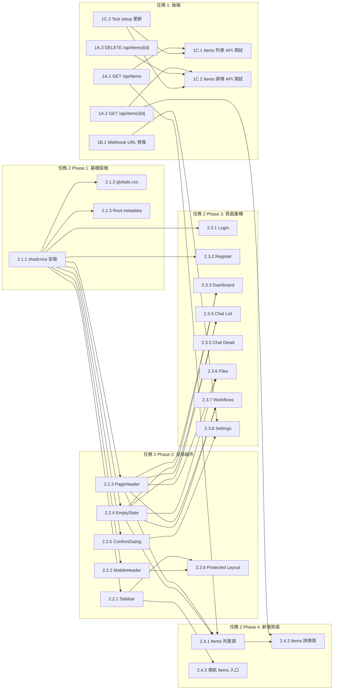

# 功能規劃：Hedy.ai 整合完善 + 前端 UI 重構

**規劃時間**：2026-03-11
**預估工作量**：52 任務點

---

## 1. 功能概述

### 1.1 目標

完成 Hedy.ai 整合的後端缺失部分（Items API + Webhook URL 修復 + 測試），並將整個前端從 MVP 級別提升至生產級 SaaS 品質，使用 shadcn/ui 組件庫統一設計語言，實現完整的響應式支持。

### 1.2 範圍

**包含**：
- Items CRUD API（GET 列表、GET 詳情、DELETE）
- Settings 頁面 Webhook URL 硬編碼修復
- Items API Vitest 測試（與現有 6 個測試 pattern 一致）
- shadcn/ui 初始化及 17 個核心組件安裝
- globals.css 設計令牌更新
- 全局佈局重構（Sidebar active state + 手機端 Sheet）
- 7 個現有頁面視覺升級（Login、Register、Dashboard、Chat List、Chat Detail、Files、Workflows、Settings）
- 2 個新增頁面（Items 列表、Items 詳情）
- 共用組件抽取（PageHeader、EmptyState、ConfirmDialog、StatusBadge）

**不包含**：
- 暗色模式（預留變量但不實現）
- 全局搜索（Cmd+K）
- Chat 重命名/刪除功能的後端 API（僅 UI 預留）
- 文件拖放上傳（Phase 2）
- Action Item checkbox 狀態持久化（需後端支持）

### 1.3 技術約束
- Next.js 16 App Router + React 19 + Tailwind CSS 4 + TypeScript strict
- shadcn/ui 最新版（需 `cn()` helper + `@radix-ui` 依賴）
- Vitest 4.x 測試框架，pattern 與 `src/__tests__/` 目錄結構一致
- Supabase RLS 確保 tenant_id 隔離
- 所有 API 端點需先驗證 `supabase.auth.getUser()` 再查 `chainthings_profiles.tenant_id`

---

## 2. WBS 任務分解

### 2.1 分解結構圖

```mermaid
graph TD
    ROOT["Hedy.ai 整合 + 前端重構"] --> T1["任務 1: 後端 — Hedy.ai 整合完善"]
    ROOT --> T2["任務 2: 前端 — UI 重構"]

    T1 --> T1A["Items API"]
    T1 --> T1B["Webhook URL 修復"]
    T1 --> T1C["測試覆蓋"]

    T1A --> T1A1["GET /api/items"]
    T1A --> T1A2["GET /api/items/[id]"]
    T1A --> T1A3["DELETE /api/items/[id]"]

    T2 --> T2P1["Phase 1: 基礎設施"]
    T2 --> T2P2["Phase 2: 全局組件+佈局"]
    T2 --> T2P3["Phase 3: 頁面重構"]
    T2 --> T2P4["Phase 4: 新增頁面"]

    T2P1 --> T2P1A["shadcn/ui 初始化"]
    T2P1 --> T2P1B["globals.css 令牌"]
    T2P1 --> T2P1C["Root metadata"]

    T2P2 --> T2P2A["Sidebar"]
    T2P2 --> T2P2B["MobileHeader"]
    T2P2 --> T2P2C["PageHeader"]
    T2P2 --> T2P2D["Protected Layout"]
    T2P2 --> T2P2E["共用組件"]

    T2P3 --> T2P3A["Auth 頁面"]
    T2P3 --> T2P3B["Dashboard"]
    T2P3 --> T2P3C["Chat List"]
    T2P3 --> T2P3D["Chat Detail"]
    T2P3 --> T2P3E["Files"]
    T2P3 --> T2P3F["Workflows"]
    T2P3 --> T2P3G["Settings"]

    T2P4 --> T2P4A["Items 列表頁"]
    T2P4 --> T2P4B["Items 詳情頁"]
    T2P4 --> T2P4C["導航添加 Items"]
```



### 2.2 任務清單

---

#### 任務 1: 後端 — Hedy.ai 整合完善（10 任務點）

---

##### 模組 1A: Items API（6 任務點）

**任務 1A.1：GET /api/items — 列表查詢**（2 點）

**文件**: `src/app/api/items/route.ts`

- [ ] 創建 `route.ts`，實現 `GET` handler
- **輸入**：Query params: `type` (可選過濾)、`page` (默認 1)、`limit` (默認 20)、`sort` (默認 `created_at`)、`order` (默認 `desc`)
- **輸出**：`{ data: Item[], pagination: { page, limit, total } }`
- **關鍵步驟**：
  1. 認證 — `createClient()` → `getUser()` → 401 if null
  2. 取 profile — `chainthings_profiles` → `tenant_id` → 404 if null
  3. 解析 `nextUrl.searchParams` 取 type/page/limit/sort/order
  4. 構建 Supabase query：`from("chainthings_items").select("*", { count: "exact" }).eq("tenant_id", tenantId)`
  5. 條件 `.eq("type", type)` if type param exists
  6. `.order(sort, { ascending: order === "asc" })`
  7. `.range((page-1)*limit, page*limit - 1)`
  8. 返回 data + pagination（total 來自 count）

**任務 1A.2：GET /api/items/[id] — 單個詳情**（2 點）

**文件**: `src/app/api/items/[id]/route.ts`

- [ ] 創建 `[id]/route.ts`，實現 `GET` handler
- **輸入**：URL param `id` (UUID)
- **輸出**：`{ data: Item }` 或 404
- **關鍵步驟**：
  1. 認證 + 取 tenant_id（同上 pattern）
  2. 從 route params 提取 `id`（Next.js 16: `context.params.id`）
  3. `from("chainthings_items").select("*").eq("id", id).eq("tenant_id", tenantId).single()`
  4. 若 data 為 null → 404 `{ error: "Item not found" }`
  5. 返回 `{ data }`

**任務 1A.3：DELETE /api/items/[id] — 刪除**（2 點）

**文件**: `src/app/api/items/[id]/route.ts`（同文件添加 DELETE export）

- [ ] 在同文件中添加 `DELETE` handler
- **輸入**：URL param `id` (UUID)
- **輸出**：`{ success: true }` 或 404
- **關鍵步驟**：
  1. 認證 + 取 tenant_id
  2. 先查詢確認 item 存在且屬於該 tenant：`.select("id").eq("id", id).eq("tenant_id", tenantId).single()`
  3. 若不存在 → 404
  4. 若有 `storage_path`，刪除 Supabase Storage 中的文件
  5. `.delete().eq("id", id).eq("tenant_id", tenantId)`
  6. 返回 `{ success: true }`

---

##### 模組 1B: Webhook URL 修復（1 任務點）

**任務 1B.1：移除 Settings 頁面的硬編碼端口拼接**（1 點）

**文件**: `src/app/(protected)/settings/page.tsx`

- [ ] 修復 Webhook URL 顯示邏輯
- **輸入**：現有 settings/page.tsx 第 41-48 行（hardcoded `:5678` 拼接）
- **輸出**：使用 setup API 返回的 webhookUrl
- **關鍵步驟**：
  1. **刪除** `loadIntegrations` 中第 41-48 行的 URL 拼接邏輯：
     ```
     // 移除這段
     const n8nUrl = window.location.protocol + "//" + window.location.hostname + ":5678";
     setWebhookUrl(`${n8nUrl}/webhook/hedy-${hedy.config?.tenant_id || "..."}`);
     ```
  2. **替換為**：當 `hedy.config?.n8n_workflow_id` 存在時，調用 setup API 取回 webhookUrl：
     ```typescript
     if (hedy.config?.n8n_workflow_id) {
       const setupRes = await fetch("/api/integrations/hedy/setup", { method: "POST" });
       const setupJson = await setupRes.json();
       if (setupJson.data?.webhookUrl) {
         setWebhookUrl(setupJson.data.webhookUrl);
       }
     }
     ```
  3. 這樣 webhookUrl 由後端的 `N8N_API_URL` 環境變量決定，不依賴客戶端 hostname

---

##### 模組 1C: 測試覆蓋（3 任務點）

**任務 1C.1：Items 列表 API 測試**（1 點）

**文件**: `src/app/api/items/route.test.ts`

- [ ] 編寫 GET /api/items 測試
- **輸入**：mock supabase client + mock items data
- **輸出**：6-8 個測試用例
- **測試用例**：
  1. 未認證 → 401
  2. Profile 不存在 → 404
  3. 返回空列表 → 200 `{ data: [], pagination: { total: 0 } }`
  4. 返回 items 列表（驗證 tenant_id 過濾）
  5. type 參數過濾
  6. 分頁參數（page=2, limit=5）
  7. Supabase 錯誤 → 500
- **Mock pattern**：參照 `src/app/api/integrations/hedy/setup/route.test.ts` 使用 `createMockSupabaseClient` + 自定義 `client.from` override

**任務 1C.2：Items 詳情 API 測試**（1 點）

**文件**: `src/app/api/items/[id]/route.test.ts`

- [ ] 編寫 GET + DELETE /api/items/[id] 測試
- **輸入**：mock supabase client
- **輸出**：8-10 個測試用例
- **測試用例（GET）**：
  1. 未認證 → 401
  2. Profile 不存在 → 404
  3. Item 不存在 → 404
  4. Item 屬於其他 tenant → 404（tenant 隔離驗證）
  5. 成功返回 item 詳情
- **測試用例（DELETE）**：
  1. 未認證 → 401
  2. Item 不存在 → 404
  3. 成功刪除 → `{ success: true }`
  4. Supabase 錯誤 → 500

**任務 1C.3：更新 test setup mock**（1 點）

**文件**: `src/__tests__/setup.ts`, `src/__tests__/helpers.ts`

- [ ] 確保 test helpers 支持 Items API 測試需求
- **關鍵步驟**：
  1. 在 `helpers.ts` 中確認 `createGetRequest` 支持帶 query params 的 URL
  2. 如需要，添加 `createDeleteRequestNoBody` helper（DELETE /api/items/[id] 無 body）
  3. 確保 `setup.ts` 的 mock 不會干擾新 route 的 import

---

#### 任務 2: 前端 — UI 重構（42 任務點）

---

##### Phase 1: 基礎設施（5 任務點）

**任務 2.1.1：安裝 shadcn/ui 及核心組件**（2 點）

**文件**: `components.json`, `src/lib/utils.ts`, `src/components/ui/*.tsx`, `package.json`, `tailwind.config.ts`

- [ ] 初始化 shadcn/ui 並安裝所有必需組件
- **關鍵步驟**：
  1. 執行 `npx shadcn@latest init` — 選擇 New York style, CSS variables, `src/components/ui` 路徑
  2. 確認生成 `components.json` 配置文件
  3. 確認生成 `src/lib/utils.ts`（含 `cn()` helper）
  4. 批量安裝組件：
     ```bash
     npx shadcn@latest add button card badge table sheet tabs dialog input textarea label separator skeleton scroll-area avatar dropdown-menu tooltip alert
     ```
  5. 安裝 `sonner`：`npx shadcn@latest add sonner`
  6. 安裝 `lucide-react` 圖標庫：`npm install lucide-react`
  7. 驗證 `src/components/ui/` 下生成了 17 個組件文件
  8. 確認 `package.json` 新增了 `@radix-ui/*`, `class-variance-authority`, `clsx`, `tailwind-merge`, `lucide-react`, `sonner` 依賴

**任務 2.1.2：更新 globals.css 設計令牌**（2 點）

**文件**: `src/app/globals.css`

- [ ] 替換現有 CSS 為 shadcn/ui 設計令牌系統
- **輸入**：`docs/ui-redesign-spec.md` 2.1 色彩方案
- **輸出**：完整的 CSS 變量定義（僅亮色主題）
- **關鍵步驟**：
  1. 保留 `@import "tailwindcss"` 和 `@theme inline` 區塊
  2. 替換 `:root` 為設計規範中的完整變量集：
     - `--background`, `--foreground`, `--card`, `--popover`, `--primary`, `--secondary`, `--muted`, `--accent`, `--destructive`, `--border`, `--input`, `--ring`, `--radius`
     - `--sidebar-background`, `--sidebar-foreground`, `--sidebar-primary`, `--sidebar-accent`, `--sidebar-border`
  3. **移除** `@media (prefers-color-scheme: dark)` 區塊（本次不實現暗色）
  4. 更新 `@theme inline` 區塊以引用新變量
  5. 添加 shadcn/ui 所需的 `@layer base` 樣式（border-border, body bg/text）

**任務 2.1.3：更新根 layout.tsx metadata**（1 點）

**文件**: `src/app/layout.tsx`

- [ ] 修正 metadata 和添加 Toaster
- **關鍵步驟**：
  1. 修改 `metadata.title` 從 `"Create Next App"` → `"ChainThings"`
  2. 修改 `metadata.description` → `"Multi-tenant AI workspace with chat, files, workflows, and meeting notes"`
  3. 在 `<body>` 內添加 `<Toaster />` 組件（from `sonner` or `@/components/ui/sonner`）

---

##### Phase 2: 全局組件 + 佈局（10 任務點）

**任務 2.2.1：創建 Sidebar 組件**（3 點）

**文件**: `src/components/layout/app-sidebar.tsx`

- [ ] 實現帶 active state 的側邊欄
- **輸入**：`usePathname()` hook, user email
- **輸出**：桌面端固定側邊欄，含導航 + 用戶區
- **組件使用方案**：
  - 外層：`<aside>` + `w-64 border-r border-sidebar-border bg-sidebar-background`
  - Logo：純文字 `<h2>` "ChainThings" + `Link` icon (from lucide)
  - NavItem：自定義組件，使用 `Link` + active 判斷
    - 默認態：`text-muted-foreground hover:bg-sidebar-accent`
    - Active 態：`bg-primary/10 text-primary font-medium` + 左側 `border-l-2 border-primary`
  - 導航項：Dashboard (LayoutDashboard), Chat (MessageSquare), Files (FolderOpen), Workflows (Zap), Meeting Notes (FileText), `<Separator>`, Settings (Settings2)
  - 底部：`<Avatar>` + email + `<DropdownMenu>` (Sign out action via form POST to `/api/auth/signout`)
- **關鍵步驟**：
  1. 創建 `NavItem` 子組件（接受 href, icon, label, isActive）
  2. 使用 `usePathname()` 判斷 active：`pathname === href || pathname.startsWith(href + "/")`
  3. Sidebar 為 client component（需 `usePathname`）
  4. Sign out 使用 form POST 保持與現有 `/api/auth/signout` 一致

**任務 2.2.2：創建 MobileHeader 組件**（2 點）

**文件**: `src/components/layout/mobile-header.tsx`

- [ ] 實現手機端頂部導航欄
- **組件使用方案**：
  - 外層：`<header>` + `md:hidden` + `sticky top-0 z-50 bg-background border-b`
  - 左側：hamburger `<Button variant="ghost" size="icon">` + `<Menu />` icon
  - 中間：App name "ChainThings"
  - 點擊 hamburger 觸發 `<Sheet side="left">`
  - Sheet 內容：複用 Sidebar 的導航內容（提取為 `SidebarContent` 共用組件）
  - Sheet 關閉：點擊導航項自動關閉（`onOpenChange`）
- **關鍵步驟**：
  1. 使用 shadcn `Sheet` + `SheetTrigger` + `SheetContent`
  2. 提取 `SidebarContent` 為獨立組件，Desktop Sidebar 和 Mobile Sheet 共用
  3. 導航點擊後調用 `setOpen(false)` 關閉 Sheet

**任務 2.2.3：創建 PageHeader 組件**（1 點）

**文件**: `src/components/shared/page-header.tsx`

- [ ] 實現統一頁面標題 + 操作區
- **組件使用方案**：
  ```tsx
  interface PageHeaderProps {
    title: string
    description?: string
    children?: React.ReactNode  // 右側操作區 slot
  }
  ```
  - 外層：`flex items-center justify-between mb-6`
  - 左側：`<h1 className="text-2xl font-bold tracking-tight">` + optional `<p className="text-muted-foreground">`
  - 右側：`{children}` (放按鈕等)

**任務 2.2.4：創建 EmptyState 組件**（1 點）

**文件**: `src/components/shared/empty-state.tsx`

- [ ] 實現通用空狀態
- **組件使用方案**：
  ```tsx
  interface EmptyStateProps {
    icon: LucideIcon
    title: string
    description: string
    action?: { label: string; href?: string; onClick?: () => void }
  }
  ```
  - 佈局：`flex flex-col items-center justify-center py-12 text-center`
  - Icon：`h-12 w-12 text-muted-foreground/50 mb-4`
  - Title：`text-lg font-medium`
  - Description：`text-sm text-muted-foreground max-w-sm`
  - Action：shadcn `<Button>` 或 `<Button asChild><Link>`

**任務 2.2.5：創建 ConfirmDialog 組件**（1 點）

**文件**: `src/components/shared/confirm-dialog.tsx`

- [ ] 實現確認操作對話框（替代 `window.confirm`）
- **組件使用方案**：
  ```tsx
  interface ConfirmDialogProps {
    open: boolean
    onOpenChange: (open: boolean) => void
    title: string
    description: string
    confirmLabel?: string  // 默認 "Delete"
    variant?: "destructive" | "default"
    onConfirm: () => void
    loading?: boolean
  }
  ```
  - 使用 shadcn `Dialog` + `DialogContent` + `DialogHeader` + `DialogFooter`
  - 確認按鈕：`<Button variant="destructive">` 或 `<Button>`
  - 取消按鈕：`<Button variant="outline">`

**任務 2.2.6：重構 Protected Layout**（2 點）

**文件**: `src/app/(protected)/layout.tsx`

- [ ] 使用新 Sidebar + MobileHeader 組件替換現有佈局
- **輸入**：現有 layout.tsx（70 行，內聯所有導航）
- **輸出**：精簡的 layout 組件，委託子組件
- **關鍵步驟**：
  1. 保留 server component 做認證檢查（`supabase.auth.getUser()`）
  2. 將 user email 傳給 `<ClientLayout>` wrapper（client component）
  3. `ClientLayout` 渲染：
     - `<AppSidebar>` — `hidden md:flex` 桌面顯示
     - `<MobileHeader>` — `md:hidden` 手機顯示
     - `<main id="main" className="flex-1 overflow-auto">` — `md:ml-64`
  4. 主內容區 padding：`p-4 md:p-6 lg:p-8`

---

##### Phase 3: 頁面重構（20 任務點）

**任務 2.3.1：Login 頁面重構**（2 點）

**文件**: `src/app/(auth)/login/page.tsx`

- [ ] 使用 shadcn 組件替換原始 HTML
- **組件使用方案**：
  - 外層背景：`bg-muted/50 min-h-screen flex items-center justify-center`
  - `<Card className="w-full max-w-sm shadow-md">`
    - `<CardHeader>` — Logo 文字 + `<CardDescription>` "Sign in to your account"
    - `<CardContent>` — 表單
      - `<Label htmlFor="email">` + `<Input id="email" type="email">`
      - `<Label htmlFor="password">` + `<Input id="password" type="password">`
      - 錯誤：`<Alert variant="destructive">` (替代 `<p className="text-red-600">`)
      - 提交：`<Button className="w-full" disabled={loading}>`，loading 時顯示 `<Loader2 className="animate-spin" />` + "Signing in..."
    - `<CardFooter>` — Link to register
- **注意**：保持所有 `useState` + `handleLogin` 邏輯不變，只改 JSX

**任務 2.3.2：Register 頁面重構**（1 點）

**文件**: `src/app/(auth)/register/page.tsx`

- [ ] 使用與 Login 相同的組件方案
- **與 Login 的差異**：
  - 標題："Create an account"
  - 多一個 Username 字段：`<Label>` + `<Input>`
  - 按鈕文字："Register" / "Creating account..."
  - Footer link：指向 `/login`
- **可選優化**：提取 `AuthLayout` 共用外層（Card + 背景）

**任務 2.3.3：Dashboard 頁面重構**（3 點）

**文件**: `src/app/(protected)/dashboard/page.tsx`

- [ ] 添加統計卡片 + 快捷操作 + 升級服務卡片
- **組件使用方案**：
  - `<PageHeader title="Dashboard" description="Welcome back, {displayName}" />`
  - **統計概覽**（新增，需 API 調用）：
    - `grid grid-cols-2 lg:grid-cols-4 gap-4`
    - 4 個 `<Card>` — 每個含 icon + label + value + change text
    - 數據來源：各表 `select("id", { count: "exact", head: true })`
    - 創建 `StatCard` 組件：`src/components/shared/stat-card.tsx`
      ```tsx
      interface StatCardProps {
        icon: LucideIcon; label: string; value: number | string; change?: string; href?: string
      }
      ```
  - **快捷操作**：
    - `flex flex-wrap gap-3`
    - `<Button variant="outline" asChild><Link href="/chat/new">` + Plus icon
    - Upload file button, Create workflow link
  - **外部服務**（保留現有，升級樣式）：
    - `grid grid-cols-1 md:grid-cols-3 gap-4`
    - 每個用 `<Card>` + `<CardHeader>` + `<CardContent>` + `<Button variant="link" asChild><a>`
- **關鍵步驟**：
  1. 頁面需改為同時 fetch 統計數據（server component 中直接查 count）
  2. 創建 `StatCard` 共用組件
  3. 外部服務 URL 從環境變量或配置讀取（可先保持 localhost 硬編碼）

**任務 2.3.4：Chat List 頁面重構**（2 點）

**文件**: `src/app/(protected)/chat/page.tsx`

- [ ] 卡片化 + EmptyState
- **組件使用方案**：
  - `<PageHeader title="Chat">` + `<Button asChild><Link href="/chat/new">` `<Plus />` "New conversation" `</Link></Button>`
  - 列表：`space-y-3`，每項用 `<Card className="hover:border-primary/50 transition-colors cursor-pointer">`
    - `<CardHeader className="flex-row items-center gap-3 p-4">`
    - 左側 `<MessageSquare className="h-5 w-5 text-muted-foreground" />`
    - 中間 title + timestamp（relative: `timeAgo()` helper）
    - 右側 `<DropdownMenu>` 三點按鈕（預留 Rename/Delete menu items）
  - 空狀態：`<EmptyState icon={MessageSquare} title="No conversations yet" description="Start your first AI chat" action={{ label: "New conversation", href: "/chat/new" }} />`
- **注意**：保持 server component，數據查詢不變

**任務 2.3.5：Chat Detail 頁面重構**（3 點）

**文件**: `src/app/(protected)/chat/[id]/page.tsx` (需確認實際路徑)

- [ ] 消息氣泡美化 + loading 動畫 + ScrollArea
- **組件使用方案**：
  - **ChatHeader**（sticky top）：
    - `<Button variant="ghost" size="icon" className="md:hidden">` ArrowLeft（返回列表）
    - Conversation title
    - DropdownMenu（...）
  - **MessageList**：
    - `<ScrollArea className="flex-1">`
    - AI 消息：左對齊，`bg-muted rounded-lg p-3`，Avatar (Bot icon)
    - User 消息：右對齊，`bg-primary text-primary-foreground rounded-lg p-3`
    - Timestamp：`text-xs text-muted-foreground`
    - Streaming indicator：3 個跳動圓點動畫
  - **ChatInput**（sticky bottom）：
    - `<Textarea>` 自動增高（`min-h-[44px] max-h-[120px] resize-none`）
    - `<Button size="icon">` Send icon，disabled when empty or streaming
  - 創建子組件：
    - `src/components/chat/message-bubble.tsx`
    - `src/components/chat/chat-input.tsx`

**任務 2.3.6：Files 頁面重構**（3 點）

**文件**: `src/app/(protected)/files/page.tsx`

- [ ] shadcn Table（桌面）+ Card list（手機）+ 上傳改進
- **組件使用方案**：
  - `<PageHeader title="Files">` + Upload button（同現有，改用 `<Button>`）
  - **桌面端**（`hidden md:block`）：
    - shadcn `<Table>` + `<TableHeader>` + `<TableRow>` + `<TableCell>`
    - 列：Name（icon by type + filename）、Type（`<Badge variant="secondary">`）、Size、Uploaded（relative date）、Actions（`<DropdownMenu>`: Download / Delete）
  - **手機端**（`md:hidden`）：
    - `<Card>` list，每卡片含 filename + meta row (type + size + date) + DropdownMenu
  - **上傳狀態**：
    - uploading 時 Button 顯示 `<Loader2 className="animate-spin" />` + "Uploading..."
    - 錯誤用 `toast.error()` (sonner) 替代內聯 `<p>`
    - 成功用 `toast.success("File uploaded")`
  - **刪除**：使用 `<ConfirmDialog>` 替代（目前無刪除功能，可預留 UI）
  - **空狀態**：`<EmptyState icon={Upload} title="No files uploaded yet" description="Upload your first file to get started" />`
  - **Loading**：`<Skeleton>` rows (3-5 個)
- **關鍵步驟**：
  1. 添加 `getFileIcon()` helper 映射 content_type → lucide icon
  2. 添加相對時間 helper（或使用簡單的 date formatting）
  3. 保持 `useCallback` + `useEffect` 數據加載邏輯

**任務 2.3.7：Workflows 頁面重構**（3 點）

**文件**: `src/app/(protected)/workflows/page.tsx`

- [ ] 生成區卡片化 + Badge 狀態 + 視覺分離
- **組件使用方案**：
  - `<PageHeader title="Workflows" />`
  - **生成區**：
    - `<Card className="bg-muted/50 border-dashed">`
    - `<CardHeader>` — `<Zap />` icon + "Create a new workflow with AI"
    - `<CardContent>` — `<Textarea>` (替代原始 textarea)
    - `<CardFooter>` — `<Button disabled={generating || !prompt.trim()}>` + error `<Alert>`
  - **工作流列表**：`space-y-3`
    - 每項 `<Card>`：
      - `<CardHeader>` — title + `<Badge>` status
      - Badge 映射：
        - `active` → `<Badge className="bg-green-100 text-green-800">Active</Badge>`
        - `pending` → `<Badge variant="secondary">Pending</Badge>`
        - `generating` → `<Badge variant="outline">` + `<Loader2 className="animate-spin h-3 w-3 mr-1" />` "Generating"
        - `error` → `<Badge variant="destructive">Error</Badge>`
      - `<CardContent>` — description
      - `<CardFooter>` — date + `<Button variant="link" asChild><a>Open in n8n</a></Button>`
  - **空狀態**：`<EmptyState icon={Zap} title="No workflows yet" description="Describe one above and let AI generate it!" />`
  - **提交反饋**：成功用 `toast.success()`，錯誤用 `toast.error()`

**任務 2.3.8：Settings 頁面重構**（3 點）

**文件**: `src/app/(protected)/settings/page.tsx`

- [ ] shadcn 組件替換 + Dialog 確認 + toast 反饋
- **組件使用方案**：
  - `<PageHeader title="Settings" />`
  - **Hedy.ai Card**：
    - `<Card>`
    - `<CardHeader>` — icon + "Hedy.ai" title + description + `<Button variant="ghost" size="sm" className="text-destructive">Remove</Button>`
    - `<Separator />`
    - `<CardContent className="space-y-6">`
      - Step 1：`<Label>` + `<div className="flex gap-2">` `<Input type="password">` + `<Button>Save</Button>`
      - Step 2：`<Label>` + `<p className="text-xs text-muted-foreground">` + `<Button>` or `<Badge className="bg-green-100 text-green-800">Active</Badge>`
      - Webhook URL：`<Label>` + `<code className="bg-muted px-3 py-2 rounded text-xs">` + `<Button variant="outline" size="sm">` Copy（點擊後圖標從 Copy 變 Check，1.5 秒後恢復）
  - **刪除確認**：使用 `<ConfirmDialog>` 替代 `window.confirm()`
  - **反饋**：用 `toast.success()` / `toast.error()` 替代頁面內 Alert div
  - **Loading**：按鈕 disabled + `<Loader2 className="animate-spin" />`

---

##### Phase 4: 新增頁面（7 任務點）

**任務 2.4.1：Items 列表頁**（3 點）

**文件**: `src/app/(protected)/items/page.tsx`

- [ ] 實現按日期分組的會議筆記列表
- **組件使用方案**：
  - `<PageHeader title="Meeting Notes">` + Sort dropdown（`<DropdownMenu>`）
  - **日期分組列表**：
    - 按日期分組 items：helper `groupByDate(items)` → `{ "Today": [...], "Yesterday": [...], "March 8, 2026": [...] }`
    - 每組：
      - `<h3 className="text-sm font-medium text-muted-foreground sticky top-0 bg-background py-2">` 日期標題
      - `<div className="space-y-3">` 卡片列表
    - 每卡片 `<Card className="cursor-pointer hover:border-primary/50 transition-colors">`：
      - `<CardHeader>` — title（Link to `/items/[id]`）
      - `<CardContent>` — summary 截斷 2 行（`line-clamp-2 text-sm text-muted-foreground`）
      - `<CardFooter>` — participants (`<Users />` icon + count) + duration (`<Clock />` icon + "45 min") + time ("10:30 AM")
  - **空狀態**：`<EmptyState icon={FileText} title="No meeting notes yet" description="Connect Hedy.ai in Settings to automatically capture meeting notes" action={{ label: "Go to Settings", href: "/settings" }} />`
  - **Loading**：3-4 個 `<Skeleton className="h-32" />`
  - **數據獲取**：`fetch("/api/items?type=meeting_note")` 或直接 Supabase client query
- **關鍵步驟**：
  1. 客戶端組件（需 loading state + fetch）
  2. 實現 `groupByDate()` helper：比較 today/yesterday/formatted date
  3. 從 `metadata` JSONB 提取 participants count 和 duration
  4. 創建 `MeetingNoteCard` 子組件：`src/components/items/meeting-note-card.tsx`

**任務 2.4.2：Items 詳情頁**（3 點）

**文件**: `src/app/(protected)/items/[id]/page.tsx`

- [ ] 實現 Tabs 切換的會議筆記詳情
- **組件使用方案**：
  - **頁面頂部**：
    - `<Button variant="ghost" asChild><Link href="/items">` ArrowLeft "Back to Notes"
    - `<h1>` meeting title
    - Meta row：date + time + duration + participants（`<Avatar>` group or text list）
  - **Tabs**（shadcn `Tabs`）：
    - `<Tabs defaultValue="summary">`
    - `<TabsList>` — Summary / Action Items / Transcript
    - **Summary TabContent**：
      - Key Points：`<Card>` + `<ul className="space-y-2">` 每項帶圓點
      - Full Summary：`<div className="prose prose-sm max-w-none">` 長文本
    - **Action Items TabContent**：
      - 每項：checkbox + assignee (bold) + description + due date
      - Checkbox 為純展示（本期不做持久化）
    - **Transcript TabContent**：
      - `<ScrollArea className="h-[60vh]">`
      - 每條：`[timestamp]` (monospace, muted) + speaker (bold, colored) + text
  - **數據獲取**：`fetch("/api/items/${id}")` → 解析 `content` 和 `metadata` JSONB
  - **404**：`<EmptyState icon={FileText} title="Note not found" action={{ label: "Back to Notes", href: "/items" }} />`
- **關鍵步驟**：
  1. 客戶端組件（需 fetch by id）
  2. 解析 `metadata` JSONB 結構：假設包含 `{ keyPoints: string[], actionItems: ActionItem[], transcript: TranscriptEntry[], participants: Participant[], duration: string }`
  3. `content` 字段作為 full summary text
  4. 創建子組件：
     - `src/components/items/action-item.tsx`
     - `src/components/items/transcript-entry.tsx`

**任務 2.4.3：導航添加 Items 入口**（1 點）

**文件**: `src/components/layout/app-sidebar.tsx`

- [ ] 在 Sidebar 導航中添加 "Meeting Notes" 入口
- **位置**：Workflows 和 Separator 之間
- **圖標**：`FileText` from lucide-react
- **href**：`/items`
- **label**：`"Meeting Notes"`
- **注意**：此任務在 Sidebar 組件（任務 2.2.1）中已包含，此處標記為確認項

---

## 3. 依賴關係

### 3.1 依賴圖



### 3.2 依賴說明

| 任務 | 依賴於 | 原因 |
|------|--------|------|
| 2.1.2 globals.css | 2.1.1 shadcn 安裝 | CSS 變量格式需配合 shadcn 配置 |
| 2.2.1 Sidebar | 2.1.1 shadcn 安裝 | 使用 Separator, Avatar, DropdownMenu 組件 |
| 2.2.2 MobileHeader | 2.1.1 shadcn 安裝 | 使用 Sheet, Button 組件 |
| 2.2.6 Protected Layout | 2.2.1 + 2.2.2 | 需要 Sidebar 和 MobileHeader 組件 |
| 2.3.1-2.3.2 Auth 頁面 | 2.1.1 shadcn 安裝 | 使用 Card, Input, Label, Button, Alert |
| 2.3.3-2.3.7 各頁面 | 2.2.3 PageHeader + 2.2.4 EmptyState | 所有頁面使用這兩個共用組件 |
| 2.3.8 Settings | 2.2.5 ConfirmDialog + 1B.1 Webhook 修復 | 需要 Dialog 替代 confirm()，且包含 URL 修復 |
| 2.4.1 Items 列表 | 1A.1 GET /api/items | 前端需要後端 API 提供數據 |
| 2.4.2 Items 詳情 | 1A.2 GET /api/items/[id] + 2.4.1 | 需要詳情 API + 列表頁先完成導航 |
| 1C.1 列表測試 | 1A.1 GET /api/items | 測試需要 API 實現完成 |
| 1C.2 詳情測試 | 1A.2 + 1A.3 | 測試需要 GET + DELETE 實現完成 |

### 3.3 並行任務

以下任務組之間無依賴，可並行開發：

**並行組 A（可同時啟動）**：
- **任務 1A (全部 Items API)** -- 後端開發
- **任務 2.1.1 (shadcn/ui 安裝)** -- 前端基礎設施

**並行組 B（Phase 1 完成後）**：
- **任務 2.2.1 Sidebar** ∥ **任務 2.2.2 MobileHeader** ∥ **任務 2.2.3 PageHeader** ∥ **任務 2.2.4 EmptyState** ∥ **任務 2.2.5 ConfirmDialog**

**並行組 C（Phase 2 完成後）**：
- **任務 2.3.1 Login** ∥ **任務 2.3.2 Register** ∥ **任務 2.3.3 Dashboard** ∥ **任務 2.3.4 Chat List** ∥ **任務 2.3.5 Chat Detail** ∥ **任務 2.3.6 Files** ∥ **任務 2.3.7 Workflows**

**並行組 D（API 完成後）**：
- **任務 1C.1 列表測試** ∥ **任務 1C.2 詳情測試**

**並行組 E（跨任務）**：
- **任務 1B.1 Webhook URL 修復** 可隨時進行（獨立）
- **任務 1C.3 Test setup 更新** 可隨時進行（獨立）

---

## 4. 實施建議

### 4.1 技術選型

| 需求 | 推薦方案 | 理由 |
|------|----------|------|
| UI 組件庫 | shadcn/ui (latest) | 與 Tailwind 4 + React 19 兼容，無運行時開銷，可定制性強 |
| 圖標 | lucide-react | shadcn/ui 官方推薦，tree-shakable |
| Toast 通知 | sonner (via shadcn) | 輕量、動畫流暢、SSR 友好 |
| 時間格式化 | 自建 `timeAgo()` helper | 避免引入 date-fns/dayjs，需求簡單 |
| CSS 變量系統 | HSL 格式 (shadcn standard) | shadcn 組件內部依賴 HSL 格式變量 |
| 測試框架 | Vitest 4.x (已有) | 保持一致 |

### 4.2 潛在風險

| 風險 | 影響 | 緩解措施 |
|------|------|----------|
| shadcn/ui 與 Tailwind CSS 4 兼容問題 | 高 | 先執行 `npx shadcn@latest init` 確認無報錯，參考 shadcn 的 Tailwind v4 遷移文檔 |
| `metadata` JSONB 結構不確定 | 中 | Items 詳情頁做防禦性解析，所有字段用 optional chaining + fallback |
| Protected Layout 改為 client+server 混合後 SSR 行為變化 | 中 | 保持認證邏輯在 server component，只將 UI 部分委託給 client component |
| n8n webhook URL 環境變量在不同部署環境值不同 | 中 | setup API 已正確使用 `N8N_API_URL` env var，前端不再拼接 |
| 頁面重構期間功能回歸 | 低 | 每頁重構保持所有 state/fetch 邏輯不變，僅替換 JSX |
| shadcn Sheet 組件在 Next.js 16 server component 中使用 | 低 | Sheet 在 client component (MobileHeader) 中使用，不在 server component |

### 4.3 測試策略

- **單元測試**：
  - `src/app/api/items/route.test.ts` — GET /api/items（7 用例）
  - `src/app/api/items/[id]/route.test.ts` — GET + DELETE /api/items/[id]（9 用例）
  - 使用現有 `createMockSupabaseClient` + `getJsonResponse` helpers
  - mock pattern 與 `hedy/setup/route.test.ts` 一致

- **集成測試**（本期不做，Phase 2 考慮）：
  - API 端點 + Supabase RLS 實際驗證
  - 前端 fetch → API → mock Supabase 全鏈路

- **手動驗收測試**：
  - 每個重構頁面在桌面 (1440px) + 手機 (375px) 兩個尺寸驗證
  - 側邊欄 active state 在所有路由切換時正確高亮
  - Sheet 在手機端點擊導航後正確關閉
  - Toast 通知在 Settings 操作後正確顯示
  - Items 列表正確按日期分組
  - Items 詳情 Tabs 正確切換

---

## 5. 驗收標準

### 5.1 任務 1 驗收

- [ ] `GET /api/items` 返回分頁列表，支持 `type` 過濾
- [ ] `GET /api/items?type=meeting_note` 正確過濾
- [ ] `GET /api/items/[id]` 返回單個 item，不同 tenant 的 item 返回 404
- [ ] `DELETE /api/items/[id]` 成功刪除，不同 tenant 的 item 返回 404
- [ ] Settings 頁面 webhook URL 來自 setup API，不再客戶端拼接 `:5678`
- [ ] `npm run test` 通過，Items API 有 16+ 個測試用例
- [ ] 所有 API 端點未認證返回 401

### 5.2 任務 2 驗收

- [ ] shadcn/ui 已初始化，17 個組件已安裝在 `src/components/ui/`
- [ ] `src/lib/utils.ts` 包含 `cn()` helper
- [ ] `globals.css` 包含完整 CSS 變量，無暗色模式覆蓋
- [ ] Root `<title>` 為 "ChainThings"
- [ ] `<Toaster />` 已添加到根 layout
- [ ] 側邊欄在所有路由顯示正確的 active state（primary 色 + 左側指示條）
- [ ] 手機端（< 768px）側邊欄隱藏，顯示 hamburger 按鈕
- [ ] 手機端點擊 hamburger 打開 Sheet 側邊欄
- [ ] 所有頁面使用 `<PageHeader>` 組件
- [ ] 所有空列表使用 `<EmptyState>` 組件（含圖標 + CTA）
- [ ] 所有按鈕統一使用 shadcn `<Button>`（無內聯 className 按鈕）
- [ ] 所有輸入框統一使用 shadcn `<Input>` / `<Textarea>`
- [ ] Auth 頁面使用 `<Card>` 佈局，有品牌感
- [ ] Dashboard 顯示 4 個統計卡片 + 快捷操作
- [ ] Files 頁桌面用 `<Table>`，手機用 Card list
- [ ] Workflow 狀態使用 `<Badge>` 組件（4 種狀態顏色）
- [ ] Settings 刪除操作使用 `<ConfirmDialog>`（不再使用 `window.confirm`）
- [ ] Settings 操作反饋使用 sonner toast
- [ ] Items 列表頁存在，按日期分組顯示卡片
- [ ] Items 詳情頁存在，有 Summary / Action Items / Transcript 三個 Tab
- [ ] 導航側邊欄包含 "Meeting Notes" 入口
- [ ] `npm run build` 無 TypeScript 錯誤
- [ ] `npm run lint` 無 ESLint 錯誤

---

## 6. 推薦實施順序

```
Day 1:  任務 1A (Items API 全部) + 任務 2.1.1 (shadcn 安裝)  [並行]
Day 2:  任務 2.1.2-2.1.3 (CSS + metadata) + 任務 1C (測試)  [並行]
Day 3:  任務 2.2 (全局組件 + Layout 全部)
Day 4:  任務 2.3.1-2.3.4 (Auth + Dashboard + Chat List)
Day 5:  任務 2.3.5-2.3.6 (Chat Detail + Files)
Day 6:  任務 2.3.7-2.3.8 (Workflows + Settings) + 任務 1B.1 (Webhook 修復)
Day 7:  任務 2.4 (Items 列表 + 詳情 + 導航)
Day 8:  驗收測試 + 響應式修復 + 最終打磨
```

---

## 7. 後續優化方向（Phase 2）

- 暗色模式支持（CSS 變量已預留）
- 全局搜索（Cmd+K with `command` 組件）
- 文件拖放上傳（`<UploadDropZone>` 組件）
- Chat 重命名/刪除 API + UI
- Action Item checkbox 持久化（需 PATCH /api/items/[id] 端點）
- 文件預覽（PDF viewer, 圖片預覽）
- `<Progress>` 組件顯示文件上傳百分比
- Dashboard 統計數據自動刷新（SWR/React Query）
- Breadcrumb 導航
- 頁面級 Loading UI（`loading.tsx`）
