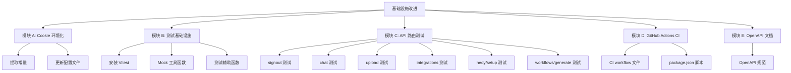
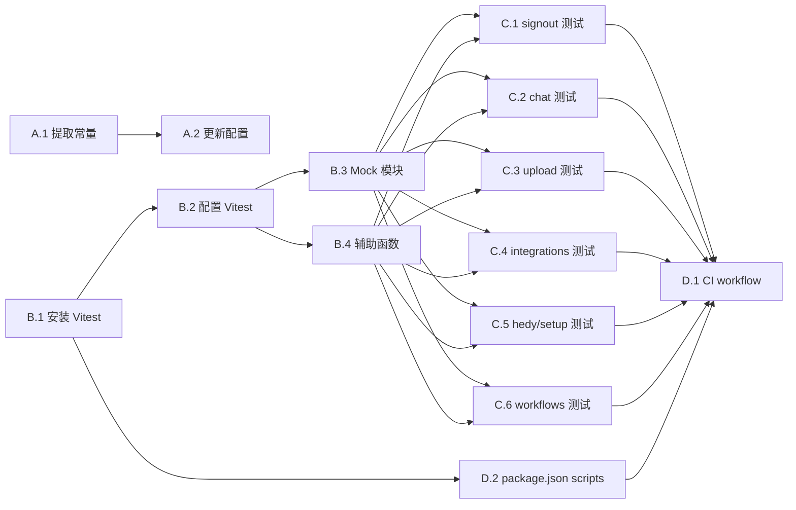

# 功能规划：ChainThings 基础设施改进

**规划时间**：2026-03-11
**预估工作量**：34 任务点
**优先级排序**：Cookie 环境化 > 单元/集成测试 > GitHub Actions CI > OpenAPI 文档

---

## 1. 功能概述

### 1.1 目标

解决 ChainThings 项目的四个基础设施缺口：硬编码 Cookie 名称、零测试覆盖、缺少 CI/CD 管线、API 文档缺失。这些改进将提升项目的可部署性、可维护性和可协作性。

### 1.2 范围

**包含**：
- Cookie 名称从硬编码提取为环境变量
- 使用 Vitest 为 6 个 API 路由编写单元/集成测试
- 配置 GitHub Actions CI 管线（lint/typecheck/test/build）
- 为 6 个 API 端点编写 OpenAPI 3.0 规范文档

**不包含**：
- E2E 测试（Playwright/Cypress）
- CD 部署流水线（自动部署到生产环境）
- 前端组件测试
- API 文档的交互式 UI（如 Swagger UI 页面集成）

### 1.3 技术约束
- Next.js 16.1.6 App Router，TypeScript strict 模式
- Node.js 22（与 Dockerfile 一致）
- ESM 模块系统（Vitest 原生支持）
- 测试需 mock 三个外部依赖：Supabase、OpenClaw、n8n
- CI 无需真实外部服务连接

---

## 2. WBS 任务分解

### 2.1 分解结构图



### 2.2 任务清单

---

#### 模块 A：Cookie 名称环境化（2 任务点）

##### 任务 A.1：提取 Cookie 名称为共享常量（1 点）

**文件**：`src/lib/supabase/constants.ts`（新建）

- [ ] 创建 `src/lib/supabase/constants.ts`
  - **输入**：环境变量 `SUPABASE_COOKIE_NAME`
  - **输出**：导出常量 `SUPABASE_COOKIE_NAME`
  - **关键步骤**：
    1. 定义 `export const SUPABASE_COOKIE_NAME = process.env.SUPABASE_COOKIE_NAME || "sb-localhost-auth-token";`

**文件**：`src/middleware.ts`（修改）

- [ ] 将 `"sb-localhost-auth-token"` 替换为导入的 `SUPABASE_COOKIE_NAME` 常量
  - **关键步骤**：
    1. 添加 `import { SUPABASE_COOKIE_NAME } from "@/lib/supabase/constants";`
    2. 将第 14 行 `name: "sb-localhost-auth-token"` 改为 `name: SUPABASE_COOKIE_NAME`

**文件**：`src/lib/supabase/server.ts`（修改）

- [ ] 将 `"sb-localhost-auth-token"` 替换为导入的 `SUPABASE_COOKIE_NAME` 常量
  - **关键步骤**：
    1. 添加 `import { SUPABASE_COOKIE_NAME } from "./constants";`
    2. 将第 12 行 `name: "sb-localhost-auth-token"` 改为 `name: SUPABASE_COOKIE_NAME`

##### 任务 A.2：更新环境配置文件（1 点）

**文件**：`.env.example`（修改）

- [ ] 添加 `SUPABASE_COOKIE_NAME=sb-localhost-auth-token`
  - **关键步骤**：
    1. 在 Supabase 配置段添加新行及注释

**文件**：`docker-compose.yml`（修改）

- [ ] 在 `environment` 段添加 `SUPABASE_COOKIE_NAME` 环境变量
  - **关键步骤**：
    1. 添加 `- SUPABASE_COOKIE_NAME=${SUPABASE_COOKIE_NAME:-sb-localhost-auth-token}`

---

#### 模块 B：测试基础设施搭建（4 任务点）

##### 任务 B.1：安装 Vitest 及相关依赖（1 点）

**文件**：`package.json`（修改）

- [ ] 安装 devDependencies
  - **输入**：无
  - **输出**：更新 package.json 和 package-lock.json
  - **关键步骤**：
    1. `npm install -D vitest @vitejs/plugin-react`
    2. 添加 scripts: `"test": "vitest run"`, `"test:watch": "vitest"`, `"test:coverage": "vitest run --coverage"`, `"typecheck": "tsc --noEmit"`

##### 任务 B.2：配置 Vitest（1 点）

**文件**：`vitest.config.ts`（新建）

- [ ] 创建 Vitest 配置文件
  - **输入**：tsconfig.json 的 paths 配置
  - **输出**：可运行的 Vitest 配置
  - **关键步骤**：
    1. 配置 `resolve.alias` 映射 `@/*` 到 `./src/*`
    2. 配置 `test.environment` 为 `"node"`（API 路由测试无需 DOM）
    3. 配置 `test.include` 为 `["src/**/*.test.ts"]`
    4. 配置 `test.globals` 为 `true`（可选）
    5. 设置 `test.setupFiles` 指向全局 setup 文件

##### 任务 B.3：创建 Mock 工具模块（1 点）

**文件**：`src/__tests__/mocks/supabase.ts`（新建）

- [ ] 创建 Supabase client mock 工厂
  - **输入**：`createClient` 函数签名
  - **输出**：可配置的 mock Supabase client
  - **关键步骤**：
    1. Mock `supabase.auth.getUser()` -- 支持返回已认证用户或 null
    2. Mock `supabase.auth.signOut()`
    3. Mock `supabase.from().select().eq().single()` 链式调用（profile 查询）
    4. Mock `supabase.from().insert().select().single()` 链式调用
    5. Mock `supabase.from().upsert().select().single()` 链式调用
    6. Mock `supabase.from().update().eq()` 链式调用
    7. Mock `supabase.from().delete().eq()` 链式调用
    8. Mock `supabase.from().select().eq().order().limit()` 链式调用（消息历史）
    9. Mock `supabase.storage.from().upload()`

**文件**：`src/__tests__/mocks/openclaw.ts`（新建）

- [ ] 创建 OpenClaw client mock
  - **关键步骤**：
    1. Mock `chatCompletion()` -- 返回可配置的 ChatCompletionResponse
    2. 提供工厂函数支持不同场景：正常响应、含 n8n-workflow 代码块、纯文本响应、异常

**文件**：`src/__tests__/mocks/n8n.ts`（新建）

- [ ] 创建 n8n client mock
  - **关键步骤**：
    1. Mock `createWorkflow()` -- 返回含 id/name/active 的 N8nWorkflow 对象
    2. Mock `activateWorkflow()` -- 返回激活后的 workflow
    3. 提供异常场景 mock

##### 任务 B.4：创建测试辅助函数（1 点）

**文件**：`src/__tests__/helpers.ts`（新建）

- [ ] 创建 API 路由测试的公用辅助
  - **输入**：API route handler 函数签名
  - **输出**：简化的请求构造和响应断言工具
  - **关键步骤**：
    1. `createMockRequest(options)` -- 构造 Request 对象（支持 JSON body、FormData、headers）
    2. `createMockFormData(file)` -- 构造含文件的 FormData
    3. `expectJsonResponse(response, status, bodyMatcher)` -- 断言响应格式
    4. `expectRedirect(response, url, status)` -- 断言重定向响应
    5. 提供默认的 mock user 和 profile 数据常量

**文件**：`src/__tests__/setup.ts`（新建）

- [ ] 创建全局 test setup
  - **关键步骤**：
    1. 设置测试环境变量（SUPABASE_COOKIE_NAME, N8N_API_URL 等）
    2. 配置 `vi.mock("@/lib/supabase/server")` 全局 mock
    3. 配置 `vi.mock("next/headers")` 用于 cookies mock

---

#### 模块 C：API 路由测试用例（16 任务点）

##### 任务 C.1：`/api/auth/signout` 测试（1 点）

**文件**：`src/app/api/auth/signout/route.test.ts`（新建）

- [ ] 编写 signout 路由测试
  - **输入**：`POST` handler，mock supabase
  - **输出**：覆盖正常登出和边界情况
  - **测试用例**：
    1. `POST` 调用 `supabase.auth.signOut()` 并返回 302 重定向到 `/login`
    2. 验证重定向 Location header 包含 `/login`
    3. 验证 signOut 被调用一次

##### 任务 C.2：`/api/chat` 测试（4 点）

**文件**：`src/app/api/chat/route.test.ts`（新建）

- [ ] 编写 chat 路由测试
  - **输入**：`POST` handler，mock supabase/openclaw/n8n
  - **输出**：全面覆盖聊天逻辑
  - **测试用例**：
    1. **认证检查**：未认证用户返回 401
    2. **参数校验**：缺少 message 返回 400
    3. **参数校验**：message 为非字符串返回 400
    4. **Profile 查询**：profile 不存在返回 404
    5. **正常聊天**：新对话（无 conversationId）-- 创建对话、保存消息、调用 OpenClaw、保存回复、返回 200
    6. **正常聊天**：已有对话（带 conversationId）-- 跳过创建对话步骤
    7. **n8n 工具模式**：`tool: "n8n"` -- 验证 system prompt 被注入
    8. **n8n 工作流提取**：响应包含 `n8n-workflow` 代码块 -- 解析 JSON、调用 createWorkflow、保存 workflow 记录
    9. **n8n API 失败**：createWorkflow 抛异常 -- 工作流仍保存为 pending 状态
    10. **OpenClaw 异常**：chatCompletion 抛错 -- 返回 502

##### 任务 C.3：`/api/files/upload` 测试（3 点）

**文件**：`src/app/api/files/upload/route.test.ts`（新建）

- [ ] 编写文件上传路由测试
  - **输入**：`POST` handler，mock supabase storage
  - **输出**：覆盖上传全流程
  - **测试用例**：
    1. **认证检查**：未认证返回 401
    2. **Profile 查询**：profile 不存在返回 404
    3. **参数校验**：无文件返回 400
    4. **正常上传**：文件上传到 `{tenant_id}/{timestamp}-{filename}` 路径，元数据写入数据库，返回文件对象
    5. **Storage 失败**：upload 返回 error -- 返回 500
    6. **DB 元数据写入失败**：insert 返回 error -- 返回 500

##### 任务 C.4：`/api/integrations` 测试（3 点）

**文件**：`src/app/api/integrations/route.test.ts`（新建）

- [ ] 编写 integrations 路由测试（GET/POST/DELETE 三个 handler）
  - **输入**：三个 handler，mock supabase
  - **输出**：覆盖 CRUD 操作
  - **测试用例 - GET**：
    1. 未认证返回 401
    2. Profile 不存在返回 404
    3. 正常返回 `{ data: Integration[] }`
    4. 数据库查询失败返回 500
  - **测试用例 - POST**：
    5. 未认证返回 401
    6. 缺少 service 参数返回 400
    7. 正常 upsert 返回集成数据
    8. 数据库 upsert 失败返回 500
  - **测试用例 - DELETE**：
    9. 未认证返回 401
    10. 缺少 id 参数返回 400
    11. 正常删除返回 `{ success: true }`
    12. 数据库删除失败返回 500

##### 任务 C.5：`/api/integrations/hedy/setup` 测试（3 点）

**文件**：`src/app/api/integrations/hedy/setup/route.test.ts`（新建）

- [ ] 编写 Hedy webhook setup 路由测试
  - **输入**：`POST` handler，mock supabase/n8n
  - **输出**：覆盖 webhook 创建全流程
  - **测试用例**：
    1. **认证检查**：未认证返回 401
    2. **Profile 查询**：profile 不存在返回 404
    3. **集成检查**：hedy.ai 集成不存在返回 400（提示先保存 API key）
    4. **工作流已存在**：`config.n8n_workflow_id` 已有值 -- 返回已有 webhookUrl 和 alreadyExists: true
    5. **正常创建**：调用 generateHedyWebhookWorkflow + createWorkflow + activateWorkflow -- 返回新 webhookUrl 和 workflow ID
    6. **激活失败**：activateWorkflow 抛异常 -- 工作流仍然创建成功（静默忽略）
    7. **n8n 创建失败**：createWorkflow 抛异常 -- 返回 502

##### 任务 C.6：`/api/workflows/generate` 测试（2 点）

**文件**：`src/app/api/workflows/generate/route.test.ts`（新建）

- [ ] 编写工作流生成路由测试
  - **输入**：`POST` handler，mock supabase/openclaw/n8n
  - **输出**：覆盖 AI 工作流生成全流程
  - **测试用例**：
    1. **认证检查**：未认证返回 401
    2. **参数校验**：缺少 prompt 返回 400
    3. **Profile 查询**：profile 不存在返回 404
    4. **正常生成**：OpenClaw 返回 JSON -- 解析、调用 createWorkflow、更新记录、返回 workflow
    5. **n8n API 不可用**：createWorkflow 抛异常 -- workflow 保存为 pending 状态
    6. **AI 返回无效 JSON**：响应不含 JSON -- workflow 标记为 error 状态、返回 500
    7. **OpenClaw 异常**：chatCompletion 抛错 -- workflow 标记为 error、返回 500

---

#### 模块 D：GitHub Actions CI（3 任务点）

##### 任务 D.1：创建 CI workflow 文件（2 点）

**文件**：`.github/workflows/ci.yml`（新建）

- [ ] 编写 GitHub Actions CI 配置
  - **输入**：项目构建要求
  - **输出**：可运行的 CI 管线
  - **关键步骤**：
    1. 触发条件：`push: branches: [main]` + `pull_request: branches: [main]`
    2. Job `ci`，运行在 `ubuntu-latest`
    3. Step: Checkout code（`actions/checkout@v4`）
    4. Step: Setup Node.js 22（`actions/setup-node@v4`，缓存 npm）
    5. Step: Install dependencies（`npm ci`）
    6. Step: Lint（`npm run lint`）
    7. Step: Type check（`npm run typecheck`）
    8. Step: Test（`npm run test`）
    9. Step: Build（`npm run build`，设置必要的 `NEXT_PUBLIC_*` 环境变量为 dummy 值）
    10. 配置环境变量：`NEXT_PUBLIC_SUPABASE_URL`, `NEXT_PUBLIC_SUPABASE_ANON_KEY` 使用占位值

##### 任务 D.2：更新 package.json scripts（1 点）

**文件**：`package.json`（修改）

- [ ] 确保所有 CI 步骤需要的 npm script 存在
  - **关键步骤**：
    1. 确认 `lint` 脚本已存在（已有 `"lint": "eslint"`）
    2. 添加 `"typecheck": "tsc --noEmit"`（如 B.1 中未添加）
    3. 确认 `test`、`build` 脚本

---

#### 模块 E：OpenAPI 文档（9 任务点）

##### 任务 E.1：编写 OpenAPI 3.0 规范（9 点）

**文件**：`docs/openapi.yaml`（新建）

- [ ] 编写完整 OpenAPI 3.0 规范文档
  - **输入**：6 个 API 路由的源码实现
  - **输出**：标准 OpenAPI 3.0 YAML 文档
  - **关键步骤**：
    1. 定义 `openapi: "3.0.3"`、`info`（title, version, description）
    2. 定义 `servers`（localhost:3000、生产环境）
    3. 定义 `components.securitySchemes`：Cookie 认证（Supabase session cookie）
    4. 定义 `components.schemas`：
       - `Error`：`{ error: string }`
       - `ChatRequest`：`{ message: string, conversationId?: string, tool?: "n8n" }`
       - `ChatResponse`：`{ conversationId: string, message: string, n8n?: N8nResult }`
       - `N8nResult`：`{ name: string, n8nWorkflowId: string | null, status: string }`
       - `FileUploadResponse`：`{ file: FileMetadata }`
       - `FileMetadata`：`{ id, tenant_id, filename, storage_path, content_type, size_bytes, created_at, updated_at }`
       - `Integration`：`{ id, service, label, config, enabled, created_at, updated_at }`
       - `IntegrationListResponse`：`{ data: Integration[] }`
       - `IntegrationCreateRequest`：`{ service: string, label?: string, config?: object }`
       - `IntegrationDeleteRequest`：`{ id: string }`
       - `HedySetupResponse`：`{ data: { webhookUrl, n8nWorkflowId, active?, alreadyExists? } }`
       - `WorkflowGenerateRequest`：`{ prompt: string }`
       - `WorkflowGenerateResponse`：`{ workflow: WorkflowRecord }`
       - `WorkflowRecord`：`{ id, tenant_id, name, description, prompt, status, n8n_workflow_id, created_at, updated_at }`
    5. 定义 6 个路径（paths）：
       - `POST /api/auth/signout` -- 302 重定向，无 request body
       - `POST /api/chat` -- 请求/响应 schema，401/400/404/502 错误
       - `POST /api/files/upload` -- multipart/form-data 请求，文件响应
       - `GET /api/integrations` -- 集成列表
       - `POST /api/integrations` -- 创建/更新集成
       - `DELETE /api/integrations` -- 删除集成
       - `POST /api/integrations/hedy/setup` -- Hedy webhook 设置
       - `POST /api/workflows/generate` -- 工作流生成
    6. 每个端点标注 `security`、`tags`、所有可能的 `responses`（含错误码）

---

## 3. 依赖关系

### 3.1 依赖图



### 3.2 依赖说明

| 任务 | 依赖于 | 原因 |
|------|--------|------|
| A.2 更新配置文件 | A.1 提取常量 | 需要先确定常量名称和默认值 |
| B.2 配置 Vitest | B.1 安装 Vitest | 需要 vitest 包安装后才能配置 |
| B.3 Mock 模块 | B.2 配置 Vitest | 需要 Vitest 的 `vi` API 可用 |
| B.4 辅助函数 | B.2 配置 Vitest | 需要测试框架的断言 API |
| C.1-C.6 所有测试 | B.3 + B.4 | 测试用例依赖 mock 和辅助函数 |
| D.1 CI workflow | C.1-C.6 + D.2 | CI 需要测试全部通过且 scripts 就绪 |
| D.2 scripts | B.1 | 需要 vitest 安装后才能配置 test script |
| E.1 OpenAPI 文档 | 无 | 独立任务，基于现有源码编写 |

### 3.3 并行任务

以下任务组之间无依赖，可并行开发：

- **模块 A**（Cookie 环境化） || **模块 B**（测试基础设施） || **模块 E**（OpenAPI 文档）
- C.1 || C.2 || C.3 || C.4 || C.5 || C.6（所有测试用例在 mock 就绪后可并行）

### 3.4 推荐实施顺序

```
Phase 1（可并行）:
  ├── A.1 → A.2          （Cookie 环境化，最简单，先完成）
  ├── B.1 → B.2 → B.3/B.4（测试基础设施）
  └── E.1                 （OpenAPI 文档，独立编写）

Phase 2（B.3/B.4 完成后）:
  └── C.1 → C.2 → C.3 → C.4 → C.5 → C.6（按复杂度递增编写测试）

Phase 3（C.* 全部完成后）:
  └── D.1 + D.2           （CI 管线，需要测试全部就绪）
```

---

## 4. 实施建议

### 4.1 技术选型

| 需求 | 推荐方案 | 理由 |
|------|----------|------|
| 测试框架 | Vitest 3.x | ESM 原生支持，与 Vite 生态一致，比 Jest 配置更简单 |
| Mock 策略 | `vi.mock()` + 手写工厂 | API 路由依赖少且明确，无需 MSW 等网络层 mock |
| CI 平台 | GitHub Actions | 项目已在 GitHub，零额外配置 |
| API 文档格式 | OpenAPI 3.0.3 YAML | 行业标准，工具生态丰富 |
| Node.js 版本 | 22 | 与 Dockerfile `node:22-alpine` 保持一致 |

### 4.2 潜在风险

| 风险 | 影响 | 缓解措施 |
|------|------|----------|
| Supabase mock 链式调用复杂度高 | 中 | 封装通用的 chainable mock builder，一次构建多处复用 |
| Next.js App Router 的 `cookies()` 在测试中不可用 | 高 | 在 setup.ts 中全局 mock `next/headers` 模块 |
| `request.formData()` 在 Node 测试环境可能行为不同 | 中 | 使用 `new Request()` + `FormData` 构造真实请求对象而非 mock |
| CI 构建需要 `NEXT_PUBLIC_*` 环境变量 | 低 | 在 CI 中设置 dummy 占位值即可通过构建 |
| `@supabase/ssr` 的 `createServerClient` 签名变更 | 低 | 在 mock 层隔离，仅 mock `createClient` 返回值 |

### 4.3 测试策略

- **单元测试**：所有 6 个 API route handler，mock 所有外部依赖
- **Mock 层级**：mock `@/lib/supabase/server` 的 `createClient`，mock `@/lib/openclaw/client` 的 `chatCompletion`，mock `@/lib/n8n/client` 的 `createWorkflow`/`activateWorkflow`
- **不测试**：中间件（依赖 Next.js 运行时）、前端组件、Supabase/n8n 的真实连接
- **覆盖目标**：API 路由代码行覆盖率 >= 80%

### 4.4 Mock 架构说明

```
vi.mock("@/lib/supabase/server") -- 返回可配置的 mock client
  ├── auth.getUser()      → { data: { user } } 或 { data: { user: null } }
  ├── auth.signOut()      → {}
  ├── from(table)         → chainable query builder mock
  └── storage.from(bucket)→ { upload: vi.fn() }

vi.mock("@/lib/openclaw/client") -- 直接 mock 导出函数
  └── chatCompletion()    → 可配置的 ChatCompletionResponse

vi.mock("@/lib/n8n/client") -- 直接 mock 导出函数
  ├── createWorkflow()    → { id, name, active }
  └── activateWorkflow()  → { id, name, active: true }
```

---

## 5. 验收标准

功能完成需满足以下条件：

- [ ] `src/middleware.ts` 和 `src/lib/supabase/server.ts` 中无硬编码 cookie 名称
- [ ] `.env.example` 和 `docker-compose.yml` 包含 `SUPABASE_COOKIE_NAME`
- [ ] `npm run test` 通过所有测试（6 个 API 路由测试文件）
- [ ] 每个 API 路由至少覆盖：认证检查、参数校验、正常流程、错误处理
- [ ] `npm run typecheck` 无错误
- [ ] `.github/workflows/ci.yml` 包含 install/lint/typecheck/test/build 步骤
- [ ] CI 在 GitHub Actions 上能成功运行
- [ ] `docs/openapi.yaml` 为合法的 OpenAPI 3.0.3 规范
- [ ] OpenAPI 文档覆盖全部 6 个端点的请求/响应 schema 和错误码

---

## 6. 预期产出物列表

| # | 文件路径 | 操作 | 描述 |
|---|----------|------|------|
| 1 | `src/lib/supabase/constants.ts` | 新建 | Cookie 名称常量定义 |
| 2 | `src/middleware.ts` | 修改 | 引用常量替代硬编码 |
| 3 | `src/lib/supabase/server.ts` | 修改 | 引用常量替代硬编码 |
| 4 | `.env.example` | 修改 | 添加 SUPABASE_COOKIE_NAME |
| 5 | `docker-compose.yml` | 修改 | 添加 SUPABASE_COOKIE_NAME |
| 6 | `package.json` | 修改 | 添加 vitest 依赖和 test/typecheck scripts |
| 7 | `vitest.config.ts` | 新建 | Vitest 配置 |
| 8 | `src/__tests__/setup.ts` | 新建 | 全局测试 setup |
| 9 | `src/__tests__/mocks/supabase.ts` | 新建 | Supabase client mock |
| 10 | `src/__tests__/mocks/openclaw.ts` | 新建 | OpenClaw client mock |
| 11 | `src/__tests__/mocks/n8n.ts` | 新建 | n8n client mock |
| 12 | `src/__tests__/helpers.ts` | 新建 | 测试辅助函数 |
| 13 | `src/app/api/auth/signout/route.test.ts` | 新建 | signout 测试 |
| 14 | `src/app/api/chat/route.test.ts` | 新建 | chat 测试 |
| 15 | `src/app/api/files/upload/route.test.ts` | 新建 | upload 测试 |
| 16 | `src/app/api/integrations/route.test.ts` | 新建 | integrations 测试 |
| 17 | `src/app/api/integrations/hedy/setup/route.test.ts` | 新建 | hedy setup 测试 |
| 18 | `src/app/api/workflows/generate/route.test.ts` | 新建 | workflows generate 测试 |
| 19 | `.github/workflows/ci.yml` | 新建 | GitHub Actions CI |
| 20 | `docs/openapi.yaml` | 新建 | OpenAPI 3.0 规范文档 |

---

## 7. 后续优化方向（Phase 2）

- 添加 Playwright E2E 测试覆盖关键用户流程（登录 -> 聊天 -> 上传文件）
- 集成测试覆盖率报告到 PR comment（Codecov / GitHub Actions summary）
- 添加 CD 管线：main 分支合并后自动构建 Docker 镜像并推送到 registry
- 为 OpenAPI 文档添加 Swagger UI 页面（`/docs` 路由或独立部署）
- 添加 API 请求/响应的 runtime schema validation（使用 Zod，可复用 OpenAPI schema）
- 添加 pre-commit hooks（husky + lint-staged）确保代码质量
