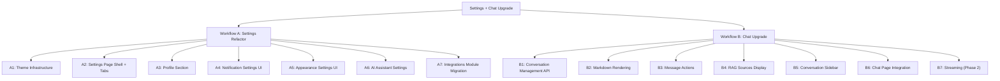
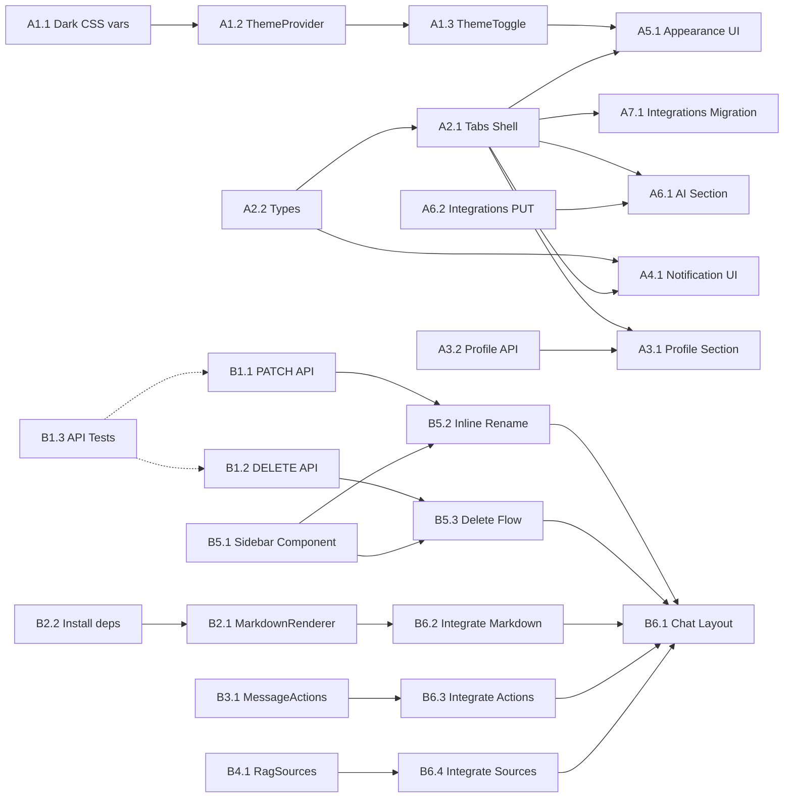

# Feature Plan: Settings Page Refactor + Chat Feature Upgrade

**Planning Date**: 2026-03-17
**Estimated Effort**: 38 task points
**Scope**: Workflow A (Settings refactor) + Workflow B (Chat upgrade)

---

## 1. Feature Overview

### 1.1 Goals

**Workflow A** -- Transform the Settings page from a single Hedy.ai integration card into a modular settings center with tabbed navigation covering: user profile, notification preferences, appearance/theme, AI assistant configuration, and integrations.

**Workflow B** -- Upgrade the chat experience from plain-text rendering to rich Markdown with syntax highlighting, add message actions (copy, regenerate), an in-page conversation sidebar with search/rename/delete, RAG source citation display, and the backend APIs to support conversation management.

### 1.2 Scope

**Included**:
- Settings: User profile editing (display_name), notification settings UI, dark/light/system theme toggle, AI provider status display + custom system prompt, Hedy.ai integration (migrated)
- Chat: Markdown rendering (GFM tables, code blocks with highlight), copy-to-clipboard and regenerate buttons per message, conversation sidebar panel (search, rename, delete), RAG sources collapsible display, PATCH/DELETE conversation API endpoints
- Streaming response via ZeroClaw WebSocket marked as Phase 2

**Excluded**:
- i18n framework (UI text in English only)
- Avatar image upload (display initials or gravatar only)
- Email/password change (delegated to Supabase Auth flows)
- Full re-architecture of the chat API streaming (Phase 2)

### 1.3 Technical Constraints

- Next.js 16 (App Router) + React 19 + TypeScript 5 + Tailwind CSS 4
- Supabase Auth for user management; `chainthings_profiles.display_name` already exists
- `next-themes` already in `package.json` (v0.4.6) but not yet wired up
- No dark mode CSS variables defined yet -- must add `.dark` theme tokens to `globals.css`
- `/api/notifications/settings` backend already complete (GET/PUT) -- needs frontend only
- Chat API already returns `sources` array in response but frontend ignores it
- shadcn/ui component library available (`@/components/ui/`)

---

## 2. WBS Task Breakdown

### 2.1 Structure Diagram

### 2.2 Task List

---

#### Module A1: Theme Infrastructure (3 points)

Sets up dark mode support across the entire app using `next-themes` (already installed).

**File (modify)**: `src/app/globals.css`

- [ ] **Task A1.1**: Add dark mode CSS variables (1 point)
  - **Input**: Existing `:root` light theme variables
  - **Output**: `.dark` selector with dark theme oklch values
  - **Key Steps**:
    1. Add `.dark { ... }` block with inverted oklch color values for all CSS custom properties (background, foreground, card, muted, primary, destructive, sidebar, etc.)
    2. Ensure border, input, ring colors are adjusted for dark backgrounds
    3. Keep `:root` as the light theme (no class needed for light)

**File (modify)**: `src/app/layout.tsx`

- [ ] **Task A1.2**: Wrap app with ThemeProvider (1 point)
  - **Input**: `next-themes` ThemeProvider, current `<html>` tag
  - **Output**: Theme-aware root layout
  - **Key Steps**:
    1. Import `ThemeProvider` from `next-themes`
    2. Wrap `{children}` with `<ThemeProvider attribute="class" defaultTheme="system" enableSystem>`
    3. Add `suppressHydrationWarning` to `<html>` tag (required by next-themes)
    4. Ensure `Toaster` remains inside the provider

**File (new)**: `src/components/shared/theme-toggle.tsx`

- [ ] **Task A1.3**: Create ThemeToggle component (1 point)
  - **Input**: `next-themes` `useTheme()` hook
  - **Output**: Reusable toggle button (sun/moon/monitor icons)
  - **Key Steps**:
    1. Create component with three-state toggle: light / dark / system
    2. Use `lucide-react` icons: `Sun`, `Moon`, `Monitor`
    3. Use shadcn `DropdownMenu` or simple button group
    4. Handle hydration mismatch with `mounted` state guard

---

#### Module A2: Settings Page Shell + Tabs (3 points)

Refactors the monolithic settings page into a tabbed layout.

**File (rewrite)**: `src/app/(protected)/settings/page.tsx`

- [ ] **Task A2.1**: Create tabbed settings shell (2 points)
  - **Input**: Current single-card settings page (352 lines)
  - **Output**: Tab-based container rendering section components
  - **Key Steps**:
    1. Create a client component with tab state (profile / notifications / appearance / ai / integrations)
    2. Use vertical tab layout on desktop (left sidebar tabs + right content), horizontal tabs on mobile
    3. Render the appropriate section component based on active tab
    4. Use URL search params (`?tab=notifications`) so tabs are deep-linkable
    5. Default tab: "profile"

**File (new)**: `src/app/(protected)/settings/types.ts`

- [ ] **Task A2.2**: Define shared Settings types (1 point)
  - **Input**: Notification settings API response, integration types, profile shape
  - **Output**: TypeScript interfaces for all settings sections
  - **Key Steps**:
    1. `NotificationSettings` interface (enabled, frequency, timezone, send_hour_local)
    2. `UserProfile` interface (id, email, display_name, tenant_id)
    3. `AiProviderStatus` interface
    4. Re-export existing `Integration` interface

---

#### Module A3: Profile Section (3 points)

**File (new)**: `src/app/(protected)/settings/components/profile-section.tsx`

- [ ] **Task A3.1**: Create ProfileSection component (2 points)
  - **Input**: Supabase Auth user object, `chainthings_profiles` table
  - **Output**: Profile editing UI with display name and email display
  - **Key Steps**:
    1. Fetch current user via `/api/profile` (or inline Supabase query)
    2. Display email as read-only field
    3. Editable `display_name` field with save button
    4. Avatar showing initials derived from display_name or email
    5. Show tenant_id as read-only badge (for reference)
    6. Success/error toast on save

**File (new)**: `src/app/api/profile/route.ts`

- [ ] **Task A3.2**: Create profile API endpoint (1 point)
  - **Input**: Supabase auth user, `chainthings_profiles` table
  - **Output**: GET (read profile) + PATCH (update display_name) endpoint
  - **Key Steps**:
    1. GET: return profile data (display_name, tenant_id) + user email from auth
    2. PATCH: validate `display_name` (string, max 100 chars, trim whitespace)
    3. Update `chainthings_profiles` set `display_name` where `id = user.id`
    4. Auth guard (same pattern as other API routes)

---

#### Module A4: Notification Settings UI (2 points)

**File (new)**: `src/app/(protected)/settings/components/notification-section.tsx`

- [ ] **Task A4.1**: Create NotificationSection component (2 points)
  - **Input**: Existing `/api/notifications/settings` API (GET/PUT)
  - **Output**: Full notification preferences UI
  - **Key Steps**:
    1. Fetch settings on mount via GET `/api/notifications/settings`
    2. Toggle switch for `enabled` (on/off)
    3. Select/radio for `frequency`: daily / biweekly / weekly
    4. Timezone picker -- use a searchable select with common IANA timezones (hardcoded list of ~30 popular timezones, not a full library)
    5. Display `send_hour_local` as read-only info (fixed at 9:00)
    6. Save button calling PUT `/api/notifications/settings`
    7. Loading skeleton while fetching

---

#### Module A5: Appearance Settings UI (1 point)

**File (new)**: `src/app/(protected)/settings/components/appearance-section.tsx`

- [ ] **Task A5.1**: Create AppearanceSection component (1 point)
  - **Input**: `next-themes` useTheme hook, ThemeToggle component
  - **Output**: Theme selection UI with visual preview cards
  - **Key Steps**:
    1. Three visual cards: Light (sun icon, light preview), Dark (moon icon, dark preview), System (monitor icon)
    2. Active card highlighted with primary border
    3. Clicking a card calls `setTheme()`
    4. Brief explanation text: "Choose your preferred color scheme"

---

#### Module A6: AI Assistant Settings (3 points)

**File (new)**: `src/app/(protected)/settings/components/ai-section.tsx`

- [ ] **Task A6.1**: Create AiSection component (2 points)
  - **Input**: `/api/integrations` for zeroclaw/openclaw config, AI provider status
  - **Output**: AI provider status display + custom system prompt editor
  - **Key Steps**:
    1. Fetch integrations and filter for `zeroclaw` / `openclaw` services
    2. Show active provider name + connection status badge (connected/disconnected)
    3. Show default provider from env (`DEFAULT_AI_PROVIDER`) as fallback info
    4. Textarea for custom `system_prompt` (saved to integrations config)
    5. Character counter for system prompt (max 2000 chars)
    6. Save button updating the integration config via PUT `/api/integrations`

**File (modify)**: `src/app/api/integrations/route.ts`

- [ ] **Task A6.2**: Add PUT method to integrations API (1 point)
  - **Input**: Integration id + partial config update
  - **Output**: Updated integration record
  - **Key Steps**:
    1. Check if a PUT handler already exists; if not, add one
    2. Accept `{ id, config }` body -- merge with existing config (spread)
    3. Validate that the integration belongs to the caller's tenant
    4. Return updated record

---

#### Module A7: Integrations Module Migration (2 points)

**File (new)**: `src/app/(protected)/settings/components/integrations-section.tsx`

- [ ] **Task A7.1**: Extract Hedy integration into standalone component (2 points)
  - **Input**: Current settings page Hedy.ai code (lines 37-351 of current page.tsx)
  - **Output**: Self-contained IntegrationsSection component
  - **Key Steps**:
    1. Move all Hedy-related state and handlers into this component
    2. Keep the same Card UI with step-1 (API key) and step-2 (webhook) flow
    3. Keep the "Other Integrations" list section
    4. Keep the ConfirmDialog for deletion
    5. Verify all functionality works identically after extraction

---

#### Module B1: Conversation Management API (3 points)

**File (new)**: `src/app/api/conversations/[conversationId]/route.ts`

- [ ] **Task B1.1**: Create PATCH endpoint for conversation rename (1 point)
  - **Input**: `conversationId` param, `{ title }` body
  - **Output**: Updated conversation record
  - **Key Steps**:
    1. Auth guard + tenant_id check
    2. Validate title (string, 1-200 chars)
    3. Update `chainthings_conversations` set `title` where `id` and `tenant_id` match
    4. Return updated record

- [ ] **Task B1.2**: Create DELETE endpoint for conversation deletion (1 point)
  - **Input**: `conversationId` param
  - **Output**: 204 No Content on success
  - **Key Steps**:
    1. Auth guard + tenant_id check
    2. Delete from `chainthings_messages` where `conversation_id` matches (cascade or explicit)
    3. Delete from `chainthings_conversations` where `id` and `tenant_id` match
    4. Return 204

- [ ] **Task B1.3**: Unit tests for conversation API (1 point)
  - **Input**: Existing test infrastructure (`src/__tests__/`)
  - **Output**: Test file with ~8 tests
  - **Key Steps**:
    1. Create `src/app/api/conversations/[conversationId]/route.test.ts`
    2. Test PATCH: success, validation error, unauthorized, not found
    3. Test DELETE: success, unauthorized, not found
    4. Use existing mock factory patterns

---

#### Module B2: Markdown Rendering (3 points)

**File (new)**: `src/components/chat/markdown-renderer.tsx`

- [ ] **Task B2.1**: Create MarkdownRenderer component (2 points)
  - **Input**: Raw markdown string from AI response
  - **Output**: Rendered HTML with GFM support and syntax highlighting
  - **Key Steps**:
    1. Install `react-markdown`, `remark-gfm`, `rehype-highlight`
    2. Create component wrapping `<ReactMarkdown>` with plugins
    3. Custom renderers: `code` (inline vs block detection, copy button on code blocks), `a` (open in new tab), `table` (styled with Tailwind)
    4. Handle the existing `n8n-workflow` code fence specially (keep current Card rendering)
    5. Apply prose-like typography styles via Tailwind classes (not `@tailwindcss/typography` -- manual)
    6. Ensure dark mode compatibility for syntax highlighting (import a highlight.js theme that supports both)

- [ ] **Task B2.2**: Install npm dependencies (1 point)
  - **Input**: package.json
  - **Output**: Updated dependencies
  - **Key Steps**:
    1. `npm install react-markdown remark-gfm rehype-highlight`
    2. `npm install highlight.js` (for CSS themes, or use rehype-highlight's built-in)
    3. Import highlight.js CSS theme in `globals.css` or component-level

---

#### Module B3: Message Actions (2 points)

**File (new)**: `src/components/chat/message-actions.tsx`

- [ ] **Task B3.1**: Create MessageActions component (2 points)
  - **Input**: Message content, message role, regenerate callback
  - **Output**: Action buttons overlay on message hover
  - **Key Steps**:
    1. Copy button: copies message content to clipboard, shows "Copied!" toast
    2. Regenerate button (assistant messages only): calls a callback that re-sends the last user message
    3. Buttons appear on hover (desktop) or via a "..." menu (mobile)
    4. Use `lucide-react` icons: `Copy`, `RefreshCw`, `MoreHorizontal`
    5. Style: small ghost buttons, positioned at bottom-right of message bubble

---

#### Module B4: RAG Sources Display (2 points)

**File (new)**: `src/components/chat/rag-sources.tsx`

- [ ] **Task B4.1**: Create RagSources component (2 points)
  - **Input**: `sources` array from chat API response (`{ id, title, type }[]`)
  - **Output**: Collapsible sources citation below assistant message
  - **Key Steps**:
    1. Collapsible section with "N sources cited" toggle
    2. Each source shows: icon (by type: FileText for item, Brain for memory), title, type badge
    3. Meeting Note sources link to `/items` page (or specific item if route exists)
    4. Collapsed by default, expands on click
    5. Store sources per message -- extend the Message interface to include optional `sources`

---

#### Module B5: Conversation Sidebar (5 points)

**File (new)**: `src/components/chat/conversation-sidebar.tsx`

- [ ] **Task B5.1**: Create ConversationSidebar component (3 points)
  - **Input**: Conversations list from Supabase, current conversationId
  - **Output**: Sidebar panel with search, list, rename, delete
  - **Key Steps**:
    1. Fetch conversations client-side (or receive as prop from parent)
    2. Search input: filters conversations by title (client-side filter)
    3. Each item shows: title (truncated), relative timestamp, active indicator
    4. Right-click or "..." menu per item: Rename, Delete
    5. Rename: inline edit mode (click title to edit, Enter to save, Esc to cancel) -- calls PATCH API
    6. Delete: confirm dialog, then calls DELETE API
    7. "New conversation" button at top
    8. Clicking a conversation navigates to `/chat/[id]`

- [ ] **Task B5.2**: Create inline rename interaction (1 point)
  - **Input**: Conversation title, PATCH API
  - **Output**: Inline editable title with save/cancel
  - **Key Steps**:
    1. Double-click or menu "Rename" activates edit mode
    2. Input pre-filled with current title
    3. Enter saves (API call), Esc cancels
    4. Optimistic update + rollback on error

- [ ] **Task B5.3**: Integrate delete with ConfirmDialog (1 point)
  - **Input**: Existing `ConfirmDialog` component, DELETE API
  - **Output**: Delete flow with confirmation
  - **Key Steps**:
    1. Reuse `ConfirmDialog` from `src/components/shared/confirm-dialog.tsx`
    2. On confirm, call DELETE API
    3. Remove from local list, navigate to `/chat/new` if deleted conversation was active
    4. Success/error toast

---

#### Module B6: Chat Page Integration (5 points)

**File (rewrite)**: `src/app/(protected)/chat/[conversationId]/page.tsx`

- [ ] **Task B6.1**: Refactor chat page layout with sidebar (2 points)
  - **Input**: Current 339-line chat page, ConversationSidebar component
  - **Output**: Split layout: sidebar (collapsible) + chat area
  - **Key Steps**:
    1. Two-column layout: left sidebar (280px, collapsible on mobile) + right chat area
    2. Toggle button to show/hide sidebar (hamburger or panel icon)
    3. On mobile: sidebar overlays as a sheet/drawer
    4. Pass `currentConversationId` to sidebar for active highlighting
    5. Keep the existing chat functionality intact during refactor

- [ ] **Task B6.2**: Integrate MarkdownRenderer into message display (1 point)
  - **Input**: `MarkdownRenderer` component, current `MessageContent` component
  - **Output**: Rich markdown rendering for assistant messages
  - **Key Steps**:
    1. Replace the plain `` rendering in assistant messages with `<MarkdownRenderer>`
    2. Keep `n8n-workflow` code fence handling (either in MarkdownRenderer or pre-process)
    3. User messages remain plain text (whitespace-pre-wrap)
    4. Test with various markdown: headers, lists, code blocks, tables, links

- [ ] **Task B6.3**: Integrate MessageActions into message bubbles (1 point)
  - **Input**: `MessageActions` component
  - **Output**: Hover actions on each message
  - **Key Steps**:
    1. Wrap each message bubble in a relative container
    2. Render `<MessageActions>` with appropriate props
    3. Implement the regenerate handler: remove last assistant message, re-send last user message to `/api/chat`
    4. Pass copy handler

- [ ] **Task B6.4**: Integrate RagSources into assistant messages (1 point)
  - **Input**: `RagSources` component, `sources` from API response
  - **Output**: Sources displayed below relevant assistant messages
  - **Key Steps**:
    1. Extend local `Message` interface to include optional `sources` field
    2. When receiving API response with `sources`, store them with the assistant message
    3. Render `<RagSources>` below assistant message bubble when sources exist
    4. Load sources from message metadata when loading historical messages (requires checking if metadata is stored -- currently `sources` is only in API response, not in DB)

---

#### Module B7: Streaming Response -- Phase 2 (not scored)

> Deferred to Phase 2. Documented here for future reference.

**File (modify)**: `src/lib/ai-gateway/client.ts`
**File (new)**: `src/lib/ai-gateway/stream.ts`
**File (modify)**: `src/app/api/chat/route.ts`
**File (modify)**: `src/app/(protected)/chat/[conversationId]/page.tsx`

- [ ] **Task B7.1**: Implement ZeroClaw WebSocket streaming client
  - Connect to ZeroClaw `/ws/chat` endpoint
  - Handle partial message chunks
  - Reconnection logic with backoff

- [ ] **Task B7.2**: Convert chat API to Server-Sent Events (SSE) or streaming response
  - Use `ReadableStream` in route handler
  - Forward ZeroClaw WS chunks as SSE events
  - Handle n8n workflow extraction from complete response

- [ ] **Task B7.3**: Update chat UI for streaming display
  - Progressive text rendering with cursor animation
  - Disable input during streaming
  - Abort button to cancel in-progress generation

---

## 3. Dependency Graph

### 3.1 Dependency Diagram

### 3.2 Dependency Table

| Task | Depends On | Reason |
|------|-----------|--------|
| A1.2 ThemeProvider | A1.1 Dark CSS vars | Provider needs CSS variables to exist |
| A1.3 ThemeToggle | A1.2 ThemeProvider | Toggle needs provider context |
| A2.1 Tabs Shell | A2.2 Types | Shell uses shared type definitions |
| A3.1 Profile Section | A2.1, A3.2 | Rendered in tabs shell, needs profile API |
| A4.1 Notification UI | A2.1, A2.2 | Rendered in tabs shell, uses types |
| A5.1 Appearance UI | A2.1, A1.3 | Rendered in tabs shell, uses ThemeToggle |
| A6.1 AI Section | A2.1, A6.2 | Rendered in tabs shell, needs PUT API |
| A7.1 Integrations Migration | A2.1 | Rendered in tabs shell |
| B2.1 MarkdownRenderer | B2.2 Install deps | Needs react-markdown packages |
| B5.2 Inline Rename | B1.1, B5.1 | Needs PATCH API + sidebar structure |
| B5.3 Delete Flow | B1.2, B5.1 | Needs DELETE API + sidebar structure |
| B6.1 Chat Layout | B5.2, B5.3, B6.2, B6.3, B6.4 | Final integration of all chat components |

### 3.3 Parallel Tasks

The following tasks can be developed in parallel:

- **Stream 1** (Theme): A1.1 -> A1.2 -> A1.3
- **Stream 2** (Settings components): A2.2 -> A2.1 -> (A3.1 || A4.1 || A7.1) -- after A3.2 and A6.2 are done
- **Stream 3** (Chat APIs): B1.1 || B1.2 || B1.3
- **Stream 4** (Chat components): B2.2 -> B2.1 || B3.1 || B4.1
- **Stream 5** (Chat sidebar): B5.1 -> (B5.2 + B5.3)

Workflow A and Workflow B are **fully independent** until final testing -- they can be developed by separate developers simultaneously.

---

## 4. Implementation Recommendations

### 4.1 Suggested Implementation Order

**Phase 1a (foundation, 7 points)**:
1. A1.1 -- Dark mode CSS variables
2. A1.2 -- ThemeProvider setup
3. A2.2 -- Shared types
4. A3.2 -- Profile API
5. B2.2 -- Install npm deps
6. B1.1 + B1.2 -- Conversation PATCH/DELETE APIs

**Phase 1b (components, 14 points)**:
7. A1.3 -- ThemeToggle component
8. B2.1 -- MarkdownRenderer
9. B3.1 -- MessageActions
10. B4.1 -- RagSources
11. B5.1 -- ConversationSidebar
12. A6.2 -- Integrations PUT API

**Phase 1c (settings assembly, 11 points)**:
13. A2.1 -- Settings tabs shell
14. A3.1 -- Profile section
15. A4.1 -- Notification section
16. A5.1 -- Appearance section
17. A6.1 -- AI section
18. A7.1 -- Integrations migration

**Phase 1d (chat assembly, 6 points)**:
19. B5.2 + B5.3 -- Sidebar rename/delete
20. B6.1 -- Chat layout refactor
21. B6.2 + B6.3 + B6.4 -- Chat integrations
22. B1.3 -- API tests

### 4.2 New npm Packages

| Package | Purpose | Size |
|---------|---------|------|
| `react-markdown` | Markdown to React rendering | ~12KB gzipped |
| `remark-gfm` | GitHub Flavored Markdown (tables, strikethrough, task lists) | ~2KB |
| `rehype-highlight` | Syntax highlighting for code blocks | ~1KB (uses highlight.js) |
| `highlight.js` | Syntax highlight engine + themes | ~30KB core (tree-shakeable by language) |

Note: `next-themes` is already installed (v0.4.6).

### 4.3 New Files vs Modified Files

**New Files (14)**:
| File | Module |
|------|--------|
| `src/components/shared/theme-toggle.tsx` | A1.3 |
| `src/app/(protected)/settings/types.ts` | A2.2 |
| `src/app/(protected)/settings/components/profile-section.tsx` | A3.1 |
| `src/app/(protected)/settings/components/notification-section.tsx` | A4.1 |
| `src/app/(protected)/settings/components/appearance-section.tsx` | A5.1 |
| `src/app/(protected)/settings/components/ai-section.tsx` | A6.1 |
| `src/app/(protected)/settings/components/integrations-section.tsx` | A7.1 |
| `src/app/api/profile/route.ts` | A3.2 |
| `src/app/api/conversations/[conversationId]/route.ts` | B1.1/B1.2 |
| `src/app/api/conversations/[conversationId]/route.test.ts` | B1.3 |
| `src/components/chat/markdown-renderer.tsx` | B2.1 |
| `src/components/chat/message-actions.tsx` | B3.1 |
| `src/components/chat/rag-sources.tsx` | B4.1 |
| `src/components/chat/conversation-sidebar.tsx` | B5.1 |

**Modified Files (5)**:
| File | Module | Changes |
|------|--------|---------|
| `src/app/globals.css` | A1.1 | Add `.dark` theme variables |
| `src/app/layout.tsx` | A1.2 | Wrap with ThemeProvider |
| `src/app/(protected)/settings/page.tsx` | A2.1 | Complete rewrite to tabbed shell |
| `src/app/(protected)/chat/[conversationId]/page.tsx` | B6.x | Major refactor with sidebar + markdown + actions |
| `src/app/api/integrations/route.ts` | A6.2 | Add PUT handler |

**No Database Migrations Required**: All needed tables already exist (`chainthings_profiles.display_name`, `chainthings_notification_settings`, `chainthings_conversations`, `chainthings_messages`).

### 4.4 Potential Risks

| Risk | Impact | Mitigation |
|------|--------|------------|
| Dark mode color tuning requires iteration | Medium | Start with a proven oklch dark palette; test with all existing pages before merging |
| `react-markdown` bundle size impact | Low | Tree-shake highlight.js to only include common languages (js, ts, json, bash, python, sql) |
| Conversation sidebar data fetching strategy | Medium | Use client-side fetch with SWR-like pattern; paginate to 50 conversations; consider `revalidateOnFocus` |
| Settings page rewrite breaks existing Hedy flow | High | Extract Hedy integration code first (A7.1) as a pure copy, verify functionality, then build shell around it |
| RAG sources not persisted in messages table | Low | Currently `sources` are only in API response, not in `metadata` column. For historical messages, sources won't be available unless we also update the chat API to store them in `metadata`. Add this to B6.4. |
| Chat page refactor is large (339 lines) | Medium | Refactor incrementally: extract MessageBubble component first, then add sidebar, then markdown |

### 4.5 Testing Strategy

- **Unit Tests**: Conversation PATCH/DELETE API (B1.3), Profile API (consider adding)
- **Integration Tests**: Settings page tab navigation, notification settings save/load round-trip
- **Manual Testing Checklist**:
  - Theme toggle persists across page reload
  - Dark mode renders correctly on all existing pages (dashboard, chat, files, workflows, items)
  - Hedy integration flow works identically after migration
  - Markdown renders tables, code blocks, links correctly
  - Copy message copies raw text (not HTML)
  - Regenerate re-sends and replaces last assistant message
  - Conversation rename updates sidebar and page title
  - Conversation delete navigates away and removes from list
  - RAG sources expand/collapse correctly

---

## 5. Acceptance Criteria

### Workflow A: Settings

- [ ] Settings page has 5 functional tabs (Profile, Notifications, Appearance, AI, Integrations)
- [ ] Display name can be edited and saved
- [ ] Notification settings (enabled, frequency, timezone) can be configured and persisted
- [ ] Theme toggle switches between light, dark, and system modes correctly
- [ ] Dark mode renders correctly across all pages
- [ ] AI provider status is displayed; custom system prompt can be saved
- [ ] Hedy.ai integration works identically to before (API key + webhook setup)

### Workflow B: Chat

- [ ] Assistant messages render Markdown (headers, lists, code with syntax highlighting, tables, links)
- [ ] Copy button copies message text to clipboard
- [ ] Regenerate button re-sends the previous user message and replaces the assistant response
- [ ] Conversation sidebar lists conversations with search/filter
- [ ] Conversations can be renamed inline
- [ ] Conversations can be deleted with confirmation
- [ ] RAG sources are displayed below assistant messages when present
- [ ] All existing chat functionality (n8n tool mode, new conversation creation, message sending) remains working
- [ ] Conversation API has unit tests (PATCH, DELETE)

---

## 6. Phase 2 Enhancements

Future improvements to consider after this work is complete:

- **Streaming responses**: ZeroClaw WebSocket `/ws/chat` integration for real-time token-by-token display
- **Avatar upload**: Allow users to upload profile photos to Supabase Storage
- **Keyboard shortcuts**: `Cmd+K` for search, `Cmd+N` for new conversation
- **Message search**: Full-text search across all messages in all conversations
- **Export conversation**: Download conversation as Markdown or PDF
- **Notification preview**: Show a preview of what the AI notification summary looks like in settings
- **Theme customization**: Allow custom accent color selection beyond light/dark
- **Conversation pinning**: Pin important conversations to the top of the sidebar
- **Message reactions**: Thumbs up/down feedback on AI responses for future quality improvement
