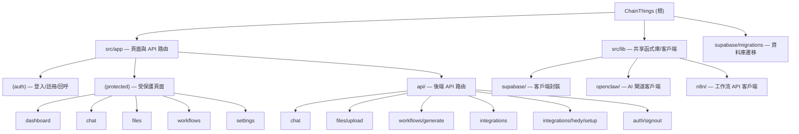

# ChainThings

## 專案願景

ChainThings 是一個多租戶 Next.js 應用，整合 Supabase（認證、資料庫、儲存）、OpenClaw AI 閘道（聊天）、以及 n8n（工作流自動化）。它為每個租戶提供隔離的聊天、檔案管理、工作流產生和第三方整合（如 Hedy.ai 會議記錄）能力。

## 架構總覽

- **框架**: Next.js 16 (App Router, React 19, TypeScript 5, Tailwind CSS 4)
- **認證與資料**: Supabase（Auth + PostgreSQL + Storage），透過 RLS 實現多租戶行級隔離
- **AI 閘道**: OpenClaw（OpenAI 相容 API），用於聊天對話和 n8n 工作流 JSON 產生
- **工作流引擎**: n8n，透過 REST API 建立/啟用工作流
- **部署**: Docker (standalone Next.js) + docker-compose，連接外部 `lab_net` 網路中的 Supabase、n8n、OpenClaw 容器
- **多租戶模型**: 每個使用者註冊時自動產生 `tenant_id`（UUID），所有業務表透過 `tenant_id` + RLS 策略隔離

```
Request -> Middleware (auth check) -> App Router
                                        |
                 +----------------------+----------------------+
                 |                      |                      |
           (auth) pages          (protected) pages        API Routes
           /login, /register     /dashboard, /chat,       /api/chat
           /callback             /files, /workflows,      /api/files/upload
                                 /settings                /api/workflows/generate
                                                          /api/integrations
                                                          /api/integrations/hedy/setup
                                                          /api/auth/signout
                 |                      |                      |
                 +----------------------+----------------------+
                                        |
                            Supabase (DB + Auth + Storage)
                            OpenClaw (AI chat completions)
                            n8n (workflow automation)
```

## 模組結構圖

本專案為單體 Next.js 應用，無獨立子模組/套件。按功能域劃分如下：



## 模組索引

| 功能域 | 路徑 | 說明 |
|--------|------|------|
| 認證 | `src/app/(auth)/` | 登入、註冊、OAuth 回呼頁面 |
| 受保護頁面 | `src/app/(protected)/` | Dashboard、Chat、Files、Workflows、Settings |
| API 路由 | `src/app/api/` | 聊天、檔案上傳、工作流產生、整合管理 |
| Supabase 封裝 | `src/lib/supabase/` | 瀏覽器客戶端、伺服器端客戶端、admin 客戶端 |
| OpenClaw 客戶端 | `src/lib/openclaw/` | AI 聊天補全介面封裝 |
| n8n 客戶端 | `src/lib/n8n/` | 工作流 CRUD + Hedy webhook 範本 |
| 資料庫遷移 | `supabase/migrations/` | 7 個增量遷移檔案（profiles -> items） |
| Docker 部署 | `Dockerfile`, `docker-compose.yml` | 多階段建置，連接外部服務網路 |

## 執行與開發

### 環境變數

參見 `.env.example`：

| 變數 | 用途 |
|------|------|
| `NEXT_PUBLIC_SUPABASE_URL` | Supabase 公開 URL（瀏覽器端） |
| `NEXT_PUBLIC_SUPABASE_ANON_KEY` | Supabase 匿名金鑰 |
| `SUPABASE_URL` | Supabase 內部 URL（伺服器端） |
| `SUPABASE_SERVICE_ROLE_KEY` | Supabase 服務角色金鑰 |
| `OPENCLAW_GATEWAY_URL` | OpenClaw AI 閘道位址 |
| `OPENCLAW_GATEWAY_TOKEN` | OpenClaw 認證權杖 |
| `N8N_API_URL` | n8n API 位址 |
| `N8N_API_KEY` | n8n API 金鑰 |

### 常用指令

```bash
npm run dev      # 啟動開發伺服器 (Next.js)
npm run build    # 正式環境建置
npm run start    # 啟動正式環境伺服器
npm run lint     # ESLint 檢查
```

### Docker 部署

```bash
docker compose up --build -d
```

容器對應連接埠 `3001:3000`，透過 `lab_net` 網路連接 Supabase (kong:8000)、OpenClaw (:18789)、n8n (:5678)。

### 資料庫遷移

遷移檔案位於 `supabase/migrations/`，按編號順序執行：
1. `001_profiles.sql` — profiles 表 + 註冊觸發器 + RLS + tenant_id 輔助函式
2. `002_conversations.sql` — 對話 + 訊息表 + RLS
3. `003_files.sql` — 檔案中繼資料表 + RLS
4. `004_workflows.sql` — n8n 工作流記錄表 + RLS
5. `005_storage.sql` — Storage bucket + 儲存 RLS 策略 (500MB 限制)
6. `006_integrations.sql` — 整合設定表 + RLS
7. `007_items.sql` — 通用業務資料表 + RLS

## 測試策略

目前專案 **沒有測試檔案**。無單元測試、整合測試或端對端測試。

建議優先補充：
- API 路由的單元/整合測試（`/api/chat`、`/api/files/upload`、`/api/workflows/generate`）
- Supabase RLS 策略測試
- 中介軟體認證邏輯測試

## 編碼規範

- **語言**: TypeScript (strict 模式)
- **樣式**: Tailwind CSS 4（內聯 utility classes）
- **Lint**: ESLint (next/core-web-vitals + next/typescript)
- **路徑別名**: `@/*` -> `./src/*`
- **建置輸出**: `standalone` 模式（用於 Docker）
- **Cookie 名稱**: 硬編碼為 `sb-localhost-auth-token`（用於容器化部署）

## AI 使用指引

- 本專案使用 OpenClaw 作為 AI 閘道，相容 OpenAI Chat Completions API
- 聊天 API (`/api/chat`) 支援 `tool` 參數，當 `tool === "n8n"` 時注入 n8n 工作流助手系統提示詞
- 工作流產生 API (`/api/workflows/generate`) 直接產生 n8n 工作流 JSON
- AI 回應中的 `n8n-workflow` 程式碼區塊會被自動解析並推送到 n8n

## 變更記錄 (Changelog)

| 日期 | 操作 | 說明 |
|------|------|------|
| 2026-03-11 | 初始掃描 | 首次產生 CLAUDE.md，覆蓋率 100% |
