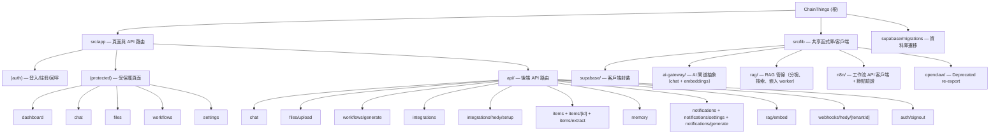

# ChainThings

## 專案願景

ChainThings 是一個多租戶 Next.js 應用，整合 Supabase（認證、資料庫、儲存、向量搜索）、AI 閘道（ZeroClaw 或 OpenClaw）、以及 n8n（工作流自動化）。它為每個租戶提供隔離的聊天（含 RAG 檢索增強）、檔案管理、工作流產生、會議記錄管理、助手記憶、AI 通知摘要和第三方整合（如 Hedy.ai）能力。

## 架構總覽

- **框架**: Next.js 16 (App Router, React 19, TypeScript 5, Tailwind CSS 4)
- **認證與資料**: Supabase（Auth + PostgreSQL + Storage + pgvector），透過 RLS 實現多租戶行級隔離
- **RAG**: pgvector 向量搜索 + 全文搜索 + RRF 混合排名，聊天時自動檢索相關會議記錄和記憶
- **AI 閘道**: ZeroClaw（預設，`POST /webhook`）或 OpenClaw（legacy，OpenAI 相容 API），透過 `src/lib/ai-gateway/` 抽象層支援 provider 切換，每租戶可獨立配置 token 與系統提示詞
- **工作流引擎**: n8n，透過 REST API 建立/啟用工作流，使用節點類型白名單限制 AI 產生的工作流
- **部署**: Docker (standalone Next.js) + docker-compose，連接外部 `lab_net` 網路中的 Supabase、n8n、ZeroClaw/OpenClaw 容器
- **多租戶模型**: 每個使用者註冊時自動產生 `tenant_id`（UUID），所有業務表透過 `tenant_id` + RLS 策略隔離

```
Request -> Middleware (auth check) -> App Router
                                        |
                 +----------------------+----------------------+
                 |                      |                      |
           (auth) pages          (protected) pages        API Routes
           /login, /register     /dashboard, /chat,       /api/chat
           /callback             /files, /workflows,      /api/files/upload
                                 /items, /items/new,      /api/workflows/generate
                                 /settings                /api/integrations
                                                          /api/integrations/hedy/setup
                                                          /api/items + /api/items/[id]
                                                          /api/items/extract
                                                          /api/memory
                                                          /api/notifications
                                                          /api/notifications/settings
                                                          /api/notifications/generate
                                                          /api/rag/embed
                                                          /api/webhooks/hedy/[tenantId]
                                                          /api/auth/signout
                 |                      |                      |
                 +----------------------+----------------------+
                                        |
                            Supabase (DB + Auth + Storage + pgvector)
                            ZeroClaw/OpenClaw (AI chat + embeddings)
                            n8n (workflow automation)
```

## 模組結構圖

本專案為單體 Next.js 應用，無獨立子模組/套件。按功能域劃分如下：



## 模組索引

| 功能域 | 路徑 | 說明 |
|--------|------|------|
| 認證 | `src/app/(auth)/` | 登入、註冊、OAuth 回呼頁面 |
| 受保護頁面 | `src/app/(protected)/` | Dashboard（含通知面板）、Chat（含 RAG）、Files、Workflows、Items（含新增頁）、Settings |
| API 路由 | `src/app/api/` | 聊天（RAG 增強）、檔案上傳、工作流產生、整合管理、記憶 CRUD、通知系統、嵌入處理 |
| Supabase 封裝 | `src/lib/supabase/` | 瀏覽器客戶端、伺服器端客戶端、admin 客戶端 |
| AI 閘道 | `src/lib/ai-gateway/` | Provider-agnostic AI client（chat + embeddings），支援 ZeroClaw + OpenClaw |
| RAG 管線 | `src/lib/rag/` | 分塊策略（chunker）、混合搜索客戶端（search）、嵌入 Worker（worker） |
| OpenClaw 客戶端 | `src/lib/openclaw/` | Deprecated re-export，指向 `ai-gateway` |
| n8n 客戶端 | `src/lib/n8n/` | 工作流 CRUD（含超時）+ 節點類型白名單驗證 + Hedy webhook 範本 |
| Webhook 端點 | `src/app/api/webhooks/` | Hedy webhook 接收端點，HMAC 簽章 + 時間戳防重放驗證 |
| Items API | `src/app/api/items/` | 通用業務資料 CRUD API（列表 + 新增 + 單項 CRUD + AI 提取） |
| Memory API | `src/app/api/memory/` | 助手記憶 CRUD API（列表、新增、刪除/歸檔） |
| Notifications API | `src/app/api/notifications/` | 通知讀取/標記 + 設定 CRUD + 排程生成（支援 cron） |
| RAG Embed API | `src/app/api/rag/embed/` | 嵌入隊列處理端點 |
| 測試基礎設施 | `src/__tests__/` | Mock 工廠、測試輔助函式、全域 setup |
| 資料庫遷移 | `supabase/migrations/` | 11 個增量遷移檔案（profiles -> notifications） |
| Docker 部署 | `Dockerfile`, `docker-compose.yml` | 多階段建置，連接外部服務網路 |

## 執行與開發

### 環境變數

參見 `.env.example`：

| 變數 | 用途 |
|------|------|
| `NEXT_PUBLIC_SUPABASE_URL` | Supabase 公開 URL（瀏覽器端） |
| `NEXT_PUBLIC_SUPABASE_ANON_KEY` | Supabase 匿名金鑰 |
| `SUPABASE_URL` | Supabase 內部 URL（伺服器端） |
| `SUPABASE_SERVICE_ROLE_KEY` | Supabase 服務角色金鑰 |
| `ZEROCLAW_GATEWAY_URL` | ZeroClaw AI 閘道位址（預設 `http://localhost:42617`） |
| `ZEROCLAW_GATEWAY_TOKEN` | ZeroClaw Bearer token（透過 `POST /pair` 取得） |
| `ZEROCLAW_TIMEOUT_MS` | ZeroClaw 請求超時（預設 30000ms） |
| `DEFAULT_AI_PROVIDER` | 預設 AI provider：`zeroclaw`（預設）或 `openclaw` |
| `OPENCLAW_GATEWAY_URL` | OpenClaw AI 閘道位址（legacy，可選） |
| `OPENCLAW_GATEWAY_TOKEN` | OpenClaw 認證權杖（legacy，可選） |
| `OPENCLAW_TIMEOUT_MS` | OpenClaw 請求超時（預設 30000ms） |
| `N8N_API_URL` | n8n API 位址 |
| `N8N_API_KEY` | n8n API 金鑰 |
| `N8N_TIMEOUT_MS` | n8n API 請求超時（預設 10000ms） |
| `N8N_WEBHOOK_URL` | n8n 公開 webhook URL（如 `https://n8n.yourdomain.com`） |
| `NEXT_PUBLIC_APP_URL` | 應用公開 URL（預設 `http://localhost:3001`） |
| `CHAINTHINGS_WEBHOOK_SECRET` | Webhook HMAC 簽章密鑰 |
| `CRON_SECRET` | 內部 cron 排程端點驗證密鑰（通知生成） |

### 常用指令

```bash
npm run dev      # 啟動開發伺服器 (Next.js)
npm run build    # 正式環境建置
npm run start    # 啟動正式環境伺服器
npm run lint     # ESLint 檢查
make up          # Docker + ngrok 一鍵啟動
make down        # 停止全部
make status      # 查看運行狀態
```

### Docker 部署

```bash
docker compose up --build -d
```

容器對應連接埠 `3001:3000`，透過 `lab_net` 網路連接 Supabase (kong:8000)、OpenClaw (:18789)、n8n (:5678)。

### 資料庫遷移

遷移檔案位於 `supabase/migrations/`，按編號順序執行：
1. `001_profiles.sql` — profiles 表 + 註冊觸發器 + RLS + tenant_id 輔助函式
2. `002_conversations.sql` — 對話 + 訊息表 + RLS
3. `003_files.sql` — 檔案中繼資料表 + RLS
4. `004_workflows.sql` — n8n 工作流記錄表 + RLS
5. `005_storage.sql` — Storage bucket + 儲存 RLS 策略 (500MB 限制)
6. `006_integrations.sql` — 整合設定表 + RLS
7. `007_items.sql` — 通用業務資料表 + RLS
8. `008_performance_indexes.sql` — 效能索引（messages 覆蓋索引、conversations/workflows 分頁索引）
9. `009_rag_foundation.sql` — pgvector 擴展 + RAG documents/chunks 表 + HNSW 向量索引 + GIN 全文索引 + 混合搜索 RPC（SECURITY INVOKER）+ items 自動嵌入觸發器
10. `010_assistant_memory.sql` — 助手記憶表 + RLS + 記憶自動嵌入觸發器
11. `011_notifications.sql` — 通知設定表 + 通知快取表 + 唯一期間索引（防重複）+ RLS

## 測試策略

專案使用 **Vitest** 作為測試框架，目前有 **108 個測試**，全部通過。

### 測試涵蓋範圍

| API 路由 / 模組 | 測試檔案 | 測試數 |
|-----------------|----------|--------|
| `/api/chat` | `route.test.ts` | 9 |
| `/api/files/upload` | `route.test.ts` | 6 |
| `/api/workflows/generate` | `route.test.ts` | 7 |
| `/api/integrations` | `route.test.ts` | 13 |
| `/api/integrations/hedy/setup` | `route.test.ts` | 14 |
| `/api/items` | `route.test.ts` | 6 |
| `/api/items/[id]` | `route.test.ts` | 7 |
| `/api/webhooks/hedy/[tenantId]` | `route.test.ts` | 7 |
| `/api/auth/signout` | `route.test.ts` | 2 |
| `lib/ai-gateway/client` | `client.test.ts` | 17 |
| `lib/ai-gateway/providers` | `providers.test.ts` | 5 |
| `lib/n8n/validation` | `validation.test.ts` | 6 |
| `lib/n8n/templates/hedy-webhook` | `hedy-webhook.test.ts` | 7 |
| `lib/openclaw/client` | `client.test.ts` | 1 |

### 測試基礎設施

- `src/__tests__/setup.ts` — 全域 mock 設定（Supabase、AI Gateway、n8n）
- `src/__tests__/mocks/supabase.ts` — Supabase 客戶端 mock 工廠
- `src/__tests__/mocks/n8n.ts` — n8n 工作流 mock
- `src/__tests__/mocks/openclaw.ts` — AI Gateway mock（含 chat + embeddings）
- `src/__tests__/helpers.ts` — 測試輔助函式

### 執行測試

```bash
npx vitest run        # 執行所有測試
npx vitest run --reporter=verbose  # 詳細輸出
```

### 待補充

- Supabase RLS 策略測試（含 RAG 跨租戶隔離驗證）
- RAG 管線單元測試（chunker、worker、search）
- 通知系統 API 路由測試
- Memory API 路由測試
- Items POST / extract 路由測試
- 中介軟體認證邏輯測試
- 端對端測試

## 編碼規範

- **語言**: TypeScript (strict 模式)
- **樣式**: Tailwind CSS 4（內聯 utility classes）
- **Lint**: ESLint (next/core-web-vitals + next/typescript)
- **路徑別名**: `@/*` -> `./src/*`
- **建置輸出**: `standalone` 模式（用於 Docker）
- **Cookie 名稱**: 可透過 `SUPABASE_COOKIE_NAME` 環境變數設定（預設 `sb-localhost-auth-token`）

## AI 使用指引

- 本專案使用 `src/lib/ai-gateway/` 作為 AI 閘道抽象層，支援 ZeroClaw（預設）和 OpenClaw（legacy）
- **每租戶隔離**：每個租戶可在 `chainthings_integrations` 表設定獨立的 `api_token` 和 `system_prompt`
- **RAG 檢索增強**：聊天 API (`/api/chat`) 自動嵌入用戶訊息 → 混合搜索（向量 + 全文 + RRF）→ 注入相關 context 到 AI 提示詞
  - RAG 失敗為非致命錯誤，不影響聊天功能
  - 回覆中包含 `sources` 欄位引用來源文件
- **嵌入管線**：新增/更新 items 或 memory entries 時自動觸發 PostgreSQL trigger → 排隊至 `rag_documents` → Worker 分塊 + 嵌入 → 存入 `rag_chunks`
- **助手記憶**：每租戶持久記憶（task/preference/fact/project/summary），AI 回答時自動引用
- 聊天 API 支援 `tool` 參數，當 `tool === "n8n"` 時注入 n8n 工作流助手系統提示詞
- 工作流產生 API (`/api/workflows/generate`) 直接產生 n8n 工作流 JSON
- AI 回應中的 `n8n-workflow` 程式碼區塊會被自動解析，經**節點類型白名單驗證**後推送到 n8n
- 白名單位於 `src/lib/n8n/validation.ts`，僅允許安全的轉換/路由節點（webhook、set、if、switch 等），禁止 code、httpRequest 等可執行任意邏輯的節點
- **AI 通知摘要**：Dashboard 通知面板，由 cron 排程觸發 AI 生成每週/雙週/每天摘要，快取到 DB 減少 token 消耗

## 安全機制

- **RAG 租戶隔離**：混合搜索 RPC 使用 `SECURITY INVOKER`，從 RLS context 取得 `tenant_id`，禁止 caller 傳入任意 tenant UUID
- **嵌入 Worker 並發安全**：使用 compare-and-set（`status='pending'` → `'processing'`）防止多 worker 重複處理
- **通知去重**：`notification_cache` 表有 `(tenant_id, user_id, period_start, period_end)` unique 索引 + upsert 操作
- **Webhook 認證**：HMAC-SHA256 簽章 + 時間戳防重放（5 分鐘窗口），租戶 ID 綁定 URL 路徑
- **n8n 節點白名單**：AI 產生的工作流僅允許預定義的安全節點類型
- **n8n 工作流標籤**：所有工作流自動標記 `chainthings` + `tenant:{tenant_id}`
- **服務金鑰隔離**：n8n 工作流 JSON 不包含 Supabase service role key，改用 HMAC 認證的 API 端點
- **外部服務超時**：n8n（10s）和 AI Gateway（30s）請求均有 AbortController 超時保護
- **中介軟體快速路徑**：無 auth cookie 時直接重定向，避免不必要的 Supabase 往返
- **時區驗證**：通知設定 API 驗證 timezone 是否為合法 IANA 時區名稱

## 變更記錄 (Changelog)

| 日期 | 操作 | 說明 |
|------|------|------|
| 2026-03-11 | 初始掃描 | 首次產生 CLAUDE.md，覆蓋率 100% |
| 2026-03-13 | 安全修復 | Hedy webhook HMAC 認證、n8n 節點白名單、OpenClaw 每租戶隔離、service role key 移除 |
| 2026-03-13 | 測試補充 | 新增 71 個單元測試覆蓋所有 API 路由 |
| 2026-03-13 | 效能優化 | 外部服務超時、資料庫效能索引、中介軟體快速路徑、列表分頁 |
| 2026-03-13 | 文檔更新 | 更新 CLAUDE.md 反映新增模組、安全機制、測試策略、環境變數 |
| 2026-03-16 | AI 閘道遷移 | 新增 `src/lib/ai-gateway/` 抽象層，支援 ZeroClaw（預設）和 OpenClaw（legacy），108 個測試全數通過 |
| 2026-03-17 | RAG + 個人秘書 | 新增 pgvector RAG（混合搜索 + RRF）、助手記憶、AI 通知摘要、Meeting Notes 手動創建、嵌入管線；3 個 DB migrations（009-011）、7 個新 API 路由、Dashboard 通知面板 |
