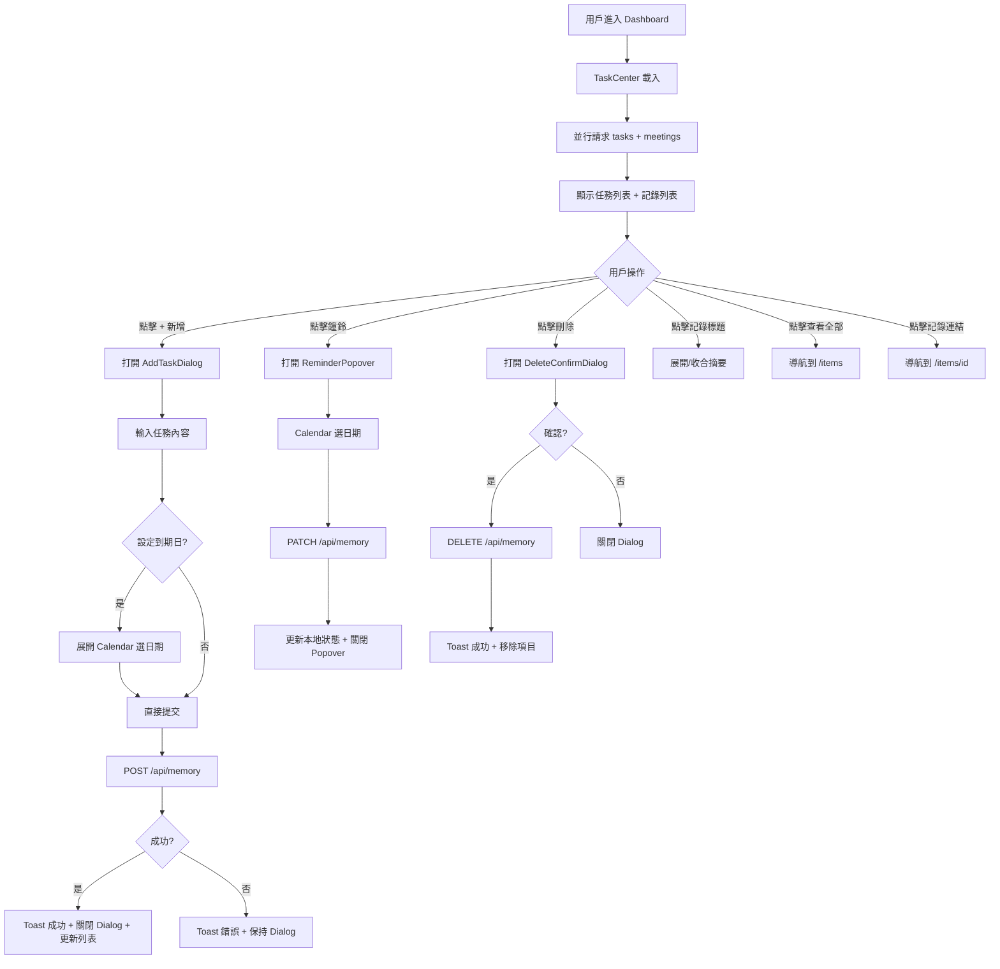

# UI/UX 設計方案：任務中心 (Task Center)

**設計時間**：2026-04-01
**目標平台**：Web（響應式，Desktop + Mobile）
**取代元件**：`src/components/shared/notification-panel.tsx`

---

## 1. 設計目標

### 1.1 用戶目標
- 在 Dashboard 快速掌握待辦事項狀態（哪些逾期、哪些即將到期）
- 一鍵新增待辦、設定提醒日期
- 快速瀏覽近期 Hedy 會議記錄，點擊跳轉詳情
- 完成/刪除已處理的待辦

### 1.2 業務目標
- 取代純粹的 AI 通知摘要面板，提供可操作的任務管理
- 將分散在不同頁面的任務和會議記錄資訊集中呈現，降低認知負擔
- 為後續「到期提醒推播」功能奠定 UI 基礎

---

## 2. 頁面結構設計

### 2.1 Dashboard 整體佈局（任務中心位置）

任務中心取代現有 `<NotificationPanel />` 的位置，在 StatCards 下方、External Services 上方：

```
+--------------------------------------------------+
| PageHeader: "Dashboard"                          |
| Welcome back, {displayName}                      |
+--------------------------------------------------+
| [StatCard] [StatCard] [StatCard] [StatCard]      |
| Conversations  Files    Workflows  Meeting Notes  |
+--------------------------------------------------+
|                                                  |
| +----------------------------------------------+|
| | Task Center Card                              ||
| | +------------------------------------------+ ||
| | | Header: [icon] 任務中心  [+ 新增] [設定]  | ||
| | +------------------------------------------+ ||
| | |                                          | ||
| | |  === 待辦事項 Section ===                | ||
| | |  [ ] Task 1 描述...  [due badge] [bell][x]| ||
| | |  [ ] Task 2 描述...  [overdue!]  [bell][x]| ||
| | |  [ ] Task 3 描述...  [no date]   [bell][x]| ||
| | |                                          | ||
| | +--- Separator ----------------------------+ ||
| | |                                          | ||
| | |  === 最近記錄 Section ===                | ||
| | |  > Meeting title 1    3/28  2 action items| ||
| | |  > Meeting title 2    3/25  0 action items| ||
| | |  > Meeting title 3    3/22  5 action items| ||
| | |                                          | ||
| | |          查看全部 ->                      | ||
| | +------------------------------------------+ ||
| +----------------------------------------------+|
|                                                  |
+--------------------------------------------------+
| External Services                                |
| [Supabase] [n8n] [OpenClaw]                     |
+--------------------------------------------------+
```

### 2.2 區塊說明

| 區塊 | 用途 | 優先級 |
|------|------|--------|
| Task Center Header | 標題、新增按鈕、設定連結 | 高 |
| 待辦事項列表 | 核心功能：顯示/管理所有 active tasks | 高 |
| Separator | 視覺分隔兩個區域 | 低 |
| 最近記錄列表 | 輔助功能：顯示近期 Hedy 會議記錄 | 中 |
| 新增待辦 Dialog | 彈窗：輸入任務內容 + 可選到期日 | 高 |
| 設定提醒 Popover | 內嵌日期選取器 | 中 |
| 刪除確認 Dialog | 確認刪除操作 | 中 |

---

## 3. 元件拆分

### 3.1 元件樹結構

```
TaskCenter                          (主容器，取代 NotificationPanel)
├── TaskCenterHeader
│   ├── lucide: ClipboardList       (標題圖標)
│   ├── CardTitle: "任務中心"
│   ├── AddTaskButton               (觸發 AddTaskDialog)
│   └── Link → /settings?tab=notifications (設定圖標按鈕)
│
├── TaskList
│   ├── TaskItem                    (重複渲染每筆 task)
│   │   ├── TaskContent             (任務描述文字，truncate)
│   │   ├── DueDateBadge            (到期狀態 Badge)
│   │   ├── SetReminderButton       (鐘鈴按鈕 → ReminderPopover)
│   │   └── DeleteTaskButton        (垃圾桶按鈕 → ConfirmDialog)
│   ├── ReminderPopover             (Popover + Calendar)
│   └── TaskListEmpty               (空狀態)
│
├── Separator
│
├── RecentMeetings
│   ├── MeetingItem                 (重複渲染每筆記錄)
│   │   ├── MeetingTitle            (標題 + 可展開摘要)
│   │   ├── MeetingDate             (日期)
│   │   └── ActionItemCount         (待辦數量 Badge)
│   └── ViewAllLink                 (查看全部 → /items)
│
├── AddTaskDialog                   (Dialog 彈窗)
│   ├── TaskContentInput            (textarea)
│   ├── DueDatePicker               (可選 Calendar)
│   └── SubmitButton
│
└── DeleteConfirmDialog             (確認刪除)
```

### 3.2 檔案結構建議

```
src/components/shared/
├── task-center/
│   ├── task-center.tsx             ← 主元件（取代 notification-panel.tsx）
│   ├── task-list.tsx               ← 待辦列表 + TaskItem
│   ├── task-item.tsx               ← 單筆待辦（含 badge、action buttons）
│   ├── add-task-dialog.tsx         ← 新增待辦 Dialog
│   ├── reminder-popover.tsx        ← 設定提醒 Popover + DatePicker
│   ├── recent-meetings.tsx         ← 最近記錄列表
│   ├── meeting-item.tsx            ← 單筆記錄（含展開摘要）
│   └── types.ts                    ← 共用 TypeScript 介面
```

### 3.3 元件詳細定義

#### 元件 A: `TaskCenter`

**職責**：主容器，負責資料載入、狀態管理，組合所有子元件。

**Props 接口**：

```typescript
// 無外部 props，內部管理所有狀態
// 作為 "use client" 元件
```

**內部狀態**：

```typescript
// task-center/types.ts
interface TaskEntry {
  id: string
  content: string
  importance: number
  due_date: string | null
  source_type: string
  source_id?: string
  created_at: string
}

interface MeetingNote {
  id: string
  title: string
  content: string
  metadata?: {
    keyPoints?: string[]
    actionItems?: Array<{ task: string; priority?: string }>
    source?: string
    duration?: number
  }
  created_at: string
}
```

**狀態管理**：

```typescript
const [tasks, setTasks] = useState<TaskEntry[]>([])
const [meetings, setMeetings] = useState<MeetingNote[]>([])
const [loading, setLoading] = useState(true)
const [addDialogOpen, setAddDialogOpen] = useState(false)
```

**資料載入邏輯**：

```typescript
// 並行請求兩個 API
const [tasksRes, meetingsRes] = await Promise.all([
  fetch("/api/memory?category=task"),           // status=active (預設)
  fetch("/api/items?type=meeting_note&limit=5"),
])
```

---

#### 元件 B: `TaskItem`

**職責**：渲染單筆待辦事項，含到期狀態、操作按鈕。

**Props 接口**：

```typescript
interface TaskItemProps {
  task: TaskEntry
  onDelete: (id: string) => void
  onUpdateDueDate: (id: string, date: Date | null) => void
  isDeleting?: boolean
}
```

**到期狀態計算邏輯**：

```typescript
function getDueStatus(dueDate: string | null): {
  label: string
  variant: "destructive" | "warning" | "outline" | "secondary"
  isUrgent: boolean
} {
  if (!dueDate) return { label: "未設定", variant: "outline", isUrgent: false }

  const now = new Date()
  const due = new Date(dueDate)
  const diffMs = due.getTime() - now.getTime()
  const diffHours = diffMs / (1000 * 60 * 60)
  const diffDays = Math.ceil(diffHours / 24)

  if (diffMs < 0) {
    // 逾期
    const overdueDays = Math.abs(diffDays)
    return {
      label: `逾期 ${overdueDays} 天`,
      variant: "destructive",
      isUrgent: true,
    }
  }
  if (diffHours <= 24) {
    return { label: "今天到期", variant: "destructive", isUrgent: true }
  }
  if (diffDays <= 3) {
    return {
      label: `${diffDays} 天後到期`,
      variant: "secondary",      // 琥珀色用 custom class
      isUrgent: true,
    }
  }
  return {
    label: `${diffDays} 天後`,
    variant: "outline",
    isUrgent: false,
  }
}
```

**樣式要點**：

- 逾期任務：左邊框 `border-l-2 border-l-destructive`，背景 `bg-destructive/5`
- 3 天內到期：左邊框 `border-l-2 border-l-amber-500`，背景 `bg-amber-500/5`
- 正常/未設定：無特殊邊框
- 按鈕群組右對齊，`opacity-0 group-hover:opacity-100` 桌面端懸停顯示，mobile 常顯

**渲染結構**：

```tsx
<div className={cn(
  "group flex items-start gap-3 py-2.5 px-3 rounded-lg transition-colors",
  "hover:bg-muted/50",
  isOverdue && "border-l-2 border-l-destructive bg-destructive/5",
  isApproaching && "border-l-2 border-l-amber-500 bg-amber-500/5",
)}>
  {/* 任務描述 */}
  <div className="flex-1 min-w-0">
    <p className="text-sm leading-relaxed">{task.content}</p>
    <DueDateBadge status={dueStatus} />
  </div>

  {/* 操作按鈕 */}
  <div className="flex items-center gap-1 shrink-0 sm:opacity-0 sm:group-hover:opacity-100 transition-opacity">
    <ReminderButton taskId={task.id} currentDueDate={task.due_date} onUpdate={onUpdateDueDate} />
    <DeleteButton taskId={task.id} onDelete={onDelete} />
  </div>
</div>
```

---

#### 元件 C: `AddTaskDialog`

**職責**：新增待辦事項彈窗。

**Props 接口**：

```typescript
interface AddTaskDialogProps {
  open: boolean
  onOpenChange: (open: boolean) => void
  onSubmit: (content: string, dueDate: Date | null) => Promise<void>
}
```

**內部狀態**：

```typescript
const [content, setContent] = useState("")
const [dueDate, setDueDate] = useState<Date | null>(null)
const [showDatePicker, setShowDatePicker] = useState(false)
const [isSubmitting, setIsSubmitting] = useState(false)
```

**Dialog 內容佈局**：

```
+----------------------------------+
| DialogHeader                     |
|   新增待辦事項                    |
|   輸入任務描述並設定到期日         |
+----------------------------------+
| DialogBody                       |
|   +----------------------------+ |
|   | textarea: 任務內容...       | |
|   | (placeholder: "輸入待辦...")| |
|   +----------------------------+ |
|                                  |
|   [Calendar icon] 設定到期日     |
|   (點擊展開 Calendar)            |
|   +----------------------------+ |
|   | Calendar (conditional)      | |
|   | < March 2026 >             | |
|   | Mo Tu We Th Fr Sa Su       | |
|   | ...                        | |
|   +----------------------------+ |
|   已選：2026/04/05 [x 清除]      |
+----------------------------------+
| DialogFooter                     |
|   [取消]              [新增]     |
+----------------------------------+
```

**驗證規則**：

- 任務內容：必填，至少 1 個非空白字元
- 到期日：可選，若設定則必須是未來日期
- 提交中禁用按鈕 + spinner

---

#### 元件 D: `ReminderPopover`

**職責**：點擊鐘鈴圖標，彈出 Popover 讓用戶選取/修改到期日。

**Props 接口**：

```typescript
interface ReminderPopoverProps {
  taskId: string
  currentDueDate: string | null
  onUpdate: (id: string, date: Date | null) => void
}
```

**Popover 內容**：

```
+---------------------------+
| 設定提醒                   |
| +-----Calendar----------+ |
| | < April 2026 >        | |
| | Mo Tu We Th Fr Sa Su  | |
| | ...                    | |
| +-----------------------+ |
| [清除提醒]    [確認]      |
+---------------------------+
```

**注意**：此元件需要 shadcn/ui 的 `Popover` 和 `Calendar` 元件，目前尚未安裝（見第 8 節）。

---

#### 元件 E: `RecentMeetings`

**職責**：顯示最近 3-5 筆 Hedy 會議記錄精簡列表。

**Props 接口**：

```typescript
interface RecentMeetingsProps {
  meetings: MeetingNote[]
  loading: boolean
}
```

**單筆 MeetingItem 佈局**：

```
+---------------------------------------------------+
| > Meeting Title                   3/28  [2 items]  |
|   ▼ (展開後)                                        |
|   - Key point 1                                     |
|   - Key point 2                                     |
|   - Key point 3                                     |
+---------------------------------------------------+
```

**交互**：

- 點擊箭頭或標題列展開/收合 keyPoints 摘要（Collapsible）
- 點擊標題文字導航至 `/items/{id}` 詳情頁
- 底部「查看全部」連結至 `/items`

**樣式要點**：

- 使用 `Collapsible` 元件（shadcn/ui，需安裝）
- actionItems 數量用 Badge 顯示，0 則不顯示
- 日期使用相對格式（今天/昨天/3月28日）

---

#### 元件 F: `DeleteConfirmDialog`

**職責**：確認刪除待辦事項。

**結構**：

```
+----------------------------------+
| 確認刪除                          |
| 確定要刪除這個待辦事項嗎？         |
| 此操作無法復原。                  |
+----------------------------------+
| [取消]              [刪除]        |
+----------------------------------+
```

**Props 接口**：

```typescript
interface DeleteConfirmDialogProps {
  open: boolean
  onOpenChange: (open: boolean) => void
  onConfirm: () => void
  isDeleting: boolean
  taskContent: string // 顯示在確認訊息中
}
```

---

## 4. 交互流程設計

### 4.1 用戶旅程圖



### 4.2 狀態轉換表

| 操作 | 當前狀態 | 觸發事件 | 下一狀態 | UI 變化 |
|------|----------|----------|----------|---------|
| 頁面載入 | - | mount | Loading | Card 內顯示 Skeleton |
| 載入完成 | Loading | fetch 成功 | Idle | 顯示任務/記錄列表 |
| 載入失敗 | Loading | fetch 失敗 | Error | 顯示錯誤提示 + 重試按鈕 |
| 新增待辦 | Idle | 點擊「+ 新增」 | Dialog Open | 顯示 AddTaskDialog |
| 提交待辦 | Dialog Open | 點擊「新增」 | Submitting | 按鈕 spinner + disabled |
| 提交成功 | Submitting | API 201 | Idle | 關閉 Dialog、Toast、列表頂部插入新項 |
| 提交失敗 | Submitting | API error | Dialog Open | Toast 錯誤、保持 Dialog |
| 設定提醒 | Idle | 點擊鐘鈴 | Popover Open | 顯示 Calendar Popover |
| 選取日期 | Popover Open | 點擊日期 + 確認 | Updating | 關閉 Popover、樂觀更新 Badge |
| 更新失敗 | Updating | API error | Idle | 回滾 Badge、Toast 錯誤 |
| 刪除任務 | Idle | 點擊垃圾桶 | Confirm Open | 顯示 DeleteConfirmDialog |
| 確認刪除 | Confirm Open | 點擊「刪除」 | Deleting | 按鈕 spinner |
| 刪除成功 | Deleting | API 200 | Idle | 移除項目（動畫淡出）、Toast |
| 展開記錄 | Idle | 點擊會議項目 | Expanded | 顯示 keyPoints 列表 |

### 4.3 關鍵交互細節

#### 交互 1：待辦排序

- 排序優先級：逾期 > 今天到期 > 即將到期 > 正常 > 未設定日期
- 同級別內按 `importance` 降序，再按 `created_at` 降序
- API 已按 `importance DESC, created_at DESC` 排序，前端需額外按到期狀態排序

#### 交互 2：到期狀態 Badge 顏色映射

| 狀態 | Badge 樣式 | 文字範例 |
|------|-----------|----------|
| 逾期 | `variant="destructive"` | "逾期 3 天" |
| 今天到期 | `variant="destructive"` | "今天到期" |
| 3 天內到期 | `className="bg-amber-500/10 text-amber-700 border-amber-200"` | "2 天後到期" |
| 3 天以上 | `variant="outline"` | "14 天後" |
| 未設定 | `variant="outline" className="text-muted-foreground"` | "未設定" |

#### 交互 3：樂觀更新策略

- **設定提醒**：先更新本地 state 中的 `due_date`，API 失敗則 rollback + Toast 錯誤
- **刪除**：確認後立即從列表移除（動畫），API 失敗則恢復 + Toast 錯誤
- **新增**：等待 API 回應後再插入列表（因為需要 server 產生的 `id`）

#### 交互 4：空狀態

```
+----------------------------------------------+
|                                              |
|   [ClipboardList icon, 大且淡色]              |
|                                              |
|   目前沒有待辦事項                             |
|   點擊「+ 新增」建立你的第一個待辦              |
|                                              |
+----------------------------------------------+
```

- 使用與 `EmptyState` 元件類似的風格，但更緊湊（不需 `min-h-[400px]`）
- 減小 icon 尺寸（`h-12 w-12`），padding 適中（`py-8`）

---

## 5. 響應式設計

### 5.1 Breakpoint 策略

| 屏幕尺寸 | Breakpoint | 佈局調整 |
|----------|------------|----------|
| Mobile | < 640px (default) | 全寬 Card，操作按鈕常顯，任務描述不 truncate |
| Tablet | sm (640px+) | Card 有適當 padding，操作按鈕 hover 顯示 |
| Desktop | lg (1024px+) | Card 最大寬度跟隨 Dashboard grid，更緊湊行間距 |

### 5.2 Mobile 特化

- **TaskItem 操作按鈕**：Mobile 常顯（去掉 `sm:opacity-0 sm:group-hover:opacity-100`），確保可觸摸
- **AddTaskDialog**：Mobile 全螢幕（`sm:max-w-md` 在 Desktop，Mobile 預設全寬）
- **ReminderPopover**：Mobile 可考慮用 Dialog 替代 Popover（Popover 在小螢幕體驗差）
- **MeetingItem 展開**：展開後 keyPoints 列表全寬，不做多欄
- **觸摸目標**：所有按鈕最小 `h-8 w-8`（32px），符合 44px 觸摸區域（含 padding）

### 5.3 響應式範例

```html
<!-- TaskCenter Card -->
<Card className="border-primary/10">
  <CardHeader className="pb-3 flex flex-row items-center justify-between space-y-0">
    <!-- 標題區 -->
  </CardHeader>
  <CardContent className="space-y-4">
    <!-- 待辦列表 -->
    <div className="space-y-1">
      <!-- TaskItems -->
    </div>

    <Separator />

    <!-- 最近記錄 -->
    <div className="space-y-2">
      <!-- MeetingItems -->
    </div>
  </CardContent>
</Card>
```

---

## 6. 無障礙訪問 (A11y)

### 6.1 關鍵實踐

| 實踐 | 實施方法 |
|------|----------|
| 語義化 | 待辦列表用 `<ul role="list">` + `<li>`，按鈕用 `<button>` |
| 鍵盤導航 | Tab 順序：新增按鈕 > 設定按鈕 > 各 TaskItem（鐘鈴 > 刪除）> 記錄列表 |
| ARIA 標籤 | 刪除按鈕 `aria-label="刪除任務：{content}"`，鐘鈴 `aria-label="設定提醒：{content}"` |
| Live region | 新增/刪除成功後 Toast 使用 `aria-live="polite"` (sonner 已處理) |
| 焦點管理 | Dialog 開啟自動 focus 到第一個 input；關閉後 focus 回觸發按鈕 |
| 色彩對比 | 逾期紅色文字在淺紅背景上確保 >= 4.5:1 對比度 |
| 到期狀態 | Badge 同時使用顏色 + 文字傳達狀態（不依賴純色彩） |

### 6.2 表單 A11y

```html
<!-- AddTaskDialog 內 -->
<label htmlFor="task-content" className="text-sm font-medium">
  任務內容
</label>
<textarea
  id="task-content"
  required
  aria-describedby="task-content-hint"
  placeholder="輸入待辦事項..."
  className="..."
/>
<p id="task-content-hint" className="text-xs text-muted-foreground">
  描述你需要完成的任務
</p>
```

---

## 7. 視覺設計建議

### 7.1 配色（沿用現有設計系統）

| 用途 | 顏色 | Tailwind Class |
|------|------|----------------|
| 逾期 | 紅色 | `text-destructive`, `bg-destructive/5`, `border-l-destructive` |
| 即將到期 (<=3天) | 琥珀色 | `text-amber-700 dark:text-amber-400`, `bg-amber-500/5`, `border-l-amber-500` |
| 正常到期 | 預設 | `text-muted-foreground`, `variant="outline"` |
| 未設定 | 淡灰 | `text-muted-foreground/60` |
| 新增按鈕 | Primary | shadcn Button `variant="default"` size="sm" |
| Header 圖標 | Primary | `text-primary` 或沿用 `h-5 w-5` |

### 7.2 間距系統

```
Card padding:      CardHeader pb-3, CardContent 預設
TaskItem 間距:      py-2.5 px-3, gap-3 (item 間 space-y-1)
Section 間距:       Separator + space-y-4
MeetingItem 間距:   py-2, gap-2
```

### 7.3 動畫

- TaskItem 刪除：`animate-out fade-out-0 slide-out-to-left-5`（可用 framer-motion 或 CSS）
- Dialog/Popover：沿用 shadcn 內建動畫
- Badge 狀態變化：`transition-colors duration-200`

---

## 8. 需要安裝/新增的 shadcn/ui 元件

### 8.1 已存在的元件（可直接使用）

| 元件 | 路徑 | 用途 |
|------|------|------|
| Card, CardHeader, CardTitle, CardContent | `ui/card` | 主容器 |
| Button | `ui/button` | 操作按鈕 |
| Badge | `ui/badge` | 到期狀態標籤 |
| Dialog, DialogContent, DialogHeader, ... | `ui/dialog` | 新增/刪除確認 |
| Separator | `ui/separator` | 區塊分隔 |
| Skeleton | `ui/skeleton` | Loading 狀態 |

### 8.2 需要新增安裝的元件

| 元件 | 安裝指令 | 用途 |
|------|----------|------|
| **Popover** | `npx shadcn@latest add popover` | 提醒日期選取彈出層 |
| **Calendar** | `npx shadcn@latest add calendar` | 日期選取器（依賴 react-day-picker） |
| **Collapsible** | `npx shadcn@latest add collapsible` | 會議記錄摘要展開/收合 |
| **Textarea** | `npx shadcn@latest add textarea` | 新增待辦輸入框 |
| **Label** | `npx shadcn@latest add label` | 表單標籤 |

安裝順序：

```bash
cd /Users/chainsea_claw/Projects/ChainThings
npx shadcn@latest add popover calendar collapsible textarea label
```

### 8.3 需要的 Lucide 圖標

| 圖標 | import name | 用途 |
|------|-------------|------|
| ClipboardList | `ClipboardList` | 任務中心標題圖標 |
| Plus | `Plus` | 新增按鈕 |
| Settings2 | `Settings2` | 設定連結（沿用現有） |
| Bell | `Bell` | 設定提醒按鈕 |
| Trash2 | `Trash2` | 刪除按鈕 |
| CalendarDays | `CalendarDays` | 到期日相關 |
| ChevronDown | `ChevronDown` | 展開/收合箭頭 |
| ChevronRight | `ChevronRight` | 會議記錄導航箭頭（沿用） |
| FileText | `FileText` | 會議記錄圖標（沿用） |
| Clock | `Clock` | 時間顯示 |
| Loader2 | `Loader2` | Loading spinner（沿用） |
| ExternalLink | `ExternalLink` | 查看全部連結 |
| AlertCircle | `AlertCircle` | 逾期警告 |
| CheckCircle2 | `CheckCircle2` | action item 圖標 |

---

## 9. API Endpoint 建議

### 9.1 現有可用 API

| 方法 | 路徑 | 用途 | 狀態 |
|------|------|------|------|
| GET | `/api/memory?category=task` | 取得 active tasks | 可用 |
| POST | `/api/memory` | 新增 task（已支援 `dueDate`） | 可用 |
| DELETE | `/api/memory` | 刪除/歸檔 task（body: `{id}`) | 可用 |
| GET | `/api/items?type=meeting_note&limit=5` | 取得最近記錄 | 可用 |

### 9.2 需要新增的 API

#### `PATCH /api/memory` -- 更新 due_date

**路由檔案**：`/Users/chainsea_claw/Projects/ChainThings/src/app/api/memory/route.ts`

在現有檔案新增 `PATCH` handler：

```typescript
export async function PATCH(request: Request) {
  const supabase = await createClient()
  const { data: { user } } = await supabase.auth.getUser()
  if (!user) {
    return NextResponse.json({ error: "Unauthorized" }, { status: 401 })
  }

  const { data: profile } = await supabase
    .from("chainthings_profiles")
    .select("tenant_id")
    .eq("id", user.id)
    .single()
  if (!profile?.tenant_id) {
    return NextResponse.json({ error: "Profile not found" }, { status: 404 })
  }

  const { id, due_date } = await request.json()
  if (!id) {
    return NextResponse.json({ error: "id is required" }, { status: 400 })
  }

  // due_date 可以是 ISO string 或 null（清除提醒）
  const validDueDate = due_date && !isNaN(new Date(due_date).getTime())
    ? due_date
    : null

  const { data, error } = await supabase
    .from("chainthings_memory_entries")
    .update({
      due_date: validDueDate,
      updated_at: new Date().toISOString(),
    })
    .eq("id", id)
    .eq("tenant_id", profile.tenant_id)
    .eq("status", "active")
    .select()
    .single()

  if (error) {
    return NextResponse.json({ error: error.message }, { status: 500 })
  }
  if (!data) {
    return NextResponse.json({ error: "Memory entry not found" }, { status: 404 })
  }

  return NextResponse.json({ data })
}
```

**前端呼叫方式**：

```typescript
await fetch("/api/memory", {
  method: "PATCH",
  headers: { "Content-Type": "application/json" },
  body: JSON.stringify({ id: taskId, due_date: selectedDate.toISOString() }),
})
```

---

## 10. Dashboard page.tsx 修改

### 10.1 import 變更

```diff
- import { NotificationPanel } from "@/components/shared/notification-panel";
+ import { TaskCenter } from "@/components/shared/task-center/task-center";
```

### 10.2 JSX 變更

```diff
- <NotificationPanel />
+ <TaskCenter />
```

Dashboard 頁面本身為 Server Component，TaskCenter 為 "use client" 元件（如同現有 NotificationPanel），因此可直接替換。

---

## 11. 開發交付清單

### 11.1 前置作業

- [ ] 安裝缺少的 shadcn/ui 元件：`popover`, `calendar`, `collapsible`, `textarea`, `label`
- [ ] 確認 `react-day-picker` 依賴已安裝（Calendar 元件依賴）

### 11.2 新增檔案

- [ ] `src/components/shared/task-center/types.ts` -- 共用介面定義
- [ ] `src/components/shared/task-center/task-center.tsx` -- 主元件
- [ ] `src/components/shared/task-center/task-list.tsx` -- 待辦列表
- [ ] `src/components/shared/task-center/task-item.tsx` -- 單筆待辦
- [ ] `src/components/shared/task-center/add-task-dialog.tsx` -- 新增 Dialog
- [ ] `src/components/shared/task-center/reminder-popover.tsx` -- 提醒 Popover
- [ ] `src/components/shared/task-center/recent-meetings.tsx` -- 最近記錄
- [ ] `src/components/shared/task-center/meeting-item.tsx` -- 單筆記錄

### 11.3 修改檔案

- [ ] `src/app/api/memory/route.ts` -- 新增 `PATCH` handler
- [ ] `src/app/(protected)/dashboard/page.tsx` -- 替換 import 和 JSX
- [ ] `src/components/shared/notification-panel.tsx` -- 標記 deprecated 或刪除

### 11.4 品質檢查

- [ ] 逾期/即將到期的視覺提示在 light + dark mode 下對比度 >= 4.5:1
- [ ] 所有互動元素可用鍵盤操作
- [ ] Mobile 斷點下操作按鈕可觸摸（>= 32px）
- [ ] 空狀態、Loading 狀態、Error 狀態三種情境皆有處理
- [ ] PATCH API 有 tenant_id 隔離 + status=active 檢查
- [ ] Toast 訊息使用繁體中文
